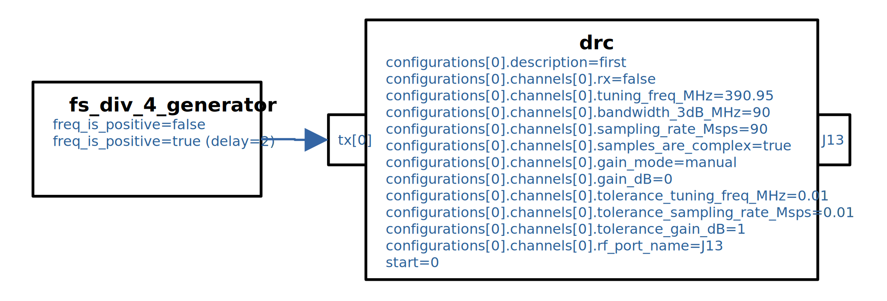
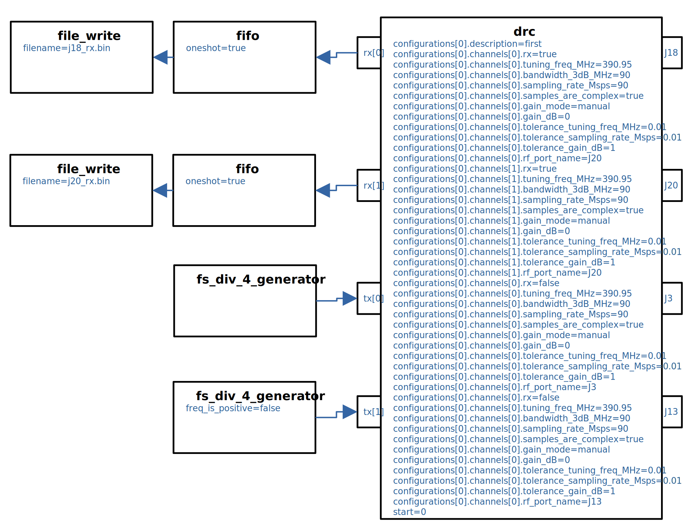
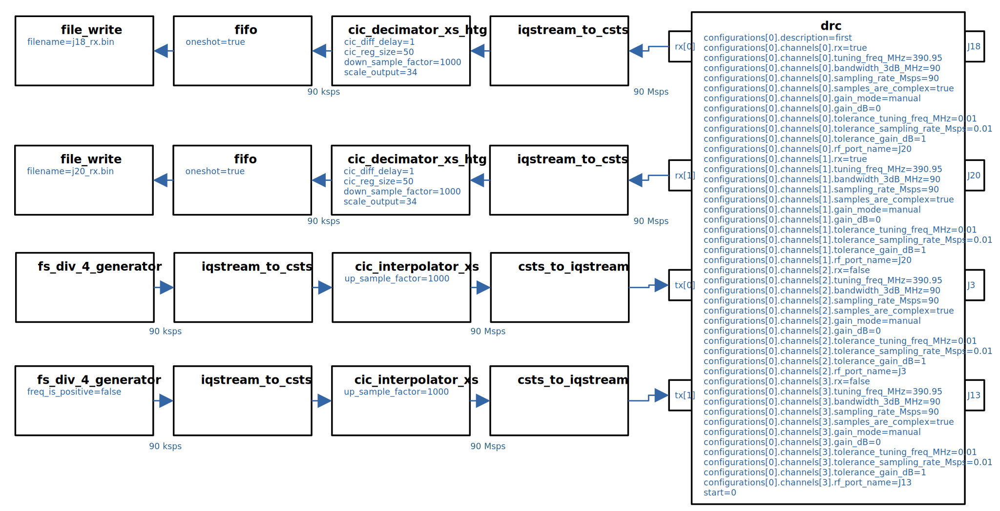
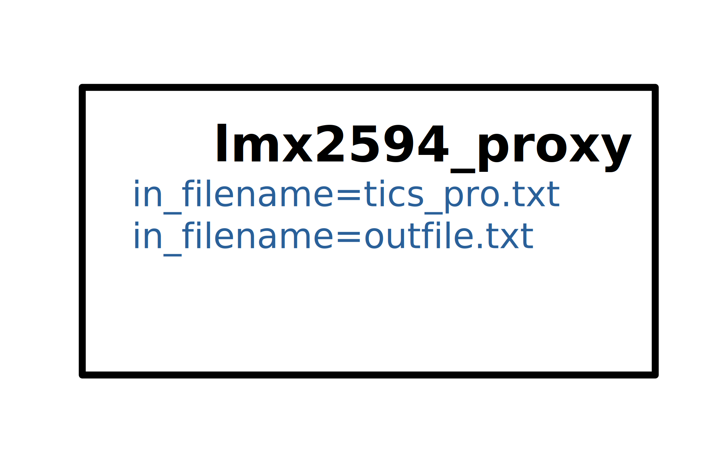

# [fs_div_4_tx](fs_div_4_tx/fs_div_4_tx-app.rst) application
Verifies DRC-based control, and HDL worker-sourced I/Q data, for single RF port (J13) transmit functionality on the HiTech Global using a spectrum analyzer.

# [fs_div_4_tx_rx](fs_div_4_tx_rx/fs_div_4_tx_rx-app.rst) application
Verifies DRC-based control, and HDL worker sources and sinks for I/Q data at the full RF Data Converter data rate of 90 Msps, for all RF ports on the HiTech Global using a spectrum analyzer to verify TX and an I/Q snapshot to file for RX. Only TX J13 and RX J20 are verified, but application is expected to actually transmits/receive on all available HiTech Global ports.

# [fs_div_4_tx_rx_resample](fs_div_4_tx_rx_resample/fs_div_4_tx_rx_resample-app.rst) application
Verifies DRC-based control, and HDL worker sources and sinks for I/Q data at a highly decimated/interpolated data rate of 90 ksps, for all RF ports on the HiTech Global using a spectrum analyzer to verify TX and an I/Q snapshot to file for RX. Only TX J13 and RX J20 are verified, but application is expected to actually transmits/receive on all available HiTech Global ports.

# [lmx2594_test_app](lmx2594_test_app/lmx2594_test_app-app.rst) application
Test application for the ``lmx2594_proxy.rcc`` RCC Worker and ``lmx2594.hdl`` HDL Device Worker.

