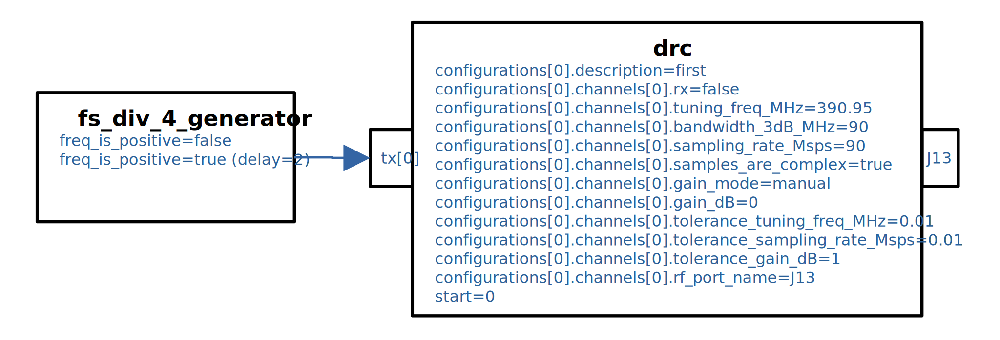

.. fs_div_4_tx application

.. This file is protected by Copyright. Please refer to the COPYRIGHT file
   distributed with this source distribution.

   This file is part of OpenCPI <http://www.opencpi.org>

   OpenCPI is free software: you can redistribute it and/or modify it under the
   terms of the GNU Lesser General Public License as published by the Free
   Software Foundation, either version 3 of the License, or (at your option) any
   later version.

   OpenCPI is distributed in the hope that it will be useful, but WITHOUT ANY
   WARRANTY; without even the implied warranty of MERCHANTABILITY or FITNESS FOR
   A PARTICULAR PURPOSE. See the GNU Lesser General Public License for
   more details.

   You should have received a copy of the GNU Lesser General Public License
   along with this program. If not, see <http://www.gnu.org/licenses/>.

..

:orphan:

.. _fs_div_4_tx:

``fs_div_4_tx.xml`` Application
===============================
Verifies Digital Radio Controller (DRC)-based control, and HDL worker-sourced I/Q data, for single RF port (J13) transmit functionality on the HiTech Global ZRF8-48DR using a spectrum analyzer.

.. _application_diagram:

   Block Diagram of Application XML

..

Detail
------

This application runs on the HiTech Global ZRF8-48DR platform and transmits a
tone that
shifts between the carrier frequency (fc) plus or minus the sampling rate
divided by 4 (denoted as fs/4) which is calculated as 390.95 MHz +/- 22.5 MHz.
It first transmits at the lower frequency then transmits at the higher frequency
after 2 seconds. This is used to verify that I/Q swap, and therefore, spectral
inversion, is not occurring for the composite TX signal chain.
The fc and fs values are set on the HiTech Global RF Data Converter which is
controlled by the DRC worker.
The frequency shift is achieved via the freq_is_positive
property of fs_div_4_generator.hdl, which controls whether the complex
sinusoidal baseband signal has a frequency of positive fs/4 or negative fs/4,
and whose property value changes as per the property delay attribute in the
application XML.

Tested Platforms
----------------
# zrf8_48dr built with Xilinx Vivado 2021.1 and xilinx21_1_aarch64

Prerequisites
-------------

#. HiTech Global's J13 TX RF port is connected to a spectrum analyzer
#. The ``zrf8_48dr`` has been properly installed and deployed, and the following assets are built and their artifacts (.bitz file for HDL and .so for RCC) exist within a directory that exists FIRST within colon-separate OCPI_LIBRARY_PATH environment variable value:

   * HDL Assembly: ``fs_div_4_tx`` built for ``zrf8_48dr``
   * RCC: drc.rcc (ocpi.osp.hitech_global project) built for xilinx21_1_aarch64 platform
   * RCC: lmx2594_proxy.rcc built for xilinx21_1_aarch64 platform

#. The fs_div_4_tx.xml file is in the working directory

Execution
---------

#. Boot the ``zrf8_48dr`` and setup for the desired mode (Standalone, Network, Server)

#. Run the application

   ``ocpirun -t 10 fs_div_4_tx.xml``

#. Monitor the HiTech Global J13 output via a spectrum analyzer and observe a tone toggle from fc - fs/4 Hz to fc + fs/4 Hz (from 368.45 MHz to 413.45 MHz)

Troubleshooting
---------------

If a runtime log occurs that indicates "lock FAILED", the drc configurations
property was likely not set according to the contrained ranges described in
its worker documentation. An example log output of a user requesting a tuning freq of
1000 MHz, which the underlying radio was not capable of,
produces the following error::

    [INFO] lock SUCCEEDED for rf_port_name: J13 for config: direction for value: 1
    [INFO] lock FAILED for rf_port_name: J13 for config: tuning_freq_MHz for value: 1000 w/ tolerance: +/- 0.01
    [INFO] for rf_port_name J13: unlocking config direction
    [INFO] rf_port_name J13 did not meet requirements
    Exiting for exception: Code 0x17, level 0, error: 'Worker "drc" produced an error during the "start" control operation: config prepare request was unsuccessful, set OCPI_LOG_LEVEL to 8 (or higher) for more info'
