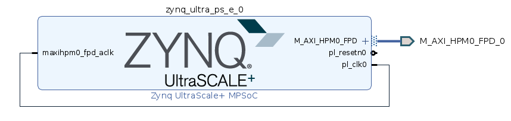

.. Guide for developing the Hitech Global ZRF8 OSP

.. This file is protected by Copyright. Please refer to the COPYRIGHT file
   distributed with this source distribution.

   This file is part of OpenCPI <http://www.opencpi.org>

   OpenCPI is free software: you can redistribute it and/or modify it under the
   terms of the GNU Lesser General Public License as published by the Free
   Software Foundation, either version 3 of the License, or (at your option) any
   later version.

   OpenCPI is distributed in the hope that it will be useful, but WITHOUT ANY
   WARRANTY; without even the implied warranty of MERCHANTABILITY or FITNESS FOR
   A PARTICULAR PURPOSE. See the GNU Lesser General Public License for
   more details.

   You should have received a copy of the GNU Lesser General Public License
   along with this program. If not, see <http://www.gnu.org/licenses/>.


:orphan:

.. _dev-Guide for developing the High-Tech Global ZRF8 OSP:

Guide for developing the High-Tech Global ZRF8 OSP
=========================================================


.. _dev-Introduction-label:

Introduction
------------

The OSP supports the following minimum requirement:

#. Control Plane via a single Master AXI High-Performance Memory Mapped port of the RFSoC

#. Data Plane via four Slave Streaming-AXI High-Performance ports of the RFSoC

#. Platform Configurations: ``base``

#. Several device/proxy workers to interface with devices that are external to the UltraScale+ RFSoC

#. Since the Xilinx Zynq UltraScale+ RFSoC on the ``zrf8_48dr`` is similar to the ``zcu104`` platform, the ``zcu104`` OSP is referenced heavily in this guide.

#. Understand the output artifacts of performing an OpenCPI ``install`` and ``deploy`` of the ``zcu104`` with ``xilinx21_1_aarch64``

#. Review of the HDL primitive and HDL platform worker source code for implementing the ``zcu104``

#. Benchmarking:

   #. Control Plane (CP) ONLY verification on the zcu104

      #. CP reference application, i.e. ``pattern_capture``

   #. Data Plane (DP) verification of the following on the zcu104

      #. DP reference application, i.e. ``testbias``

      #. FSK ``filerw``

      #. All viable Component Unit Tests to establish their PASS/FAIL benchmarks

.. _dev-Deliverables-label:

Deliverables
^^^^^^^^^^^^

#. An OpenCPI project named, ``ocpi.osp.hitech-global``

#. One OpenCPI Board Support Package (OSP)

   HDL Platform named ``zrf8_48dr``, with an RCC platform dependency on ``xilinx21_1_aarch64``

#. Supports the HDL Control Plane, HDL Data Plane, and interfaces to various other devices in a manner that is comparable with the vendor provided SDR

TODO: Not sure if we are provided all of this:

#. Documentation

   #. OpenCPI ZRF8 Getting Started Guide

   #. Guide for developing the Hitech Global ZRF8 OSP (This guide)

   #. Guide for developing Device / Proxy Workers for i2c an bus

   #. Datasheets for each application, Device Worker, and Device Proxy

.. _dev-Prerequisites-label:

Prerequisites
^^^^^^^^^^^^^

#. **Knowledge**

   #. A working knowledge of the OpenCPI framework is a must. Its documentation is located at https://opencpi.gitlab.io/releases/latest/. Close attention must be made to the following:

      - `OpenCPI Platform Development Guide <https://opencpi.gitlab.io/releases/v2.2.1/docs/OpenCPI_Platform_Development_Guide.pdf>`_

      - `OpenCPI Component Development Guide (Component Unit Test) <https://opencpi.gitlab.io/releases/v2.2.1/docs/OpenCPI_Component_Development_Guide.pdf>`_

      - Getting Started Guide for the ZCU104

      - Getting Started Guide for the FSK applications

      - Support documentation for the fmcomms2/3 daughtercard

   #. High-Tech Global ZRF8

      .. note::

        The following documentation must be requested directly from Hitech Global

      ..

      #. Documents:

         #.

         #.

         #.

      #. Vendor reference design package

#. **Equipment**

TODO: This needs to be completed

   +------------------+--------------------------------------------------------------------------+
   | **Item**         | HTG-ZRF89                                                                |
   +------------------+--------------------------------------------------------------------------+
   | **Desciption**   | Software Defined Radio that hosts a Zynq UltraScale+ RFSoC               |
   +------------------+--------------------------------------------------------------------------+
   | **Vendor**       | High-Tech Global                                                         |
   +------------------+--------------------------------------------------------------------------+
   | **Version**      |                                                                          |
   |                  |                                                                          |
   |                  |                                                                          |
   +------------------+--------------------------------------------------------------------------+
   | **P/N**          | X                                                                        |
   +------------------+--------------------------------------------------------------------------+
   | **Cost**         | X                                                                        |
   +------------------+--------------------------------------------------------------------------+

#. **Tools**

   #. Xilinx tools:

      #. Vivado/SDK 2021.1

      #. PetaLinux: v2021.1

   #. OpenCPI FOSS framework, https://gitlab.com/opencpi/opencpi.git

      - Release v2.4.3

      .. note::

         Bug fixes and enhancements are detailed in this guide

      ..


.. _dev-Preview-of-the-concluding-directory-tree-label:

Preview of the concluding directory tree
^^^^^^^^^^^^^^^^^^^^^^^^^^^^^^^^^^^^^^^^

This guide requires the creation of many directories. A summary of those directories are provided below:

**Clone of OpenCPI FOSS framework**::

   /home/user/opencpi

..


**OpenCPI project repo directory for ZRF8**::

   /home/user/opencpi/projects/osps/ocpi.osp.hitech-global

..

**Vendor's reference design(s)**::

   /home/user/zrf8_48dr_ref
   /home/user/zrf8_48dr_cp
   /home/user/zrf8_48dr_dp

..


**Petalinux directories**::

   /home/user/plx_zrf8_48dr_cp
   /home/user/plx_zrf8_48dr_dp

..


.. _dev-Design-Staging-label:

Design Staging
--------------

.. _dev-Take-inventory-of-the-target-board-label:

Take inventory of the target board
^^^^^^^^^^^^^^^^^^^^^^^^^^^^^^^^^^

**BACKGROUND:**

Per the OpenCPI Platform Development Guide, the target board was examined to identify the devices and interfaces that are required to support a functioning OSP. One of the main focuses of this phase is to identify the device(s) that will be used as an OpenCPI “container(s)”, which is where an application or portion of an application can be deployed. The interfaces between all devices are examined to determine if they are necessary for command/control or to transport payload data within an OSP. It is necessary to establish which device or interconnect to an external device serves as the “main processor”, and whose responsibility it is to perform system level functionality like, command/control, and possibly, transportation of payload data. This serves as an aid for determining the amount of work necessary to develop an OSP for the target platform.

**GOAL:**

#. Identify container(s)

#. Identify interface(s)

These items were sorted into the following categories based on their current support within the OpenCPI framework: **Yes, No, Partial.** For items where there is partial or no support, a research phase was conducted to ascertain the amount of development that is required to understand the level of support that is needed by the target platform. The “level of support” varies based on the configuration for a given device versus the requirements of the target platform. For example, although the digital interface of the Analog Devices transceiver may support LVDS and CMOS electrical standards, the target platform may implement support of only the LVDS standard, and therefore it may not be necessary to also enable support for CMOS. However, implementing support for CMOS standard could be added at a later time. This also highlights any additional requirement(s) for developing support for new tooling or other features that must be integrated into the OpenCPI framework to properly target the devices, such as FPGA build tools or software cross-compilers. In many cases, this initial investigation into the platform can be accomplished from vendor provided documentation, such as,  the User’s guide, board schematics and wiring diagrams. In cases where this documentation is insufficient, analysis must be performed with access to the board directly. However, it is also possible that not enough information can be gathered to successfully develop an OSP, but this should be determined upon the completion of the phases described above.

**IMPLEMENTATION:**

TODO: This may need to be updated

+---------------------------------+-------------------------------+------------------------------------+
| Tool/Device/Interface/Function  | Description                   | Framework Support (Yes/No/Partial) |
+=================================+===============================+====================================+
| T: FPGA build tools             | Xilinx Vivado 2021.1          | No                                 |
+---------------------------------+-------------------------------+------------------------------------+
| D: Xilinx XCZU48DR-FFVG1517-2-E | Zynq UltraScale+ RFSoC        | Yes                                |
+---------------------------------+-------------------------------+------------------------------------+
| D: Skyworks Si5341A             | Clock Generator               | No                                 |
+---------------------------------+-------------------------------+------------------------------------+
| D: TI LMX2594                   | Wideband Freq Synth           | No                                 |
+---------------------------------+-------------------------------+------------------------------------+
| D: VCC6-LAB-122M8800000         | I2C Programmable XO           | NO                                 |
+---------------------------------+-------------------------------+------------------------------------+
| D: DDR4                         | External Memory               | NO                                 |
+---------------------------------+-------------------------------+------------------------------------+
| D: XADC                         | Low Rate ADC                  | NO                                 |
+---------------------------------+-------------------------------+------------------------------------+
| D: Display Port                 | Video Monitor                 | NO                                 |
+---------------------------------+-------------------------------+------------------------------------+
| D: SATA                         | High Speed Serial             | NO                                 |
+---------------------------------+-------------------------------+------------------------------------+
| D: IRIG                         | GPS Sync                      | NO                                 |
+---------------------------------+-------------------------------+------------------------------------+
| I: Slots: FMC+                  | Slots for daughtercards       | Existing                           |
+---------------------------------+-------------------------------+------------------------------------+
| I: x8 PCI Express Gen3          | Interface                     | Partial                            |
+---------------------------------+-------------------------------+------------------------------------+
| I: GPIO                         | General Purpose I/O           | Existing (May require mods)        |
+---------------------------------+-------------------------------+------------------------------------+

.. _dev-Review-Vendor's-Reference-Design-Package-label:

Review Vendor's Reference Design Package
^^^^^^^^^^^^^^^^^^^^^^^^^^^^^^^^^^^^^^^^

**GOAL:**

- Allow the user to become familiar with the target board and its reference design package. By working through the reference design package, the user becomes comfortable with various tools, modifying source code, understanding the build flow (Vivado, PetaLinux), creating a microSD card, loading the FPGA and running an application. The build flow steps captured during the review are heavily relied upon throughout much of this guide and its lessons-learned are used during the integration with OpenCPI.

   - Review its documentation and work though the reference designs that targets the processor and/or the FPGA.

   - (OPTIONAL) Verify that the reference design can be modified and rebuilt so that a value of a register is set at build-time and readback during run-time. Then build the bitstream, create an image via PetaLinux, install on the ZRF8 and readback the value from the custom register.

**IMPLEMENTATION:**

#. Install and build reference design package:

   #. Create a reference design directory

      ``cd /home/user``

      ``mkdir zrf8_48dr_ref``

   #. Download the ``GEON_2022_10_12_icr.zip``

#. Unzip the initial file and then the subsequent ``pl_core.zip`` embedded zip file into your ``~/Downloads`` folder

      ``cd Downloads``

      ``unzip GEON_2022_10_12_icr.zip``

      ``cd 2022_10_12``

      ``unzip pl_core.zip``

   #. Copy the unzipped contents into your reference design directory

      ``cp -rf ~/Downloads/2022_10_12/* ~/zrf8_48dr_ref/``

      ``cd /home/user/zrf8_48dr_ref``

#. Source Vivado 2021.1

   ``source /opt/Xilinx/Vivado/2021.1/settings64.sh``

#.  Follow the top-level ``readme.txt`` (Step 1 Complete) ::

      1. extract the zip file in a folder

      2. change to the following directory:
              cd <folder>/pl_core/build/htg-zrf8_48dr-rev3/

      3. create the FPGA project:
              vivado -mode batch -source create_project.tcl

      4. after project creation and initial build, open the project file in vivado
              vivado <folder>/pl_core/build/htg-zrf8_48dr-rev3/pl_core/pl_core.xpr

      the above has been tested with Vivado 2021.1

TODO: Add documents if provided:

#. Review the vendor provided documentation, such as, but not limited to:

   #.

   #.

   #.

#. Run the various examples application(s)

#. Explore all that has been provided and make note of any special build or run time steps, which may be reused in the OpenCPI development flow:

   #. Build the bitstream

   #. Booting the into ZRF8

   #. Setting up the microSD card

   #. Loading of the FPGA

   #. Run Application(s)

#. (OPTIONAL) Once you have become familiar with the out-of-the-box reference design, convince yourself that you can edit the design by including a register for readback, which supports read/write or has a constant value. The details are left to the reader.


.. _dev-OpenCPI-Staging-label:

OpenCPI Staging
---------------

.. _dev-Install-the-OpenCPI-framework-label:

Install the OpenCPI framework
^^^^^^^^^^^^^^^^^^^^^^^^^^^^^

**GOAL:**

- Install the OpenCPI ``v2.4.3`` Framework

**IMPLEMENTATION:**

Download the ``v2.4.3`` tag of OpenCPI from the provided link, then run the default installation that targets the host OS, which in this case is ``centos7``.

#. Clone the OpenCPI framework

   ``cd /home/user``

   ``git clone https://gitlab.com/opencpi/opencpi.git``

   ``cd opencpi``

   ``git checkout tags/v2.4.3``

#. Complete the steps in the :ref:`dev-Bug-Fixes-to-the-framework-label` section of the APPENDIX

#. Install the framework  (Duration 30 min)

   ``cd /home/user/opencpi/``

   ``./scripts/install-opencpi.sh --minimal``


.. _dev-Configure-a-host-terminal-for-OpenCPI-development-label:

Configure a host terminal for OpenCPI development
^^^^^^^^^^^^^^^^^^^^^^^^^^^^^^^^^^^^^^^^^^^^^^^^^

**GOAL:**

- As a convenience, below are the steps for configuring a Host terminal for the OpenCPI development environment

**IMPLEMENTATION:**

#. After the OpenCPI framework has been installed, source the OpenCPI framework setup script

   ``cd /home/user/opencpi``

   ``source cdk/opencpi-setup.sh -s``

#. Ensure that the environment is configured for the **desired version of Vivado** and its license file

   ``export OCPI_XILINX_VIVADO_VERSION=2021.1``

   ``export OCPI_XILINX_LICENSE_FILE=2100@r420``

   ``env | grep OCPI``

   ::

      $ env | grep OCPI
      OCPI_TOOL_PLATFORM=centos7
      OCPI_PREREQUISITES_DIR=/home/user/opencpi/prerequisites
      OCPI_TOOL_OS_VERSION=c7
      OCPI_CDK_DIR=/home/user/opencpi/cdk
      OCPI_XILINX_VIVADO_VERSION=2021.1
      OCPI_ROOT_DIR=/home/user/opencpi
      OCPI_TOOL_OS=linux
      OCPI_TOOL_PLATFORM_DIR=/home/user/opencpi/project-registry/ocpi.core/exports/rcc/platforms/centos7
      OCPI_TOOL_ARCH=x86_64
      OCPI_XILINX_LICENSE_FILE=2100@r420
      OCPI_TOOL_DIR=centos7

  ..

.. _dev-Modifications-to-the-Install-and-Deploy-scripts-label:

Modifications to the Install and Deploy scripts
^^^^^^^^^^^^^^^^^^^^^^^^^^^^^^^^^^^^^^^^^^^^^^^

**GOAL:**

By default, the ``testbias`` HDL assembly (Control + Data Plane) is built as part of the installation process for a given OSP, and this bitstream is included in the deployment of said OSP. The purpose of these modifications are to replace the ``testbias`` HDL assembly, so that, the ``canary`` Control Plane HDL assembly ``pattern_capture`` and its bitstream are built, and application (``pattern_capture.xml``) are deployed, thus making it the ``new`` default assembly and app for assessing the behavior of the Control Plane.

**IMPLEMENTATION:**

#. So that the ``canary`` Control Plane app (``pattern_capture.xml``) is included in the list of OASs that are exported to ``/home/user/opencpi/cdk/<rcc-platform>/sd*/opencpi/applications``, create a symbolic link within the ``/home/user/opencpi/projects/assets/applications/`` to ``pattern_capture.xml``

   ``cd /home/user/opencpi/projects/assets/applications/``

   ``ln -s pattern_capture/pattern_capture.xml ./pattern_capture.xml``

#. Edit the following scripts to target the assembly ``pattern_capture_asm``, rather than the ``testbias`` assembly:::


   1. It is recommended to perform a ``Find and Replace`` for all occurances of ``testbias`` with ``pattern_capture`` in the files listed below. A syntax error in these files can be difficult to diagnose, therefore it is NOT recommended to simply comment out and replace the lines when making these edits.

   2. In a later section** (:ref:`dev-undo-edits-made-to-validate-hdl-control-plane-label`), **these edits will be reverted back to their original state, so that, the ``testbias`` will be installed/deployed in support of enabling the Data Plane.

..

   #. Edit the ``/home/user/opencpi/tools/scripts/export-platform-to-framework.sh`` to target ``pattern_capture_asm``

      FROM:::

         tbz=projects/assets/exports/artifacts/ocpi.assets.testbias_${platform}_base.hdl.0.${platform}.bitz

      ..

      TO:::

         tbz=projects/assets/exports/artifacts/ocpi.assets.pattern_capture_asm_${platform}_base.hdl.0.${platform}.bitz

      ..

   #. Edit the ``/home/user/opencpi/tools/scripts/ocpiadmin.sh`` to target ``pattern_capture_asm``

      FROM:::

         ocpidev -d projects/assets build --hdl-platform=$platform hdl ${minimal:+--workers-as-needed} assembly testbias

      ..

      TO:::

         ocpidev -d projects/assets build --hdl-platform=$platform hdl ${minimal:+--workers-as-needed} assembly pattern_capture_asm

      ..

      **AND**

      FROM:::

         echo "HDL platform \"$platform\" built, with one HDL assembly (testbias) built for testing."

      ..

      TO:::

         echo "HDL platform \"$platform\" built, with one HDL assembly (pattern_capture_asm) built for testing."

      ..

   #. Edit the ``/home/user/opencpi/tools/scripts/deploy-platform.sh`` to target ``pattern_capture_asm``

      FROM:::

         cp $verbose -L ../projects/assets/hdl/assemblies/testbias/container-testbias_${hdl_platform}_base/target-*/*.bitz \
            $sd/opencpi/artifacts


      ..

      TO:::

         cp $verbose -L ../projects/assets/hdl/assemblies/pattern_capture_asm/container-pattern_capture_asm_${hdl_platform}_base/target-*/*.bitz \
            $sd/opencpi/artifacts

      ..

.. _dev-Setup-the-Software-cross-compiler-label:

Setup the Software cross-compiler
^^^^^^^^^^^^^^^^^^^^^^^^^^^^^^^^^

**GOAL:**

- To establish the software cross-complier

- To setup the OpenCPI functionality of the ``ZynqReleases`` and ``git`` Xilinx directories

**IMPLEMENTATION:**

The following commands are outlined in the `OpenCPI Installation Guide <https://opencpi.gitlab.io/releases/latest/docs/OpenCPI_Installation_Guide.pdf>`_

#. Download the prebuilt Linux image for the ``zcu104`` board platform

#. Go to the `Xilinx Wiki page <https://xilinx-wiki.atlassian.net/wiki/spaces/A/pages/1884029195/2021.1+Release>`_

#. Navigate/scroll to the ``Downloads`` section of the page

#. Download the ``2021.1-zcu104-release.tar.xz``

#. Setup ``Xilinx/ZynqReleases/``

   ``sudo mkdir -p /opt/Xilinx/ZynqReleases/2021.1/``

   ``cd /home/user/Downloads``

   ``sudo cp 2021.1-zcu104-release.tar.xz /opt/Xilinx/ZynqReleases/2021.1``

   ``sudo chown -R <user>:users /opt/Xilinx/ZynqReleases``

      - Example: ``sudo chown -R smith:users /opt/Xilinx/ZynqReleases``

      - Note: This may require adjusting the permissions for ``/opt/Xilinx/ZynqReleases`` or its subdirectories

#. Setup ``Xilinx/git/``

   #. ``sudo mkdir -p /opt/Xilinx/git``

   #. Download ``linux-xlnx``

      #. ``cd ~/Downloads``

      #. ``git clone https://github.com/Xilinx/linux-xlnx.git``

      #. ``cd linux-xlnx``

      #. ``git checkout -b xilinx-v2021.1``

      #. ``cd ../``

      #. ``sudo cp -rf linux-xlnx /opt/Xilinx/git``


   #. Download ``u-boot-xlnx``

      #. ``cd ~/Downloads``

      #. ``git clone https://github.com/Xilinx/u-boot-xlnx.git``

      #. ``cd u-boot-xlnx``

      #. ``git checkout -b xilinx-v2021.1``

      #. ``cd ../``

      #. ``sudo cp -rf u-boot-xlnx /opt/Xilinx/git``

   #. ``sudo chown -R <user>:users /opt/Xilinx/git``

      - Example: ``sudo chown -R smith:users /opt/Xilinx/git``

      - Note: This may require adjusting the permissions for ``/opt/Xilinx/git`` or its subdirectories

.. _dev-Create/Install-xilinx21_1_aarch64-RCC-Platfrom-label:

Create/Install xilinx21_1_aarch64 RCC Platform
^^^^^^^^^^^^^^^^^^^^^^^^^^^^^^^^^^^^^^^^^^^^^^

**GOAL**

- The ``zrf8_48dr`` HDL Platform requires the use of the RCC platform ``xilinx21_1_aarch64``. Since the ``xilinx21_1_aarch64`` RCC Platform is not implemented in this version (v2.4.3) of OpenCPI, the user must create the RCC Platform for building the OpenCPI run-time utilities against ``xilinx21_1_aarch64``.

**IMPLEMENTATION:**

#. **Create new RCC Platform:** ``xilinx21_1_aarch64`` **to target the ZRF8**

   #. ``cd /home/user/opencpi/projects/core/rcc/platforms/``

   #. Copy the core RCC platform ``xilinx19_2_aarch64`` directory and rename it ``xilinx21_1_aarch64``

      ``cp -rf xilinx19_2_aarch64/ ./xilinx21_1_aarch64`` #. ``cd xilinx21_1_aarch64/``

   #. Ensure that the newly created ``xilinx21_1_aarch64/`` is void of old artifacts, i.e. remove ``gen/`` and ``lib/`` that may have been copied from ``xilinx19_2_aarch64``

   #. Change file names in ``xilinx21_1_aarch64/`` from ``19_2`` to ``21_1``

   #. Edit the contents of ``xilinx21_1_aarch64.mk`` per the below:::


         #OcpiXilinxLinuxRepoTag:=xilinx-v2021.1

         include $(OCPI_CDK_DIR)/include/xilinx/xilinx-rcc-platform-definition.mk
         OcpiCXXFlags+=-fno-builtin-memset -fno-builtin-memcpy -Wtype-limits
         OcpiCFlags+=-fno-builtin-memset -fno-builtin-memcpy -Wtype-limits
         OcpiPlatformOs:=linux
         OcpiPlatformOsVersion:=21_1
         OcpiPlatformArch:=aarch64

   ..

   #. Unregister and reregister the project:

      ``cd /home/user/opencpi/projects/core``

      ``ocpidev unregister project``

      ``ocpidev register project``

#. Verify that the ``xilinx21_1_aarch64`` project has been registered:

      ``cd /home/user/opencpi``

      ``ocpidev show platforms``

#. **Install: xilinx21_1_aarch64 (an RCC platform)**

   #. Downgrade the ``uboot-tools`` package to avoid any errors

      ``sudo yum downgrade uboot-tools 2018.09``

   #. Install the RCC platform

      ``ocpiadmin install platform xilinx21_1_aarch64``

      #. Error - Driver Build:::

         /bin/bash: scripts/mod/modpost: No such file or directory
         make[4]: *** [/home/jpalmer/projects/opencpi/releases/opencpi/os/linux/driver/Module.symvers] Error 1
         make[3]: *** [modules] Error 2
         make[2]: *** [__sub-make] Error 2
         make[2]: Leaving directory `/home/jpalmer/projects/opencpi/releases/opencpi/projects/core/rcc/platforms/xilinx21_1_aarch64/lib/kernel-headers'
         make[1]: *** [target-xilinx21_1_aarch64/opencpi-5.10.0-xilinx-v2021.1-v2021.1.ko] Error 2
         make[1]: Leaving directory `/home/jpalmer/projects/opencpi/releases/opencpi/os/linux/driver'
         make: *** [driver] Error 2

      ..


         - There is an error with the modpost script not existing in the kernel headers when the OpenCPI build tooling goes to build the data plane driver. I think OpenCPI is supposed to go and create these on the kernel if its not already there but its clearly not.

         - Essentially you go into the ``cd projects/core/rcc/platforms/xilinx21_1_aarch64/lib/kernel-headers`` directory and run these three commands, the first two will produce an ``Error 2``.::

            % make prepare V=2 ARCH=arm64 CROSS_COMPILE=/opt/Xilinx/Vitis/2021.1/gnu/aarch64/lin/aarch64-linux/bin/aarch64-linux-gnu-
            % make modules_prepare V=2 ARCH=arm64 CROSS_COMPILE=/opt/Xilinx/Vitis/2021.1/gnu/aarch64/lin/aarch64-linux/bin/aarch64-linux-gnu-
            % make scripts V=2 ARCH=arm64 CROSS_COMPILE=/opt/Xilinx/Vitis/2021.1/gnu/aarch64/lin/aarch64-linux/bin/aarch64-linux-gnu-

         ..

   #. Reinstall the RCC platform after implementing bug fix

   ``cd /home/user/opencpi``

   ``ocpiadmin install platform xilinx21_1_aarch64``

.. _dev-Install-zcu104-HDL-Platform-label:

Install zcu104 HDL Platform
^^^^^^^^^^^^^^^^^^^^^^^^^^^

**GOAL**

- To install for a build-in HDL platform that targets the same Xilinx device family as the ``ZRF8``. This will ensure that all of the HDL assets are built for the correct target device family (``zynq_ultra``).

**IMPLEMENTATION:**

#. **Install: zcu104 (an HDL platform)**

   ``cd /home/user/opencpi/

   ``ocpiadmin install platform zcu104 --minimal``


.. _dev-Deploy-platforms-zcu104-xilinx21_1_aarch64-label:

Deploy platforms: zcu104, xilinx21_1_aarch64
^^^^^^^^^^^^^^^^^^^^^^^^^^^^^^^^^^^^^^^^^^^^

**GOAL:**

- ``Known good`` HDL and RCC platforms are installed and deployed to aid in the development of the OSP for the ``ZRF8``. They are used to validate the installation of the framework and to ensure that the run-time utilities perform on the ``zcu104`` as expected prior to enabling the ``ZRF8``.

**IMPLEMENTATION:**

.. note::

   The zrf8_48dr HDL platform will not be installed here as it has not yet been developed.

..

#. **Deploy: zcu104 with xilinx21_1_aarch64**

   ``ocpiadmin deploy platform xilinx21_1_aarch64 zcu104``

.. _dev-Benchmark-testing-the-OpenCPI-zcu104-OSP-label:

Benchmark testing the OpenCPI zcu104 OSP
^^^^^^^^^^^^^^^^^^^^^^^^^^^^^^^^^^^^^^^^

**GOAL:**

- Gain a benchmark understanding of build-time and run-time utilities, as they are performed for the OpenCPI ``zcu104`` HDL platform when paired with SW RCC platform ``xilinx21_1_aarch64``.

**IMPLEMENTATION:**

#. Build ``known good`` HDL and RCC platforms to aid in the development of the OSP. *There is a calculated risk using a new RCC platform for this step.*

#. Understand the impact of the contents of the ``zcu104.exports`` file by reviewing the outputs of install/deploy of the ``zcu104``

#. Build the ``canary`` **Control Plane** (CP) HDL bitstreams and run its application

#. Build the ``canary`` **Data Plane** (DP) HDL bitstreams and run its application

#. Build the Component Unit Tests and run them on the ``zcu104`` to obtain benchmark performance metrics. These benchmark performance metrics for the ``zcu104`` are outlined in the :ref:`dev-Component-Unit-Test-results-table-label` section.

.. _dev-Create-an-OpenCPI-project-for-the-ZRF8-label:

Create an OpenCPI project for the ZRF8
^^^^^^^^^^^^^^^^^^^^^^^^^^^^^^^^^^^^^

**GOAL:**

- To create a skeleton project directory for the OSP and add to the project-registry

**IMPLEMENTATION:**

#. Create a project, under ``/home/user/opencpi/projects/osps``

   ``cd /home/user/opencpi/projects/osps/``

   ``ocpidev create project ocpi.osp.hitech-global``

   ``cd ocpi.osp.hitech-global``

#. Create ``Project.mk``:::

   PackageName=osp.hitech-global
   PackagePrefix=ocpi
   ProjectDependencies=ocpi.platform ocpi.assets
   ComponentLibraries+=misc_comps util_comps dsp_comps comms_comps

..

#. Register the project

   ``ocpidev register project``


#. Confirm that the ``ocpi.osp.hitech-global`` project is registered

   ``ocpidev show registry``::

      -----------------------------------------------------------------------------------------------------
      | Project Package-ID       | Path to Project                                         | Valid/Exists |
      | ------------------------ | ------------------------------------------------------- | ------------ |
      | ocpi.osp.hitech-global   | /home/user/opencpi/projects/osps/ocpi.osp.hitech-global | True         |
      | ocpi.core                | /home/user/opencpi/projects/core                        | True         |
      | ocpi.tutorial            | /home/user/opencpi/projects/tutorial                    | True         |
      | ocpi.assets              | /home/user/opencpi/projects/assets                      | True         |
      | ocpi.platform            | /home/user/opencpi/projects/platform                    | True         |
      | ocpi.assets_ts           | /home/user/opencpi/projects/assets_ts                   | True         |
      -----------------------------------------------------------------------------------------------------

   ..


.. _dev-Enable-OpenCPI-HDL-Control-Plane-label:

Enable OpenCPI HDL Control Plane
-------------------------------

.. _dev-Configure-PS-for-CP-label:

Configure PS for CP
^^^^^^^^^^^^^^^^^^

**GOAL:**

- Obtain a **Processing System** (PS) core IP which is precisely configured for the ``ZRF8``, that will be wrapped or normalized into OpenCPI signaling and made available to be instanced in the Platform Worker. The steps to acheive this goal start by leveraging the ``ZRF8`` vendor reference design to isolate the Processing System (PS) core IP's source code.

- Configure the PS core IP to enable and configure signals/ports, per the requirements of the OpenCPI HDL Control Plane control software for the Zynq UltraScale+ RFSoC devices:

   - Clock(s)

   - Reset(s)

   - An AXI Master interface - Memory mapping must match with that defined in ``HdlZynq.hh``

- The product of this section is the PS core IP HDL primitive that supports the Control Plane.

#. Be sure to have the Reference Design built and installed from the :ref:`dev-Review-Vendor's-Reference-Design-Package-label`

#. Create a copy of the reference design ``zrf8_48dr_ref`` and create a ``Control-Plane`` only version ``zrf8_48dr_cp``

   ``cd /home/user``

   ``cp -rf zrf8_48dr_ref ./zrf8_48dr_cp``

#. Open the ``zrf8_48dr_cp`` vivado project

   ``source /opt/Xilinx/Vivado/2021.1/settings64.sh``

   ``cd /home/user/zrf8_48dr_cp/pl_core/build/htg-zrf8_48dr-rev3/pl_core/``

   ``vivado pl_core.xpr``

#. Remove the following files from the ``Design Sources``

   #. ``axi_reg_if``

   #. ``pulse_converter``

#. ``Open Block Design``

#. Open the Block Design for editing

   #. Remove all modules except the Zynq UltraScale+ RFSoC IP ``zynq_ultra_ps_e_0``

   #. Remove all connections

   #. Edit the PS core IP (Double Click ``zynq_ultra_ps_e_0``):

      #. **Disable I2C**

         I/O Configuration -> Low-Speed -> I/O Periperals -> I2C -> I2C 0

      #. **Disable SPI**

         I/O Configuration -> Low-Speed -> I/O Peripherals -> SPI -> SPI 0

      #. **Disable TTC**

         I/O Configuration -> Low-Speed -> Processing Unit -> TTC -> TTC 3

      TODO: Check this -> We left this in
      #. **Disable GEM**

         I/O Configuration -> High-Speed -> GEM -> GEM 3

      #. **Disable PL to PS Interrupts**

         PS-PL Configuration -> General -> Interrupts -> PL to PS -> IRQ0[0-7] -> 0

      #. **Disable the second Master Interface AXI HPM1 FPD:**

         PS-PL Configuration -> PS-PL Interfaces -> Master Interface -> AXI HPM1 FPD

      #. **Configure the Master Interface AXI HPMO FPD for 32 bit** -> Does OpenCPI support 64/128?

         PS-PL Configuration -> PS-PL Interfaces -> Master Interface -> AXI HPM0 FPD -> AX0 HPM1 FPD Data Width -> 32

      #. Click ``OK``

   #. Make a connection from ``pl_clk0`` to ``maxihpm0_fpd_aclk``

   #. Perform ``Regenerate Layout``

   #. Perform ``Validate Design (F6)``

   #. Externalize the ``M_AXI_HPM0_FDP`` port (Ctrl + t)

   #. Perform ``Validate Design (F6)`` -> Auto assign address -> Yes

   #. Edit the Address Editor to match the expected OpenCPI adrress as described here ``/home/user/opencpi/runtime/hdl/include/HdlZynq.hh`` (``M_HP0_PADDR 0xA800000``)

      #. Select the ``Address Editor`` ribbon

      #. Modify the ``M_AXI_HPM0_FPD_0`` Master Base Address to ``0x00_A800_0000``

      #. Re-validate the design ``Validate Design (F6)``

      #. Perform ``Flow Navigator window`` -> ``IP INTEGRATOR`` -> ``Generate Block Design`` -> ``Generate``

#. In the ``Sources`` tab and ``Hierarchy`` view, expand the ``design_1_wrapper`` and right mouse click the ``design_1_i`` design and click ``Create HDL Wrapper`` -> OK

#. Export an ``.xsa`` file

   - File -> Export -> Export Hardware...-> Next -> Pre-synthesis -> Finish

   - Leave the default export location ``pl_core``

#. Close Vivado

TODO: Implement CP Block Design Picture
#. The Block Design should look as follows:



   ZRF8 PS CP Block Design

..


PetaLinux workspace for Control Plane
^^^^^^^^^^^^^^^^^^^^^^^^^^^^^^^^^^^^^

**GOAL:**

- The following `PetaLinux Tools Documentation Reference Guide (UG1144) <https://docs.xilinx.com/r/2021.1-English/ug1144-petalinux-tools-reference-guide>`_ describes the commands and build flow that will be utilized in this section. These steps can be revisted, and will allow consequent bitstreams to be "spot checked". 

- Successful completion of this section is a bootable SD-card image utilizing the Petalinux utility

**IMPLEMENTATION:**

#. Source Petalinux 2021.1

   ``source /opt/Xilinx/Petalinux/2021.1/settings.sh``

#. Create a petalinux project directory for Control-Plane (cp)

   ``cd /home/user``

   ``petalinux-create -t project --template zynqMP --name "plx_zrf8_48dr_cp"``

#. Import the Hardware Configuration that was exported from the Vivado project. This is the ``*.xsa`` file that was created during the  File → Export → Export Hardware step.

   ``cd /home/user/plx_zrf8_48dr_cp``

   ``petalinux-config --get-hw-description=../zrf8_48dr_cp/pl_core/build/htg-zrf8_48dr-rev3/pl_core/``

#. Once the ``/misc/config`` System Configuration GUI is present in the terminal, continue with the following edits

   #. ``Yocto Settings`` -> ``[*] Enable Buildtools Extended``

   #. Exit -> Yes

   #. If you are presented with: ``ERROR: Failed to generate meta-plnx-generated layer``, this can be fixed with the following command:

      ``sudo sysctl -n -w fs.inotify.max_user_watches=524288``

#. Build the project **You may need to run ``petalinux-build`` twice to get passed some erroneous errors**

   ``petalinux-build``

#. Package the ``BOOT.BIN`` image

   ``cd images/linux``

   ``petalinux-package --boot --fsbl --u-boot --force``

   There should now be a ``BOOT.BIN`` in the ``images/linux`` directory

Create CP Boot Artifacts
^^^^^^^^^^^^^^^^^^^^^^^^

**GOAL:**

Create Control-Plane boot artifacts for the framework to leverage when the Platform is deployed

**IMPLEMENTATION**

#. Create ``2021.1-zrf8_48dr-release`` directory to store boot artifacts

   ``cd /home/user/plx_zrf8_48dr_cp/images/linux``

   ``mkdir 2021.1-zrf8_48dr-release``

#. Copy the boot artifacts into the directory and create a ``ZynqReleases`` tar

   ``cp BOOT.BIN image.ub boot.scr rootfs.tar.gz 2021.1-zrf8_48dr-release``

   ``tar cvfz 2021.1-zrf8_48dr-release.tar.xz 2021.1-zrf8_48dr-release``

   ``sudo cp 2021.1-zrf8_48dr-release.tar.xz /opt/Xilinx/ZynqReleases/2021.1``

   ``sudo chown -R <user>:users /opt/Xilinx/ZynqReleases/2021.1``

       - Example: ``sudo chown -R smith:users /opt/Xilinx/ZynqReleases``

       - Note: This may require adjusting the permissions for ``/opt/Xilinx/ZynqReleases`` or its subdirectories

Reinstall RCC Platform ``xilinx21_1_aarch64``
^^^^^^^^^^^^^^^^^^^^^^^^^^^^^^^^^^^^^^^^^^^^^

Reinstall RCC Platform ``xilinx21_1_aarch64`` so that the new ``2021.1-zrf8_48dr-release.tar.xz`` boot artifacts can be implemented into the framework

   #. Remove the old ``xilinx21_1_aarch64`` from ``cdk``

      ``cd /home/user/opencpi/cdk``

      ``rm -rf xilinx21_1_aarch64``

   #. Clean out stale build artifacts from ``core/rcc/platforms/xilinx21_1_aarch64``

      ``cd /home/user/opencpi/projects/core/rcc/platforms/xilinx21_1_aarch64``

      ``rm -rf /gen /lib``

   #. Unregister/Re-register project

      ``cd /home/user/opencpi/projects/core``

      ``ocpidev unregister project``

      ``ocpidev register project``

   #. Reinstall the RCC platform

      ``cd /home/user/opencpi``

      ``ocpiadmin install platform xilinx21_1_aarch64``

      #. Error - Driver Build:::

         /bin/bash: scripts/mod/modpost: No such file or directory
         make[4]: *** [/home/jpalmer/projects/opencpi/releases/opencpi/os/linux/driver/Module.symvers] Error 1
         make[3]: *** [modules] Error 2
         make[2]: *** [__sub-make] Error 2
         make[2]: Leaving directory `/home/jpalmer/projects/opencpi/releases/opencpi/projects/core/rcc/platforms/xilinx21_1_aarch64/lib/kernel-headers'
         make[1]: *** [target-xilinx21_1_aarch64/opencpi-5.10.0-xilinx-v2021.1-v2021.1.ko] Error 2
         make[1]: Leaving directory `/home/jpalmer/projects/opencpi/releases/opencpi/os/linux/driver'
         make: *** [driver] Error 2

      ..


         - There is an error with the modpost script not existing in the kernel headers when the OpenCPI build tooling goes to build the data plane driver. I think OpenCPI is supposed to go and create these on the kernel if its not already there but its clearly not.

         - Essentially you go into the ``cd projects/core/rcc/platforms/xilinx21_1_aarch64/lib/kernel-headers`` directory and run these three commands, the first two will produce an ``Error 2``.::

            % make prepare V=2 ARCH=arm64 CROSS_COMPILE=/opt/Xilinx/Vitis/2021.1/gnu/aarch64/lin/aarch64-linux/bin/aarch64-linux-gnu-
            % make modules_prepare V=2 ARCH=arm64 CROSS_COMPILE=/opt/Xilinx/Vitis/2021.1/gnu/aarch64/lin/aarch64-linux/bin/aarch64-linux-gnu-
            % make scripts V=2 ARCH=arm64 CROSS_COMPILE=/opt/Xilinx/Vitis/2021.1/gnu/aarch64/lin/aarch64-linux/bin/aarch64-linux-gnu-

         ..

   #. Reinstall the RCC platform after implementing bug fix

   ``cd /home/user/opencpi``

   ``ocpiadmin install platform xilinx21_1_aarch64``

.. _dev-Create-HDL-Primitive-for-CP-label:

Create HDL Primitive for CP
^^^^^^^^^^^^^^^^^^^^^^^^^^^

**GOAL:**

- Create an OpenCPI HDL primitive that wraps the Zynq UltraScale+ RFSoC PS core IP which has been configured per the settings of the ``ZRF8``. As the ``zcu104`` OpenCPI HDL Platform targets the same device family, its HDL primitive module is used as a reference implementation for this task.

**IMPLEMENTATION:**

TODO: Implement Code-Blocks for the Control-Plane Section

**CODEBLOCK**: The code block for the various files that make up the HDL Primitive can be found in the following directory of the ocpi.osp.hitech-global repository:::

   ocpi.osp.hitech-global/guide/zrf8_48dr/code-blocks/control-plane/primitives/

..

#. Setup terminal for OpenCPI development

   ``cd /home/user/opencpi``

   ``source cdk/opencpi-setup.sh -s``

   ``export OCPI_XILINX_VIVADO_VERSION=2021.1``

#. Create an OpenCPI HDL primitive library, named ``zynq_ultra_zrf8_48dr``

   ``cd projects/osps/ocpi.osp.hitech-global``

   ``ocpidev create hdl primitive library zynq_ultra_zrf8_48dr``

#. From the Vivado project modified in  :ref:`dev-Configure-PS-for-CP-label`, which is specific to using the vendor's reference design for configuring the PS core IP for the ``ZRF8``, browse to the generated artifacts directory, and copy them into the newly created OpenCPI HDL primitive library.

   ``cd /home/user/zrf8_48dr_cp/pl_core/build/htg-zrf8_48dr-rev3/pl_core/pl_core.gen/sources_1/bd/design_1/ip``

   ``cp -rf design_1_zynq_ultra_ps_e_0_0/ <ocpi.osp.hitech-global>/hdl/primitives/zynq_ultra_zrf8_48dr``

#. Copy the ``design_1_zynq_ultra_ps_e_0_0.xci`` into the proper location

   ``cp /home/user/icr_cp/pl_core/build/htg-zrf8_48dr-rev3/pl_core/pl_core.srcs/sources_1/bd/design_1/ip/design_1_zynq_ultra_ps_e_0_0/design_1_zynq_ultra_ps_e_0_0.xci ./design_1_zynq_ultra_ps_e_0_0/``


#. Since the ``zrf8_48dr`` is very similar to the ``zcu104``, simply copy and rename a couple files from the ``platform/hdl/primitive/zynq_ultra`` HDL primitive library into the ``zynq_ultra_zrf8_48dr`` and edit as needed.

   ``cd /home/user/opencpi/projects/platform/hdl/primitives/zynq_ultra/``

   ``cp zynq_ultra_pkg.vhd  <ocpi.osp.hitech-global>/hdl/primitives/zynq_ultra_zrf8_48dr/zynq_ultra_zrf8_48dr_pkg.vhd``

   ``cp zynq_ultra_ps.cpp_vhd <ocpi.osp.hitech-global>/hdl/primitives/zynq_ultra_zrf8_48dr/zynq_ultra_zrf8_48dr_ps.vhd``

   .. note::

      **This guide does not perform the C++ preprocessing on the zynq_ultra_ps.cpp_vhd, that is described in the platform/hdl/primitives/zynq_ultra/Makefile. All C++ preprocessing will be removed in subsequent steps.**
   ..

#. Edit the HDL package ``zynq_ultra_zrf8_48dr_pkg.vhd``

   #. Change package name from ``zynq_ultra_pkg`` to ``zynq_ultra_zrf8_48dr_pkg``

   #. Reduce the number of Master ports that are supported from 2 to 1.

      From: ``constant C_M_AXI_HP_COUNT : natural := 2``

      To: ``constant C_M_AXI_HP_COUNT : natural := 1``

   #. Change primitive component name from ``zynq_ultra_ps`` to ``zynq_ultra_zrf8_48dr_ps``

   #. Comment out the ``s_axi_hp_in`` and ``s_axi_hp_out`` ports

      .. note::

	 These are for the Data Plane and will be added back into the design in a later section.

      ..

#. Edit the ``zynq_ultra_zrf8_48dr_ps.vhd``, to remove all C++ preprocessing code and to normalize the interface of the generated PS core IP to OpenCPI Control Plane signaling.

   .. note::

      This file edit is very intricate and in depth. As you read through this section it is encouraged that you use a comparison tool and compare the CODEBLOCK of this file (outlined at the top of this section) with the file that is currently in place in your project. This will give you the best overview of the step-by-step process in this section.

   ..

   #. Change library names from:

      from ``library zynq_ultra`` to ``library zynq_ultra_zrf8_48dr``

      from ``zynq_ultra.zynq_ultra_pkg.all`` to ``zynq_ultra_zrf8_48dr.zynq_ultra_zrf8_48dr_pkg.all``

   #. Change entity name:

      from ``zynq_ultra_ps`` to ``zynq_ultra_zrf8_48dr_ps``

   #. Comment out any lines containing:

      ``s_axi_hp_in``, ``s_axi_hp_out``

   #. Change architecture name:

      from ``zynq_ultra_ps`` to ``zynq_ultra_zrf8_48dr_ps``

   #. Change the component name:

      from ``PS8_WRAPPER_MODULE`` to ``design_1_zynq_ultra_ps_e_0_0``

   #. Remove the ``GENERIC`` ports:

   #. Remove all ports in the entity except for the following:

      #. ``maxihpm0_*``, ``saxihp0_*``, ``saxihp1_*``, ``saxihp2_*``, ``saxihp3_*``

      #. ``maxigp0_*``, ``saxigp2_*``, ``saxigp3_*``, ``saxigp4_*``, ``saxigp5_*``

      #. ``pl_resetn0``

      #. ``pl_clk0``

   #. Of the remaining ports in the entity, comment out the following  ports from the entity
      (these are for the Data Plane, and will be added back later):

      #. ``saxihp0_*``, ``saxihp1_*``, ``saxihp2_*``, ``saxihp3_*``

      #. ``saxigp2_*``, ``saxigp3_*``, ``saxigp4_*``, ``saxigp5_*``

   #. Replace the ``PS8_WRAPPER_MODULE`` that is in the architecture declaration and body with
      ``design_1_zynq_ultra_ps_e_0_0``

   #. In the ``PORT MAP`` perfrom the same removal and commenting as in the entity

      #. Remove the ``GENERIC`` ports

      #. Remove all ports in the entity except for the following:

         #. ``maxihpm0_*``, ``saxihp0_*``, ``saxihp1_*``, ``saxihp2_*``, ``saxihp3_*``

         #. ``maxigp0_*``, ``saxigp2_*``, ``saxigp3_*``, ``saxigp4_*``, ``saxigp5_*``

         #. ``pl_resetn0``

         #. ``pl_clk0``

   #. Of the remaining ports in the entity, comment out the following  ports from the entity
      (these are for the Data Plane, and will be added back later):

      #. ``saxihp0_*``, ``saxihp1_*``, ``saxihp2_*``, ``saxihp3_*``

      #. ``saxigp2_*``, ``saxigp3_*``, ``saxigp4_*``, ``saxigp5_*``

   #. All that should remain are the following ports:

      #. gm: for i in - to C_M_AXI_HP_COUNT-1 code block (Control Plane Ports)

      #. gs: for i in 0 to C_S_AXI_HP_COUNT-1 generate code block (Data Plane Ports)

      #. ``maxihpm0_fpd_aclk`` (Control Plane Clock - destination)

      #. ``maxigp0_*`` (Control Plane Ports)

      #. ``saxihp{0,1,2,3}_fpd_aclk`` (Data Plane Clocks - destination)

      #. ``saxigp{2,3,4,5}`` (Data Plane Ports)

      #. ``pl_resetn0``

      #. ``pl_clk0`` (Control Plane Clock - source)

   #. Of the remaining ports, the following ports listed should be commented out (these are for the
      Data Plane, and will be added back later)

      #. gs: for i in 0 to C_S_AXI_HP_COUNT-1 generate code block (Data Plane Ports)

      #. ``saxihp{0,1,2,3}_fpd_aclk`` (Data Plane Clocks)

      #. ``saxigp{2,3,4,5}`` (Data Plane Ports)

#. Create the primitive library's ``Makefile`` to specify all of the dependencies:

   ``/home/user/opencpi/projects/osps/ocpi.osp.hitech-global/hdl/primitives/zynq_ultra_zrf8_48dr/Makefile``

   ::

      Libraries=fixed_float ocpi axi sdp platform

      SourceFiles= \
          zynq_ultra_zrf8_48dr_pkg.vhd \
          zynq_ultra_zrf8_48dr_ps.vhd \
          design_1_zynq_ultra_ps_e_0_0/design_1_zynq_ultra_ps_e_0_0.dcp

      OnlyTargets=zynq_ultra

      include $(OCPI_CDK_DIR)/include/hdl/hdl-library.mk

   ..

.. _dev-Build-HDL-Primitive-with-CP-label:

Build HDL Primitive with CP
^^^^^^^^^^^^^^^^^^^^^^^^^^^

**GOAL:**

- Build the HDL Primitive that is instanced in the HDL Platform Worker

**IMPLEMENTATION:**

#. Return to the top of the project

   ``cd /home/user/opencpi/projects/osps/ocpi.osp.hitech-global``

#. Build the primitive library

   ``ocpidev build --hdl-target zynq_ultra``

   ::

      $ ocpidev build --hdl-target zynq_ultra
      No HDL platforms specified. No HDL assets will be targeted.
      Possible HdlPlatforms are: alst4 alst4x isim matchstiq_z1 ml605 modelsim picoevb x4sim xsim zcu104 zcu106 zed zed_ether zed_ise.
      Setting up exports
      :
      :
      :
      :
      :
      ============== For library zynq_ultra_zrf8_48dr:
      Building the zynq_ultra_zrf8_48dr library for zynq_ultra (target-zynq_ultra/zynq_ultra_zrf8_48dr) 0:()
       Tool "vivado" for target "zynq_ultra" succeeded.  0:00.02 at 10:53:39
      Creating directory ../lib/zynq_ultra_zrf8_48dr for library zynq_ultra_zrf8_48dr
      No previous installation for gen/zynq_ultra_zrf8_48dr.libs in ../lib/zynq_ultra_zrf8_48dr.
      Installing gen/zynq_ultra_zrf8_48dr.libs into ../lib/zynq_ultra_zrf8_48dr
      No previous installation for target-zynq_ultra/zynq_ultra_zrf8_48dr.sources in target-zynq_ultra/zynq_ultra_zrf8_48dr.
      Installing target-zynq_ultra/zynq_ultra_zrf8_48dr.sources into target-zynq_ultra/zynq_ultra_zrf8_48dr
      No previous installation for target-zynq_ultra/zynq_ultra_zrf8_48dr in ../lib/zynq_ultra_zrf8_48dr/zynq_ultra.
      Installing target-zynq_ultra/zynq_ultra_zrf8_48dr into ../lib/zynq_ultra_zrf8_48dr/zynq_ultra


.. _dev-Create-HDL-Platform-Worker-for-CP-label:

Create HDL Platform Worker for CP
^^^^^^^^^^^^^^^^^^^^^^^^^^^^^^^^^

**CODEBLOCK:** The code block for the various files that make up the HDL platform worker can be found in the following directory of the ocpi.osp.hitech-global repository:::

   ocpi.osp.hitech-global/guide/zrf8_48dr/code-blocks/control-plane/platforms/

..

#. Create HDL Platform Worker

   ``cd /home/user/opencpi/projects/osps/ocpi.osp.hitech-global``

   ``ocpidev create hdl platform zrf8_48dr``

#. Change directory to HDL Platform Worker

   ``cd hdl/platforms/zrf8_48dr``

#. Copy ``zcu104.xml`` into the ``zrf8_48dr`` platform worker directory and rename it ``zrf8_48dr.xml``

   ``cp /home/user/opencpi/projects/platform/hdl/platforms/zcu104/zcu104.xml ./zrf8_48dr.xml``

#. Edit the newly created ``zrf8_48dr.xml``

   #. Change all references of ``zcu104`` to ``zrf8_48dr``

   #. Delete all ``specproperty`` elements except for ``platform``, i.e. delete nLEDS, nSlots,
      nSwitches, slotNames.

   #. Comment out the Scalable-Data Plane interface, i.e. ``<sdp name=...>```

   #. Delete Property: ``useGP1``

   #. Comment out debug Properties: ``axi_error``, ``sdpDropCount``, ``debug_state``,
      ``debug_state1``, and ``debug_state2``

   #. Remove all signals

   #. Remove the slot declaration(s) and associated signals and comments

#. Copy ``zcu104.vhd`` into the zrf8_48dr platform worker directory and rename it ``zrf8_48dr.vhd``

   ``cp /home/user/opencpi/projects/platform/hdl/platform/zcu104/zcu104.vhd ./zrf8_48dr.vhd``

#. Edit the newly created ``zrf8_48dr.vhd``

   #. Comment out Library: ``platform``

   #. Change Library: ``zynq_ultra`` to ``zynq_ultra_zrf8_48dr``

   #. Change: ``zynq_ultra.zynq_ultra_pkg.all`` to ``zynq_ultra_zrf8_48dr.zynq_ultra_zrf8_48dr_pkg.all``

   #. Comment out Library: ``bsv`` and ``sdp``

   #. Change architecture: ``zcu104_worker`` to ``zrf8_48dr_worker``

   #. Remove ``whichGP`` comments and constant

   #. Comment out the following signals:

      ``ps_s_axi_hp_in``, ``ps_s_axi_hp_out``, ``rst_n``, ``my_sdp_out``, ``my_sdp_out_data``,
      ``dbg_state``, ``dbg_state1``, ``dbg_state2``

   #. Remove signals: ``count`` ``ledbuf`` and ``cnt_t``

   #. Change ``ps : zynq_ultra_ps`` to ``ps : zynq_ultra_zrf8_48dr_ps``

   #. Remove the ``useGP1`` comments

   #. Change: ``ps in.debug => (31 => useGP1, others => '0'),`` to ``ps in.debug => (others => '0'),``

   #. Comment out connections: ``s_axi_hp_in``, ``s_axi_hp_out``, ``zynq_ultra_out``,
      ``zynq_ultra_out_data``, ``props_out.sdpDropCount``

   #. Change : ``ps_m_axi_gp_out(whichGP)`` to ``ps_m_axi_gp_out(0)``

   #. Change : ``ps_m_axi_gp_in(whichGP)`` to ``ps_m_axi_gp_in(0)``

   #. Comment out the ``sdp2axi`` adapter module

   #. Remove connections: ``props_out.switches``, ``leds``

   #. Remove the comments and ``process`` associated with driving the LEDS

#. Create a constraints files named ``zrf8_48dr.xdc`` and add the following clock constraint

   ::

      # OpenCPI additions to the above, which is unmodified from the original

      create_clock -name clk_fpga_0 -period 10.000 [get_pins -hier * -filter {NAME =~ /ps/U0/inst/PS8_i/PLCLK[0]}]
      set_property DONT_TOUCH true [get_cells "ftop/pfconfig_i/zrf8_48dr_i/worker/ps/U0/inst/PS8_i"]

   ..

      .. warning::

         **Signal paths may be different if the HDL dependency modules are based on
         VHDL vs Verilog**

      ..

#. Copy the ``zcu104/Makefile`` to ``zrf8_48dr/Makefile`` and edit it such that its contents match the provided CODE BLOCK

   ``cd /home/user/opencpi/projects/osps/ocpi.osp.hitech-global/hdl/platforms/zrf8_48dr``

   ``cp /home/user/opencpi/projects/platform/hdl/platform/zcu104/Makefile ./``

   Code-Block:::

      # The zrf8_48dr platform.
      Libraries=zynq_ultra_zrf8_48dr axi sdp
      Configuration=base
      OnlyTargets=zynq_ultra

      include $(OCPI_CDK_DIR)/include/hdl/hdl-platform.mk

   ..


#. Copy/rename the ``zcu104/zcu104.mk`` to ``zrf8_48dr/zrf8_48dr.mk`` and edit it such that its contents match the provided CODE BLOCK

   ``cp /home/user/opencpi/projects/platforms/hdl/platforms/zcu104/zcu104.mk ./zrf8_48dr.mk``

   Code-Block:::
      HdlPart_zrf8_48dr=xczu48dr-2-ffvg1517e
      HdlRccPlatform_zrf8_48dr=xilinx21_1_aarch64

   ..

#. Copy/rename the ``zcu104/zcu104.exports`` to ``zrf8_48dr/zrf8_48dr.exports`` and edit it such that its contents match the provided CODE BLOCK

   ``cp /home/user/opencpi/projects/platforms/hdl/platforms/zcu104/zcu104.exports ./zrf8_48dr.exports``

   Code-Block:::

      # Development files for building for this platform
      +<platform_dir>/zrf8_48dr.xdc
      +<platform_dir>/zrf8_48dr_bit.xdc
      =<platform_dir>/sd_card/system.xml

      # Udev rules for runtime on dev host
      # They are always placed in the udev-rules subdir in the runtime packages
      =<platform-dir>/98-zrf8_48dr.rules udev-rules/

      # Assume that all the boot files are in the software platforms for now
      @<platform-dir>/sd_card/system.xml opencpi/
      @<platform-dir>/sd_card/artifacts/image.ub /
      @<platform-dir>/sd_card/artifacts/rootfs.tar.gz /

   ..


#. Copy/rename the ``zcu104/98-zcu104.rules`` to ``zrf8_48dr/98-zrf8_48dr.rules`` and edit such that its contents match the provided CODE BLOCK

   ``cp /home/user/opencpi/projects/platforms/hdl/platforms/zcu104/98-zcu104.rules ./98-zrf8_48dr.rules``

   Code-Block:::

      UBSYSTEM=="tty" ATTRS{product}=="Cypress-USB2UART-*" SYMLINK+="z3u%n" MODE:="0666"

   ..

#. Create a ``zrf8_48dr_bit.xdc``, which is to remain empty.

   .. note::

      When this file is void of contents, it signifies to Vivado that all defaults project settings are acceptable.

   ..

#. Create an ``sd_card`` directory

   #. ``mkdir sd_card``

   #. ``cp /home/user/opencpi/platforms/zynq/zynq_system.xml ./sd_card/system.xml``

   #. Edit the file to look like the following::

         <opencpi>
             <container>
                 <rcc load='1'/>
                 <remote load='1'/>
                 <hdl load='1'>
                     <device name='PL:0' platform='zrf8_48dr'/>
                 </hdl>
             </container>
             <transfer smbsize='128K'>
                 <pio load='1' smbsize='10M'/>
                 <dma load='1'/>
                 <socket load='1'/>
             </transfer>
         </opencpi>

   ..

.. _dev-Build-HDL-Platform-Worker-with-CP-enabled-label:

Build HDL Platform Worker with CP enabled
^^^^^^^^^^^^^^^^^^^^^^^^^^^^^^^^^^^^^^^^^

**GOAL:**

- Build the HDL Platform Worker and ``base`` Platform Configuration

- Verify that the HDL platform is recognized by the framework

**IMPLEMENTATION:**

#. **Build the HDL platform zrf8_48dr**

   ``cd /home/user/opencpi/projects/osps/ocpi.osp.hitech-global``

   ``ocpidev build --hdl-platform zrf8_48dr --rcc-platform xilinx21_1_aarch64``

#. Confirm that the zrf8_48dr is recognized by the framework as a valid HDL platform target:

   ``ocpidev show platforms``

   ::

      | -----------------------------------------------------------------------------------------------------------------------------------------
      | Platform            | Type | Package-ID                                 | Target              | HDL Part                   | HDL Vendor |
      | ------------------ -| ---- | ------------------------------------------ | ------------------- | -------------------------- | ---------- |
      | centos7             | rcc  | ocpi.core.platforms.centos7                | linux-c7-x86_64     | N/A                        | N/A        |
      | xilinx21_1_aarch64  | rcc  | ocpi.core.platforms.xilinx21_1_aarch64     | linux-18_3-aarch64  | N/A                        | N/A        |
      | zrf8_48dr           | hdl  | ocpi.osp.hitech-global.platforms.zrf8_48dr | zynq_ultra          | xczu3eg-1-sbva484i         | xilinx     |
      | zcu104              | hdl  | ocpi.platform.platforms.zcu104             | zynq_ultra          | xczu7ev-2-ffvc1156e        | xilinx     |
      | -----------------------------------------------------------------------------------------------------------------------------------------

   ..


.. _dev-Install-and-Deploy-with-CP-enabled-label:

Install and Deploy with CP enabled
^^^^^^^^^^^^^^^^^^^^^^^^^^^^^^^^^^

**GOAL:**

- The goal of this section is to **install** and **deploy** the zrf8_48dr.

- Installation of the ``ZRF8`` includes building the HDL Container (i.e. bitstream) for verifying
  the Control Plane.

- Deploying the ``ZRF8`` involves targeting a specific RCC Platform, which results in the gathering
  artifacts into a directory that can be copied onto the microSD card.

**IMPLEMENTATION:**

With all previous _dev-Enable-OpenCPI-HDL-Control-Plane-label: section complete, the platform can now be installed and deployed.

#. Browse to top of the OpenCPI directory

   ``cd /home/user/opencpi``

#. Setup terminal for OpenCPI development

   ``source ./cdk/opencpi-setup.sh -s``

   ``export OCPI_XILINX_VIVADO_VERSION=2021.1``

#. **Install**: zrf8_48dr (an HDL platform)

   ``ocpiadmin install platform zrf8_48dr``

   .. note::

      Assuming the zcu104 has gone through the *install* process, this step is estimated to take ~30 minutes.

   ..

#. **Deploy**: zrf8_48dr with xilinx21_1_aarch64

   ``ocpiadmin deploy platform xilinx21_1_aarch64 zrf8_48dr``

#. **Populate the sd-card artifacts**

   #. Be sure that the :ref:`dev-Format-microSD-card-label` section is complete.

   #. ``cd /home/user/opencpi/cdk/zrf8_48dr/sdcard-xilinx21_1_aarch64``

   #. ``sudo rm -rf /run/media/<user>/BOOT/*``

   #. ``cp BOOT.BIN image.ub boot.scr system.dtb /run/media/<user>/BOOT/``

   #. ``sudo cp -RLp opencpi/ /run/media/<user>/BOOT/``

   #. ``umount /dev/sda1``

.. _dev-HDL-CP-Verification-OpenCPI-Magic-Word-label:

HDL CP Verification: OpenCPI Magic Word
^^^^^^^^^^^^^^^^^^^^^^^^^^^^^^^^^^^^^^^

**GOAL:**

- The ``Magic Word`` is a constant value that is located in the OpenCPI Scalable Control Plane infrastructure HDL module and spells out ``CPIxxOPEN`` in hexidecimal. Successfully reading this register value is the first verification step to determine if the OpenCPI HDL Control Plane is functioning correctly.

- As this step only requires devmem/devmem2 to be available on the embedded image, it does not require that the OpenCPI run-time utilities to have been cross-compiled, thus greatly simplifying the level of effort required for verification.

**IMPLEMENTATION:**

#. Be sure that the :ref:`dev-Install-and-Deploy-with-CP-enabled-label` section has been implemented, specifically the **Populate the sd-card artifacts** step.

#. Execute the :ref:`dev-Boot-ZRF8-label` section.

#. To setup ``Standalone mode`` properly to target the ``pattern_capture_asm`` bitstream. For the next step (Execute the Standalone Mode setup section)  edit the ``mysetup.sh`` script as follows:

   FROM:

   ::

      echo Loading bitstream
        if   ocpihdl load -d $OCPI_DEFAULT_HDL_DEVICE $OCPI_CDK_DIR/artifacts/testbias_$HDL_PLATFORM\_base.bitz; then
          echo Bitstream loaded successfully

   ..

   TO:

   ::

      echo Loading bitstream
        if   ocpihdl load -d $OCPI_DEFAULT_HDL_DEVICE $OCPI_CDK_DIR/artifacts/pattern_capture_asm_$HDL_PLATFORM\_base.bitz; then
          echo Bitstream loaded successfully

   ..


#. Execute the :ref:`dev-Standalone-Mode-setup-label` section.

#. Perform the following commands to verify that the Control Plane is successfully enabled:

::

   % devmem 0xa8000000
   0x4F70656E
   % devmem 0xa8000004
   0x43504900
   %

.. _dev-HDL-CP-Verification-Pattern-Capture-application-label:

HDL CP Verification: Pattern Capture application
^^^^^^^^^^^^^^^^^^^^^^^^^^^^^^^^^^^^^^^^^^^^^^^^

**GOAL:**

- Setup the zrf8_48dr with the OpenCPI runtime environment and run the ``canary`` Control Plane test
  application ``pattern_capture``

**IMPLEMENTATION:**

TODO: Revise section

#. Perform the 

#. Be sure that the :ref:`dev-Install-and-Deploy-with-CP-enabled-label` section has been implemented, specifically the **Populate the sd-card artifacts** step.

#. Execute the :ref:`dev-Boot-ZRF8-label` section.

#. To setup ``Standalone mode`` properly to target the ``pattern_capture_asm`` bitstream. For the next step (Execute the Standalone Mode setup section)  edit the ``mysetup.sh`` script as follows:

   FROM:

   ::

      echo Loading bitstream
        if   ocpihdl load -d $OCPI_DEFAULT_HDL_DEVICE $OCPI_CDK_DIR/artifacts/testbias_$HDL_PLATFORM\_base.bitz; then
          echo Bitstream loaded successfully

   ..

   TO:

   ::

      echo Loading bitstream
        if   ocpihdl load -d $OCPI_DEFAULT_HDL_DEVICE $OCPI_CDK_DIR/artifacts/pattern_capture_asm_$HDL_PLATFORM\_base.bitz; then
          echo Bitstream loaded successfully

   ..

#. Execute the :ref:`dev-Standalone-Mode-setup-label` section.

#. ``% ocpirun -v -x -d pattern_capture.xml``

::

   % cd /home/root/opencpi/applications
   % export OCPI_LIBRARY_PATH=../artifacts
   % ocpirun -v -d pattern_capture.xml
   Available containers are:  0: PL:0 [model: hdl os:  platform: zrf8_48dr], 1: rcc0 [model: rcc os: linux platform: xilinx21_1_aarch64]
   Actual deployment is:
     Instance  0 pattern_v2 (spec ocpi.assets.util_comps.pattern_v2) on hdl container 0: PL:0, using pattern_v2/a/pattern_v2 in ../artifacts/pattern_capture_asm_zrf8_48dr_base.bitz dated Mon Jul 12 13:53:15 2021
     Instance  1 capture_v2 (spec ocpi.assets.util_comps.capture_v2) on hdl container 0: PL:0, using capture_v2/a/capture_v2 in ../artifacts/pattern_capture_asm_zrf8_48dr_base.bitz dated Mon Jul 12 13:53:15 2021
   Application XML parsed and deployments (containers and artifacts) chosen [0 s 21 ms]
   Application established: containers, workers, connections all created [0 s 9 ms]
   Dump of all initial property values:
   Property   0: pattern_v2.dataRepeat = "true" (cached)
   Property   1: pattern_v2.numMessagesMax = "0x5" (parameter)
   Property   2: pattern_v2.messagesToSend = "0x5"
   Property   3: pattern_v2.messagesSent = "0x0"
   Property   4: pattern_v2.dataSent = "0x0"
   Property   5: pattern_v2.numDataWords = "0xf" (parameter)
   Property   6: pattern_v2.numMessageFields = "0x2" (parameter)
   Property   7: pattern_v2.messages = "{0x4,0xfb},{0x8,0xfc},{0xc,0xfd},{0x10,0xfe},{0x14,0xff}" (cached)
   Property   8: pattern_v2.data = "0x0,0x1,0x2,0x3,0x4,0x5,0x6,0x7,0x8,0x9,0xa,0xb,0xc,0xd,0xe" (cached)
   Property  20: capture_v2.stopOnFull = "true" (cached)
   Property  21: capture_v2.metadataCount = "0x0"
   Property  22: capture_v2.dataCount = "0x0"
   Property  23: capture_v2.numRecords = "0x100" (parameter)
   Property  24: capture_v2.numDataWords = "0x400" (parameter)
   Property  25: capture_v2.numMetadataWords = "0x4" (parameter)
   Property  26: capture_v2.metaFull = "false"
   Property  27: capture_v2.dataFull = "false"
   Property  28: capture_v2.stopZLMOpcode = "0x0" (cached)
   Property  29: capture_v2.stopOnZLM = "false" (cached)
   Property  30: capture_v2.stopOnEOF = "true" (cached)
   Property  31: capture_v2.totalBytes = "0x0"
   Property  32: capture_v2.metadata = "{0xfb000004,0x2961212f,0x2961212f,0xfb},{0xfc000008,0x2961212f,0x2961212f,0xfb},{0xfd00000c,0x29612206,0x29612206,0xfb},{0xfe000010,0x296122dd,0x296122dd,0xfb},{0xff000014,0x296123b4,0x296123b4,0xfb},{0x0}"
   Property  33: capture_v2.data = "0x0,0x0,0x1,0x0,0x1,0x2,0x0,0x1,0x2,0x3,0x0,0x1,0x2,0x3,0x4,0x0"
   Application started/running [0 s 8 ms]
   Waiting for application to finish (no time limit)
   Application finished [0 s 0 ms]
   Dump of all final property values:
   Property   0: pattern_v2.dataRepeat = "true" (cached)
   Property   2: pattern_v2.messagesToSend = "0x0"
   Property   3: pattern_v2.messagesSent = "0x5"
   Property   4: pattern_v2.dataSent = "0xf"
   Property   7: pattern_v2.messages = "{0x4,0xfb},{0x8,0xfc},{0xc,0xfd},{0x10,0xfe},{0x14,0xff}" (cached)
   Property   8: pattern_v2.data = "0x0,0x1,0x2,0x3,0x4,0x5,0x6,0x7,0x8,0x9,0xa,0xb,0xc,0xd,0xe" (cached)
   Property  20: capture_v2.stopOnFull = "true" (cached)
   Property  21: capture_v2.metadataCount = "0x5"
   Property  22: capture_v2.dataCount = "0xf"
   Property  26: capture_v2.metaFull = "false"
   Property  27: capture_v2.dataFull = "false"
   Property  28: capture_v2.stopZLMOpcode = "0x0" (cached)
   Property  29: capture_v2.stopOnZLM = "false" (cached)
   Property  30: capture_v2.stopOnEOF = "true" (cached)
   Property  31: capture_v2.totalBytes = "0x3c"
   Property  32: capture_v2.metadata = "{0xfb000004,0x403e8761,0x403e8761,0x13b},{0xfc000008,0x403e8838,0x403e8761,0x13b},{0xfd00000c,0x403e8838,0x403e8838,0x13b},{0xfe000010,0x403e890f,0x403e890f,0x13b},{0xff000014,0x403e8abc,0x403e89e6,0x13b},{0x0}"
   Property  33: capture_v2.data = "0x0,0x0,0x1,0x0,0x1,0x2,0x0,0x1,0x2,0x3,0x0,0x1,0x2,0x3,0x4,0x0"


.. _dev-Enable-OpenCPI-HDL-Data-Plane-label:

Enable OpenCPI HDL Data Plane
-----------------------------


.. _dev-Configure-PS-for-DP-label:

Configure PS for DP
^^^^^^^^^^^^^^^^^^^

**GOAL:**

- Modify the PS core IP from the :ref:`dev-Enable-OpenCPI-HDL-Control-Plane-label` section, to add the ports necessary to support enabling the OpenCPI Data Plane

- Re-generate the PS core IP output products

- Build, Run/Verify the ``canary`` Data Plane application: ``testbias``

- Build, Run/Verify another application which requires the Data Plane, but is more complicated: FSK ``filerw``

**IMPLEMENTATION:**

#. These steps continue with the completion of the :ref:`dev-Configure-PS-for-CP-label` section.

#. ``source /opt/Xilinx/Vivado/2021.1/settings64.sh``

#. ``cd /home/user/``

#. ``cp -rf zrf8_48dr_cp/  zrf8_48dr_dp/``

#. ``cd /home/user/zrf8_48dr_dp/pl_core/build/htg-zrf8-rev3/pl_core/``

#. ``vivado pl_core.xpr &``

#. Enable the Slave High Performance ports of the PS core IP

   #. Open the Block Design

   #. Double-click the ``zynq_ultra_ps_e_0`` IP Block

   #. Click on the PS-PL Configuration

      #. ``PS-PL Interface`` -> ``Slave Interface`` -> ``AXI HP`` -> Enable the following AXI HP Ports: ``AXI HP0 FPD``, ``AXI HP1 FPD``, ``AXI HP2 FPD``, ``AXI HP3 FPD``

      #. From the same location expand each of the enabled ``AXI HP* FPD`` Ports to select a ``32 bit`` ``AXI HP FPD* Data Width`` -> Select ``OK``

      #. For each of the Slave AXI HP port clocks ( ``saxihp*_fpd_aclk``), perform ``Make External``

#. Perform ``Regenerate Layout``

#. Perform ``Validate Design (F6)``

#. Perform ``Flow Navigator window`` -> ``IP INTEGRATOR`` -> ``Generate Block Design`` -> ``Generate``

#. Export an ``.xsa`` file

   - File -> Export -> Export Hardware...-> Next -> Pre-synthesis -> Finish

   - Leave the default export location ``pl_core``


#. The Block Design should look as follows:

.. figure:: figures/zrf8_48dr_dp.png
   :alt: ZRF8 PS DP Block Design
   :align: center

   ZRF8 PS DP Block Design

..

PetaLinux workspace for Data Plane
^^^^^^^^^^^^^^^^^^^^^^^^^^^^^^^^^^

**GOAL:**

- The following `PetaLinux Tools Documentation Reference Guide (UG1144) <https://docs.xilinx.com/r/2021.1-English/ug1144-petalinux-tools-reference-guide>`_ describes the commands and build flow that will be utilized in this section. These steps can be revisted, and will allow consequent bitstreams to be "spot checked". 

- Successful completion of this section is a bootable SD-card image utilizing the Petalinux utility

TODO: Include Integrating buildtools-extended into Petalinux picture for GCC Error

**IMPLEMENTATION:**

#. Source Petalinux 2021.1

   ``source /opt/Xilinx/Petalinux/2021.1/settings.sh``

#. Create a petalinux project directory for Control-Plane (cp)

   ``cd /home/user``

   ``petalinux-create -t project --template zynqMP --name "plx_zrf8_48dr_dp"``

#. Import the Hardware Configuration that was exported from the Vivado project. This is the ``*.xsa`` file that was created during the  File → Export → Export Hardware step.

   ``cd /home/user/plx_zrf8_48dr_dp``

   ``petalinux-config --get-hw-description=../zrf8_48dr_dp/pl_core/build/htg-zrf8_48dr-rev3/pl_core/``

#. Once the ``/misc/config`` System Configuration GUI is present in the terminal, continue with the following edits

   #. ``Yocto Settings`` -> ``[*] Enable Buildtools Extended``

   #. Exit -> Yes

   #. If you are presented with: ``ERROR: Failed to generate meta-plnx-generated layer``, this can be fixed with the following command:

      ``sudo sysctl -n -w fs.inotify.max_user_watches=524288``

#. Build the project **You may need to run ``petalinux-build`` twice to get passed some erroneous errors**

   ``petalinux-build``

#. Package the ``BOOT.BIN`` image

   ``cd images/linux``

   ``petalinux-package --boot --fsbl --u-boot --force``

   There should now be a ``BOOT.BIN`` in the ``images/linux`` directory

Create DP Boot Artifacts
^^^^^^^^^^^^^^^^^^^^^^^^

**GOAL:**

Create Control-Plane boot artifacts for the framework to leverage when the Platform is deployed

**IMPLEMENTATION**

#. Create ``2021.1-zrf8_48dr-release`` directory to store boot artifacts

   ``cd /home/user/plx_zrf8_48dr_dp/images/linux``

   ``mkdir 2021.1-zrf8_48dr-release``

#. Copy the boot artifacts into the directory and create a ``ZynqReleases`` tar

   ``cp BOOT.BIN image.ub boot.scr rootfs.tar.gz 2021.1-zrf8_48dr-release``

   ``tar cvfz 2021.1-zrf8_48dr-release.tar.xz 2021.1-zrf8_48dr-release``

   ``sudo cp 2021.1-zrf8_48dr-release.tar.xz /opt/Xilinx/ZynqReleases/2021.1``

   ``sudo chown -R <user>:users /opt/Xilinx/ZynqReleases/2021.1``

       - Example: ``sudo chown -R smith:users /opt/Xilinx/ZynqReleases``

       - Note: This may require adjusting the permissions for ``/opt/Xilinx/ZynqReleases`` or its subdirectories

Reinstall RCC Platform ``xilinx21_1_aarch64``
^^^^^^^^^^^^^^^^^^^^^^^^^^^^^^^^^^^^^^^^^^^^^

Reinstall RCC Platform ``xilinx21_1_aarch64`` so that the new ``2021.1-zrf8_48dr-release.tar.xz`` boot artifacts can be implemented into the framework

   #. Remove the old ``xilinx21_1_aarch64`` from ``cdk``

      ``cd /home/user/opencpi/cdk``

      ``rm -rf xilinx21_1_aarch64``

   #. Clean out stale build artifacts from ``core/rcc/platforms/xilinx21_1_aarch64``

      ``cd /home/user/opencpi/projects/core/rcc/platforms/xilinx21_1_aarch64``

      ``rm -rf /gen /lib``

   #. Unregister/Re-register project

      ``cd /home/user/opencpi/projects/core``

      ``ocpidev unregister project``

      ``ocpidev register project``

   #. Reinstall the RCC platform

      ``cd /home/user/opencpi``

      ``ocpiadmin install platform xilinx21_1_aarch64``

      #. Error - Driver Build:::

         /bin/bash: scripts/mod/modpost: No such file or directory
         make[4]: *** [/home/jpalmer/projects/opencpi/releases/opencpi/os/linux/driver/Module.symvers] Error 1
         make[3]: *** [modules] Error 2
         make[2]: *** [__sub-make] Error 2
         make[2]: Leaving directory `/home/jpalmer/projects/opencpi/releases/opencpi/projects/core/rcc/platforms/xilinx21_1_aarch64/lib/kernel-headers'
         make[1]: *** [target-xilinx21_1_aarch64/opencpi-5.10.0-xilinx-v2021.1-v2021.1.ko] Error 2
         make[1]: Leaving directory `/home/jpalmer/projects/opencpi/releases/opencpi/os/linux/driver'
         make: *** [driver] Error 2

      ..

         - There is an error with the modpost script not existing in the kernel headers when the OpenCPI build tooling goes to build the data plane driver. I think OpenCPI is supposed to go and create these on the kernel if its not already there but its clearly not.

         - Essentially you go into the ``cd projects/core/rcc/platforms/xilinx21_1_aarch64/lib/kernel-headers`` directory and run these three commands, the first two will produce an ``Error 2``.::

            % make prepare V=2 ARCH=arm64 CROSS_COMPILE=/opt/Xilinx/Vitis/2021.1/gnu/aarch64/lin/aarch64-linux/bin/aarch64-linux-gnu-
            % make modules_prepare V=2 ARCH=arm64 CROSS_COMPILE=/opt/Xilinx/Vitis/2021.1/gnu/aarch64/lin/aarch64-linux/bin/aarch64-linux-gnu-
            % make scripts V=2 ARCH=arm64 CROSS_COMPILE=/opt/Xilinx/Vitis/2021.1/gnu/aarch64/lin/aarch64-linux/bin/aarch64-linux-gnu-

         ..

   #. Reinstall the RCC platform after implementing bug fix

   ``cd /home/user/opencpi``

   ``ocpiadmin install platform xilinx21_1_aarch64``

.. _dev-Configure-HDL-Primitive-for-DP-label:

Configure HDL Primitive for DP
^^^^^^^^^^^^^^^^^^^^^^^^^^^^^^

**GOAL:**

- Edit the OpenCPI HDL primitive library source to support the Slave High-Performance (HP) ports that were made available in the previous section.

**IMPLEMENTATION:**


**CODEBLOCK**: The code block for the various files that make up the HDL Primitive can be found in the following directory of the ocpi.osp.hitech-global repository:::

   ocpi.osp.hitech-global/guide/zrf8_48dr/code-blocks/data-plane/primitives/

..

#. At the start of this effort, perform a clean within the OSP directory to ensure that no stale files exist

   ``cd /home/user/opencpi/projects/osps/ocpi.osp.hitech-global``

   ``ocpidev clean``

#. In an effort to avoid stale content, remove the current PS core IP before copying over the updated version

   ``cd /home/user/projects/osps/ocpi.osp.hitech-global/hdl/primitives/zynq_ultra_zrf8_48dr``

   ``rm -rf design_1_zynq_ultra_ps_e_0_0``

#. From :ref:`dev-Configure-PS-for-DP-label`, copy the updated ``design_1_zynq_ultra_ps_e_0_0`` directory into the ``ocpi.osp.hitech-global`` HDL primitive directory

   ``cd /home/user/zrf8_48dr_dp/

   ``cp -rf /home/user/zrf8_48dr_dp/zrf8_48dr_dp.srcs/sources_1/bd/zynq_system/ip/design_1_zynq_ultra_ps_e_0_0/ /home/user/opencpi/projects/osps/ocpi.osp.hitech-global/hdl/primitives/zynq_ultra_zrf8_48dr/``


#. Edit the ``zynq_ultra_zrf8_48dr_pkg.vhd`` file to include the newly enabled Slave HP ports

   #. In the entity, uncomment the ``s_axi_hp_in`` and ``s_axi_hp_out`` ports

#. Edit the ``zynq_ultra_zrf8_48dr_ps.vhd`` file to enable the newly enabled Slave HP ports

   #. In the entity, uncomment the ``s_axi_hp_in`` and ``s_axi_hp_out`` ports

   #. Uncomment all other ports which included:

      #. ``saxihp0_*``, ``saxihp1_*``, ``saxihp2_*``, ``saxihp3_*``

      #. ``saxigp2_*``, ``saxigp3_*``, ``saxigp4_*``, ``saxigp5_*``

   #. Uncomment the ``gs: for i in 0 to C_S_AXI_HP_COUNT-1 generate`` code block


.. _dev-Build-HDL-Primitive-with-DP-label:

Build HDL Primitive with DP
^^^^^^^^^^^^^^^^^^^^^^^^^^^

**GOAL:**

- Build the HDL Primitive that implements the DP and which is instanced in the zrf8_48dr HDL Platform
  Worker

**IMPLEMENTATION:**

#. Return to the top of the project

   ``$ cd /home/user/opencpi/projects/osps/ocpi.osp.hitech-global``

#. **Build the primitive library**

   ``$ ocpidev build --hdl-target zynq_ultra``

   ::

      $ ocpidev build --hdl-target zynq_ultra
      No HDL platforms specified.  No HDL assets will be targeted.
      Possible HdlPlatforms are: alst4 alst4x isim matchstiq_z1 ml605 modelsim x4sim xsim zcu104 zcu104 zcu104_ise.
      make[1]: Entering directory `/home/user/opencpi/projects/osps/ocpi.osp.hitech-global'
      make[1]: Leaving directory `/home/user/opencpi/projects/osps/ocpi.osp.hitech-global'
      ============== For library zynq_ultra_zrf8_48dr:
      Building the zynq_ultra_zrf8_48dr library for zynq_ultra (target-zynq_ultra/zynq_ultra_zrf8_48dr) 0:()
       Tool "vivado" for target "zynq_ultra" succeeded.  0:00.02 at 14:13:29
      Creating directory ../lib/zynq_ultra_zrf8_48dr for library zynq_ultra_zrf8_48dr
      No previous installation for gen/zynq_ultra_zrf8_48dr.libs in ../lib/zynq_ultra_zrf8_48dr.
      Installing gen/zynq_ultra_zrf8_48dr.libs into ../lib/zynq_ultra_zrf8_48dr
      No previous installation for target-zynq_ultra/zynq_ultra_zrf8_48dr.sources in target-zynq_ultra/zynq_ultra_zrf8_48dr.
      Installing target-zynq_ultra/zynq_ultra_zrf8_48dr.sources into target-zynq_ultra/zynq_ultra_zrf8_48dr
      No previous installation for target-zynq_ultra/zynq_ultra_zrf8_48dr in ../lib/zynq_ultra_zrf8_48dr/zynq_ultra.
      Installing target-zynq_ultra/zynq_ultra_zrf8_48dr into ../lib/zynq_ultra_zrf8_48dr/zynq_ultra


.. _dev-Configure-HDL-Platform-Worker-for-DP-label:

Configure HDL Platform Worker for DP
^^^^^^^^^^^^^^^^^^^^^^^^^^^^^^^^^^^^

**GOAL:**

- Edit the HDL Platform Worker files in order to implement the Slave High-Performance (HP) ports that have been made available to the ZynqMP Processing System.

**IMPLEMENTATION:**


**CODEBLOCK**: The code block for the various files that make up the HDL Primitive can be found in the following directory of the ocpi.osp.hitech-global repository:::

   ocpi.osp.hitech-global/guide/zrf8_48dr/code-blocks/data-plane/platforms/

..

#. Edit the ``zrf8_48dr.xml`` file

   #. Uncomment the ``<sdp name='zynq_ultra' master='true' count='4'/>``

   #. Uncomment the following Properties: ``axi_error``, and ``sdpDropCount``

   #. Leave the ``debug_state*`` properties commented out

#. Edit the ``zrf8_48dr.vhd`` file:

   #. Uncomment the ``library sdp``

   #. Uncomment the newly created ``Slave HP`` signals: ``ps_m_axi_gp_in``, and ``ps_m_axi_gp_out``

   #. Uncomment the sdp signals: ``my_sdp_out``, and ``my_sdp_out_data``

   #. Leave the ``dbg_state*`` signals commented out

   #. Uncomment the ``s_axi_hp_in`` and ``s_axi_hp_out`` signals in the ``ps : zynq_ultra_zrf8_48dr_ps``
      code block

   #. Uncomment the ``zynq_ultra_out`` and ``zynq_ultra_out_data`` signals in the ``cp : axi_...``
      code block

   #. Uncomment the generate block for the ``sdp2axi adapter``, leave the ``dbg_state*`` signals
      commented out


.. _dev-Build-HDL-Platform-Worker-with-DP-enabled-label:

Build HDL Platform Worker with DP enabled
^^^^^^^^^^^^^^^^^^^^^^^^^^^^^^^^^^^^^^^^^

#. **Build the HDL Platform Worker and "base" Platform Configuration**

   ``$ cd /home/user/projects/osps/ocpi.osp.hitech-global``

   ``$ ocpidev build --hdl-platform zrf8_48dr --rcc-platform xilinx21_1_aarch64``


.. _dev-Undo-edits-made-to-validate-HDL-Control-Plane-label:

Undo edits made to validate HDL Control Plane
^^^^^^^^^^^^^^^^^^^^^^^^^^^^^^^^^^^^^^^^^^^^^

**GOAL:**

- Initially in support of validating the HDL platform for Control Plane ONLY, several scripts
  were modified to build and deploy the ``canary`` Control Plane bitstream (pattern_capture). The
  purpose of this section is to revert those changes such that the ``canary`` Data Plane bitstream
  (testbias) will be installed (i.e. built) and deployed for the targeted HDL platform.

**IMPLEMENTATION:**

#. ``$ cd /home/user/opencpi``

#. ``$ git checkout tools/scripts/deploy-platform.sh``

#. ``$ git checkout tools/scripts/export-platform-to-framework.sh``

#. ``$ git checkout tools/scripts/ocpiadmin.sh``


.. _dev-Install-and-Deploy-with-DP-enabled-label:

Install and Deploy with DP enabled
^^^^^^^^^^^^^^^^^^^^^^^^^^^^^^^^^^

**GOAL:**

- **Install** and **deploy** the zrf8_48dr for verifying the DP.

  - Installation of the ``ZRF8`` includes building the HDL Container (i.e. bitstream) for verifying
    the ``Data Plane``.

  - Deploying the ``ZRF8`` involves targeting a specific RCC Platform, which results in the gathering
    artifacts into a directory that can be copied onto the microSD card.

- This section simply installs/builds the ``testbias`` bitstream and deploys (i.e. updates) the
  contents of the ``cdk/zrf8_48dr/sdcard-xilinx21_1_aarch64/opencpi/artifacts/.bitz``

**IMPLEMENTATION:**

#. Setup the Software cross-compiler

   #. For this step, section :ref:`dev-Install-and-Deploy-with-CP-enabled-label` performed all that was
      necessary.

      .. note::

         **At this point in the development, there is NO NEED to create a
         2018.3-zrf8_48dr-release.tar.xz file.**

      ..

#. Remove the old ``ZRF8`` installation

   ``$ cd /home/user/opencpi/cdk``

   ``$ rm -rf zrf8_48dr/``

#. Browse to the top of the OpenCPI directory

   ``$ cd /home/user/opencpi``

#. **Install**: zrf8_48dr (an HDL platform)

   .. note::

      Estimated time ~30 minutes**
   ..

   ``$ ocpiadmin install platform zrf8_48dr``

#. **Deploy**: zrf8_48dr with xilinx21_1_aarch64

   ``$ ocpiadmin deploy platform xilinx21_1_aarch64 zrf8_48dr``

#. **Populate the sd-card artifacts**

   #. Be sure that the :ref:`dev-Format-microSD-card-label` section is complete.

   #. ``cd /home/user/opencpi/cdk/zrf8_48dr/sdcard-xilinx21_1_aarch64``

   #. ``sudo rm -rf /run/media/<user>/RootFs/*``

   #. ``sudo rm -rf /run/media/<user>/BOOT/*``

   #. ``cp image.ub /run/media/<user>/BOOT/``

   #. ``sudo tar xvf rootfs.tar.gz -C /run/media/<user>/RootFs/``

   #. ``sudo cp -RLp opencpi/ /run/media/<user>/root/home/RootFs/``

   #. ``umount /dev/sda1`` and ``$ umount /dev/sda2``


.. _dev-HDL-DP-Verification-testbias-application-label:

HDL DP Verification: testbias application
^^^^^^^^^^^^^^^^^^^^^^^^^^^^^^^^^^^^^^^^^

**GOAL:**

- To successfully execute the ``canary`` HDL Data Plane application on the embedded platform. ``Success`` is defined as the application ran to completion and the md5sum of the input data vs the output data of the testbias application match, when no bias is applied to the data, i.e. bias worker property biasValue=0.

.. note::

   **The** :ref:`dev-Component-Unit-Test-results-table-label` **section in the
   APPENDIX contains the verfication test results of the zrf8_48dr board.**

..

**IMPLEMENTATION:**

#. Be sure that the :ref:`dev-Install-and-Deploy-with-DP-enabled-label` section has been
   implemented, specifically the **Populate the sd-card artifacts** step.

#. Execute the :ref:`dev-Boot-ZRF8-label` section.

#. Execute the :ref:`dev-Standalone-Mode-setup-label` section.

#. Run DP application: ``testbias``

   #. ``# cd /home/root/opencpi/applications``

   #. ``# export OCPI_LIBRARY_PATH=../artifacts:../xilinx21_1_aarch64/artifacts``

   #. ``# export OCPI_DMA_CACHE_MODE=0`` (required if FOSS version is <v2.4.3)

   #. Confirm that the ``testbias`` application functions as expected by verify the input and
      output are equal when assigning a testbias of zero 0 (no change).

      ``% ocpirun -v -d -x -m bias=hdl -p bias=biasvalue=0 testbias.xml``

      stdout of screen session::

         % cd /home/root/opencpi/applications/
         % export OCPI_LIBRARY_PATH=../artifacts/:../xilinx21_1_aarch64/artifacts/
         % export OCPI_DMA_CACHE_MODE=0
         % ocpirun -v -d -x -m bias=hdl -p bias=biasvalue=0^C
         % ocpirun -v -d -x -m bias=hdl -p bias=biasvalue=0 testbias.xml
         Available containers are:  0: PL:0 [model: hdl os:  platform: zrf8_48dr], 1: rcc0 [model: rcc os: linux platform: xilinx21_1_aarch64]
         Actual deployment is:
           Instance  0 file_read (spec ocpi.core.file_read) on rcc container 1: rcc0, using file_read in ../xilinx21_1_aarch64/artifacts//ocpi.core.file_read.rcc.0.xilinx21_1_aarch64.so dated Mon Dec 13 19:04:08 2021
           Instance  1 bias (spec ocpi.core.bias) on hdl container 0: PL:0, using bias_vhdl/a/bias_vhdl in ../artifacts//testbias_zrf8_48dr_base.bitz dated Mon Dec 13 19:04:08 2021
           Instance  2 file_write (spec ocpi.core.file_write) on rcc container 1: rcc0, using file_write in ../xilinx21_1_aarch64/artifacts//ocpi.core.file_write.rcc.0.xilinx21_1_aarch64.so dated Mon Dec 13 19:04:08 2021
         Application XML parsed and deployments (containers and artifacts) chosen [0 s 40 ms]
         Application established: containers, workers, connections all created [0 s 66 ms]
         Dump of all initial property values:
         Property   0: file_read.fileName = "test.input" (cached)
         Property   1: file_read.messagesInFile = "false" (cached)
         Property   2: file_read.opcode = "0x0" (cached)
         Property   3: file_read.messageSize = "0x10"
         Property   4: file_read.granularity = "0x4" (cached)
         Property   5: file_read.repeat = "false"
         Property   6: file_read.bytesRead = "0x0"
         Property   7: file_read.messagesWritten = "0x0"
         Property   8: file_read.suppressEOF = "false"
         Property   9: file_read.badMessage = "false"
         Property  16: bias.biasValue = "0x0" (cached)
         Property  20: bias.test64 = "0x0"
         Property  31: file_write.fileName = "test.output" (cached)
         Property  32: file_write.messagesInFile = "false" (cached)
         Property  33: file_write.bytesWritten = "0x0"
         Property  34: file_write.messagesWritten = "0x0"
         Property  35: file_write.stopOnEOF = "true" (cached)
         Property  39: file_write.suppressWrites = "false"
         Property  40: file_write.countData = "false"
         Property  41: file_write.bytesPerSecond = "0x0"
         Application started/running [0 s 1 ms]
         Waiting for application to finish (no time limit)
         Application finished [0 s 20 ms]
         Dump of all final property values:
         Property   0: file_read.fileName = "test.input" (cached)
         Property   1: file_read.messagesInFile = "false" (cached)
         Property   2: file_read.opcode = "0x0" (cached)
         Property   3: file_read.messageSize = "0x10"
         Property   4: file_read.granularity = "0x4" (cached)
         Property   5: file_read.repeat = "false" (cached)
         Property   6: file_read.bytesRead = "0xfa0"
         Property   7: file_read.messagesWritten = "0xfa"
         Property   8: file_read.suppressEOF = "false" (cached)
         Property   9: file_read.badMessage = "false"
         Property  16: bias.biasValue = "0x0" (cached)
         Property  20: bias.test64 = "0x0" (cached)
         Property  31: file_write.fileName = "test.output" (cached)
         Property  32: file_write.messagesInFile = "false" (cached)
         Property  33: file_write.bytesWritten = "0xfa0"
         Property  34: file_write.messagesWritten = "0xfb"
         Property  35: file_write.stopOnEOF = "true" (cached)
         Property  39: file_write.suppressWrites = "false" (cached)
         Property  40: file_write.countData = "false" (cached)
         Property  41: file_write.bytesPerSecond = "0x44229"

      ..

#. Verify that the data has successfully transferred through the application by performing an
   m5sum on the input and output data files with bias effectively disabled, by setting the
   biasValue=0.

   Compare the md5sum of both ``test.input`` and ``test.output``. The stdout should be as follows:

   ::

      % md5sum test.*
      2934e1a7ae11b11b88c9b0e520efd978  test.input
      2934e1a7ae11b11b88c9b0e520efd978  test.output

   ..

.. note::

   **This shows that with a biasvalue=0 (no change in data) that the input matches the output
   and the testbias application is working as it should.**

..


.. _dev-HDL-DP-Verification-FSK-application-filerw-mode-label:

HDL DP Verification: FSK application filerw mode
^^^^^^^^^^^^^^^^^^^^^^^^^^^^^^^^^^^^^^^^^^^^^^^^

**GOAL:**

- (OPTIONAL) Execute another standard application which relies upon the HDL Data Plane

**IMPLEMENTATION:**

.. note::

   **The** :ref:`dev-Component-Unit-Test-results-table-label` **section in the
   appendix contains the verification test results of the ZRF8 board.**

..

This section is outlined in the following location:

   ``/home/user/opencpi/projects/assets/application/FSK/doc/FSK_app.tex``.

This document covers the FSK ``txrx`` execution mode however, the ``filerw`` execution mode will be
used in this section to validate the implementation of the Data Plane. To retrieve the contents
of the ``FSK_app.tex`` file install **rubber** and run the following command:

``$ rubber -d FSK_App_Getting_Started_Guide.tex``

``$ envince FSK_App_Getting_Started_Guide.pdf``

The following is a step-by-step set of instructions for executing the FSK application in ``filerw``
mode:

.. note::

   #. **$ indicates the command is performed on the Development Host**

   #. **% indicates the command is performed on the Target-platform**

..

#. **Build the FSK Application executable and copy it into the microSD card**

   ``$ cd /home/user/opencpi/projects/assets/applications/FSK``

   ``$ ocpidev build --rcc-platform xilinx21_1_aarch64``

   ::

      Xilinx RCC platform is: xilinx21_1_aarch64. Version is: 18_3. Architecture is: aarch64
      Compiling source file: FSK.cxx for platform xilinx21_1_aarch64
      Creating executable for "FSK" running on platform xilinx21_1_aarch64 from target-xilinx21_1_aarch64/FSK.o
      ./scripts/gen_rrcos_taps.py 128 0.95 `echo "1/64000" | bc -l` `echo "64000*39" | bc -l` 4096 idata/tx_rrcos_taps.dat
      ('\n', '********************************************************************************')
      *** Python: Generate Root-Raised Cosine taps ***
      1.2588365809784572
      [  85   96  105  111  115  116  114  109  100   88   72   53   31    6
      -21  -50  -81 -113 -145 -177 -207 -235 -259 -280 -295 -305 -307 -302
      -287 -263 -229 -184 -128  -60   20  112  217  334  462  602  752  912
      1081 1257 1441 1629 1821 2015 2209 2402 2593 2779 2958 3130 3292 3443
      3581 3705 3814 3906 3981 4038 4076 4096 4096 4076 4038 3981 3906 3814
      3705 3581 3443 3292 3130 2958 2779 2593 2402 2209 2015 1821 1629 1441
      1257 1081  912  752  602  462  334  217  112   20  -60 -128 -184 -229
      -263 -287 -302 -307 -305 -295 -280 -259 -235 -207 -177 -145 -113  -81
      -50  -21    6   31   53   72   88  100  109  114  116  115  111  105
      96   85]
      127862
      31.21630859375
      ./scripts/gen_rrcos_taps.py 128 0.95 `echo "1/64000" | bc -l` `echo "64000*39" | bc -l` 4096 idata/rx_rrcos_taps.dat
      ('\n', '********************************************************************************')
      *** Python: Generate Root-Raised Cosine taps ***
      1.2588365809784572
      [  85   96  105  111  115  116  114  109  100   88   72   53   31    6
      -21  -50  -81 -113 -145 -177 -207 -235 -259 -280 -295 -305 -307 -302
      -287 -263 -229 -184 -128  -60   20  112  217  334  462  602  752  912
      1081 1257 1441 1629 1821 2015 2209 2402 2593 2779 2958 3130 3292 3443
      3581 3705 3814 3906 3981 4038 4076 4096 4096 4076 4038 3981 3906 3814
      3705 3581 3443 3292 3130 2958 2779 2593 2402 2209 2015 1821 1629 1441
      1257 1081  912  752  602  462  334  217  112   20  -60 -128 -184 -229
      -263 -287 -302 -307 -305 -295 -280 -259 -235 -207 -177 -145 -113  -81
      -50  -21    6   31   53   72   88  100  109  114  116  115  111  105
      96   85]
      127862
      31.21630859375

   ``$ cd /home/user/opencpi/projects/assets/applications``

   ``$ cp -rf FSK/ /home/user/opencpi/cdk/zrf8_48dr/sdcard-xilinx21_1_aarch64/opencpi/applications``

#. **Build the fsk_filerw HDL Container (i.e. bitstream) and copy it into the microSD card**

   ``$ cd /home/user/opencpi/projects/assets/hdl/assemblies/fsk_filerw``

   ``$ ocpidev build --hdl-platform zrf8_48dr``

   ``$ cd container-fsk_filerw_zrf8_48dr_base/target-zynq_ultra``

   ``$ cp fsk_filerw_zrf8_48dr_base.bitz /home/user/opencpi/cdk/zrf8_48dr/sdcard-xilinx21_1_aarch64/opencpi/artifacts``

#. Implement missing .so files into the microSD card xilinx21_1_aarch64 artifacts directory

   .. note::

      The following files are needed based off of the **/home/user/opencpi/projects/assets/
      applications/FSK/app_fsk_filerw.xml** file under RCC Components. The ocpi.core.file_read is
      already given but the **ocpi.assets.dsp_comps.baudTracking** and **ocpi.assets.dsp_comps.real_
      digitizer** components need to be supplemented. Check the **/home/user/opencpi/cdk/zrf8_48dr
      /sdcard-xilinx21_1_aarch64/opencpi/xilinx21_1_aarch64/artifacts** to see what is included
   ..

   #. Copy the Baudtracking_simple.so into the microSD card xilinx21_1_aarch64 artifacts directory

      ::

         $ cd /home/user/opencpi/projects/assets/components/dsp_comps/Baudtracking_simple.rcc/target-xilinx21_1_aarch64

      ..

      ::

         $ cp Baudtracking_simple.so /home/user/opencpi/cdk/zrf8_48dr/sdcard-xilinx21_1_aarch64/opencpi/xilinx21_1_aarch64/artifacts/

      ..

   #. Copy the real_digitizer.so into the microSD card xilinx21_1_aarch64 artifacts directory

      ::

         $ cd /home/user/opencpi/projects/assets/components/dsp_comps/real_digitizer.rcc/target-xilinx21_1_aarch64

      ..

      ::

         $ cp real_digitizer.so /home/user/opencpi/cdk/zrf8_48dr/sdcard-xilinx21_1_aarch64/opencpi/xilinx21_1_aarch64/artifacts/

      ..

#. Copy the newly implemented file onto the microSD card

   ::

      $ cp -RLp /home/user/opencpi/cdk/zrf8_48dr/sdcard-xilinx21_1_aarch64/opencpi/ /run/media/<user>/root/home/root/

   ..

#. Execute the :ref:`dev-Boot-ZRF8-label` section

#. Execute the :ref:`dev-Standalone-mode-setup-label` section

#. Setup the library path to the artifacts:

   ::

      % cd /home/root/opencpi/applications/FSK
      % export OCPI_LIBRARY_PATH=/home/root/opencpi/artifacts:/home/root/opencpi/xilinx21_1_aarch64/artifacts
      % export OCPI_DMA_CACHE_MODE=0

   ..

#. Run application: FSK filerw:

   ``% ./target-xilinx21_1_aarch64/FSK filerw``

   ::

      % ./target-xilinx21_1_aarch64/FSK filerw
      Application properties are found in XML file: app_fsk_filerw.xml
      App initialized.
      App started.
      Waiting for done signal from file_write.
      real_digitizer: sync pattern 0xFACE found
      App stopped/finished.
      Bytes to file : 8950
      TX FIR Real Peak       = 4696
      Phase to Amp Magnitude = 20000
      RP Cordic Magnitude    = 19481
      RX FIR Real Peak       = 13701
      Application complete

   ..

#. In order to confirm that the output file is correct, it must be copied back to the development
   host so that the graphical display utility can be executed.

   - Copy/move the ``/home/root/opencpi/applications /FSK/odata/out_app_fsk_filerw.bin`` to the
     development host.

#. View the results of the output file

   ``$ eog \<path>/out_app_fsk_filerw.bin``

.. figure:: figures/oriole.png
   :alt: Oriole
   :align: center

   Oriole

..


.. _dev-Component-Unit-Testing-label:

Component Unit Testing
----------------------

**GOAL:**

- To build, run and capture the results for each of the Component Unit Tests provided with the OpenCPI framework. The ``PASS`` (P) or ``FAIL`` (F), results for each test are captured in the :ref:`dev-Component-Unit-Test-results-table-label` section. The table compares the ``PASS and FAIL`` results to the FOSS supported zcu104. Refer to this table to ensure that testing behavior is consistent.


.. _dev-Build-the-Unit-Tests-(in-parallel)-on-the-Development-Host-label:

Build the Unit Tests (in parallel) on the Development Host
^^^^^^^^^^^^^^^^^^^^^^^^^^^^^^^^^^^^^^^^^^^^^^^^^^^^^^^^^^

This process can be done in parallel. Open three different terminals and build all three Unit Test project directories (core, assets, assets_ts).

#. Build the component unit tests from project: **core** (Takes several hours)

   Open a new terminal on your local machine

   ``$ cd /home/user/opencpi``

   ``$ source cdk/opencpi-setup.sh -s``

   ``$ cd /home/user/opencpi/projects/core/components``

   ``$ ocpidev build test --hdl-platform zrf8_48dr``

#. Build the component unit tests from project: **assets** (Takes several hours)

   Open a new terminal on your local machine

   ``$ cd /home/user/opencpi``

   ``$ source cdk/opencpi-setup.sh -s``

   ``$ cd /home/user/opencpi/projects/assets/components/<sub-directory>/``

   ``$ ocpidev build test --hdl-platform zrf8_48dr``

#. Build the component unit tests from project: **assets_ts** (Takes several hours)

   Open a new terminal on your local machine

   ``$ cd /home/user/opencpi``

   ``$ source cdk/opencpi-setup.sh -s``

   ``$ cd /home/user/opencpi/projects/assets_ts/components/``

   ``$ ocpidev build test --hdl-platform zrf8_48dr``


.. _dev-Run-the-Unit-Tests-(Sequentially)-on-the-Development-Host-label:

Run the Unit Tests (Sequentially) on the Development Host
^^^^^^^^^^^^^^^^^^^^^^^^^^^^^^^^^^^^^^^^^^^^^^^^^^^^^^^^^

.. note::

   #. **This section is very painstaking. In order to be certain, that each Component Unit
      Test is performed, the user must traverse into each unit *\.test directory of each
      component library and to execute the unit test.**

      - There alternative methods, but this is the most thorough to execute.

   #. **Some of these tests are known to fail or partically fail, per the their performance
      on a FOSS supported OSP (i.e. zcu104).**

   #. **A chart is provided in the** :ref:`dev-Component-Unit-Test-results-table-label` **section below
      that outlines the expected outcome for each of these tests (as of v2.4.3).**

#. Setup for :ref:`dev-Server-Mode-setup-label`

#. Run the component unit tests from project: **core**

   ``$ cd /home/user/opencpi/projects/core/components/<>.test``

   ``$ ocpidev run --only-platform zrf8_48dr --accumulate-errors``

#. Run the component unit tests from project: **assets**

   ``$ cd /home/user/opencpi/projects/assets/components/<sub-directory>/<>.test``

   ``$ ocpidev run --only-platform zrf8_48dr --accumulate-errors``

#. Run the component unit tests from project: **assets_ts**

   ``$ cd /home/user/opencpi/projects/assets_ts/components/<>.test``

   ``$ ocpidev run --only-platform zrf8_48dr --accumulate-errors``


.. _dev-Enable-support-for-AD9361-label:

Enable support for AD9361
-------------------------

**BACKGROUND:**

- While the ``AD9361`` IC is a dual channel transceiver, the ``ZRF8`` supports one RX only
  and a Tx/RX interfaces.

**GOAL:**

- Add Device Workers to the ``Platform Worker`` that are required to support the ``AD9361``.

- Build test assembly(ies) to prove that the interfaces to the ``AD9361`` are functional.

**IMPLEMENTATION:**

- Declare the Device Workers that support the ``AD9361`` to the ``ZRF8`` Platform Worker

- Create/Update a XDC constraints file

- Create HDL Assemblies and Containers XML files for testing the 1Tx/1Rx configuration

   - i.e. ``fsk_modem``

- Create HDL Assemblies and Containers XML files for testing the dual Rx configuration

   .. warning::

      A bug in FOSS version 2.2.0 does not allow for dual Rx applications to execute properly

   ..

- Run the applications to verify the above configurations and verifying the output file

   - 1Tx/1Rx - fsk_modem_app

   - Dual RX - **Not supported by FOSS v2.4.3**

.. note::

   **CODEBLOCK: The ``finalized`` code block of various files mentioned in this section are located
   in the ocpi.osp.hitech-global repository and whose contents should be referenced for the
   remainder of this section.**

   ::

      ocpi.osp.hitech-global/hdl/platforms/zrf8_48dr/

      ocpi.osp.hitech-global/hdl/assemblies/fsk_modem/

      ocpi.osp.hitech-global/hdl/applications/fsk_dig_radio_ctrlr/

   ..

..


.. _dev-Update-HDL-Platform-Worker-to-declare-HDL-Device-Workers-label:

Update HDL Platform Worker to declare HDL Device Workers
^^^^^^^^^^^^^^^^^^^^^^^^^^^^^^^^^^^^^^^^^^^^^^^^^^^^^^^^

**GOAL:**

- Since the ``ZRF8`` does not implement a slot/card paradigm for the ``AD9361``, then **ALL** HDL
  Device Workers that are required in support of the the ZRF8 **MUST** be declared in the HDL
  ``Platform Worker``. **THEREFORE**, the data streaming protocol for the ZRF8 OSP is *limited* to
  the protocol of the HDL Device Workers declared in the ``Platform Worker``. **Furthermore**, if
  another protocol is desired, then protocol adapters must be implemented in the HDL Assembly.

**IMPLEMENTATION:**

#. Since the ``ocpi.ocp.e3xx`` supports the ``AD9361`` in a similar manner as the ``zrf8_48dr``, it will
   be referenced in this section.

#. Consolidated the appropriate constraints files ``zrf8_48dr.xdc`` and ``sidekiq_zrf8_48dr.xdc`` to support
   the ``AD9361`` and the other various signals to support complete functionality of the ``ZRF8``.

#. Create an HDL Assembly and Container XML in support of the ``fsk_modem``

#. Build the bitstream for the ``fsk_modem``

#. Create a DRC App Worker (``drc_zrf8_48dr.rcc``), by using the ``assets/hdl/cards/drc_fmcomms_2_3.rcc``
   as a benchmark

#. Run ``fsk_modem_app`` (any OCPI ``setup mode`` is possible: Standalone, Network, Server)

.. _dev-Create-the-fsk_modem-HDL-Assembly-and-Container-XML-label:

Create the fsk_modem HDL Assembly and Container XML
^^^^^^^^^^^^^^^^^^^^^^^^^^^^^^^^^^^^^^^^^^^^^^^^^^^

**GOAL:**

- For better organizational purposes, an HDL Assembly directory and XML are created, named
  ``fsk_modem`` and located in this ``projects/osps/ocpi.ocp.epiq_solutions``` repository. The
  HDL Assembly XML (fsk_modem.xml) from the ``assets/hdl/assemblies/fsk_modem/fsk_modem.xml``
  is simply copied into this directory.

- The HDL Container XML and constraints files are created so that the zrf8_48dr is included within the
  build of the fsk_modem HDL Assembly.

- Additionally, the **e310** Container XML file for the fsk_modem is also referenced.

**IMPLEMENTATION:**

#. Clone the ``ocpi.osp.e3xx`` project

   ``$ cd ~/Downloads``

   ``$ git clone -b release-2.2.0 git@gitlab.com:opencpi/osp/ocpi.osp.e3xx.git``

#. Create an assembly library

   ``$ cd /home/user/opencpi/projects/osps/ocpi.osp.hitech-global``

   ``$ ocpidev create hdl assembly fsk_modem``

   ``$ cd hdl/assemblies/fsk_modem``

#. Copy and edit files from ``ocpi.osp.e3xx/hdl/assemblies/fsk_modem/cnt.xml``

   #. ``$ cp /home/user/Downloads/ocpi.osp.e3xx/hdl/assemblies/fsk_modem/cnt.xml ./cnt_1tx_1rx.xml``

   #. Edit:

      ::

         only='zrf8_48dr'

         constraints='zrf8_48dr.xdc'

         Remove all card='*' attributes

         Change interconnect='zynq' to 'zynq_ultra'

      ..

#. Create a ``Makefile`` to declare the Containers to build

   ::

      Containers=\
              cnt_1tx_1rx.xml

      DefaultContainers=
      ExcludePlatforms=isim modelsim xsim
      Libraries+=misc_prims util_prims dsp_prims comms_prims

   ..

#. Update the ``zrf8_48dr.xdc`` by examining the following file:

   ::

      ocpi.osp.e3xx/hdl/assemblies/fsk_modem/e31x_mimo_xcvr_data_src_qadc_ad9361_sub_data_sink_qdac_ad9361_sub_mode_2_cmos.xdc

   ..

   Integrate the relevant ``AD9361`` constraints into the ``hdl/platforms/zrf8_48dr/zrf8_48dr.xdc`` file.


.. _dev-Build-the-fsk_modem-HDL-Assembly-and-Container-label:

Build the fsk_modem HDL Assembly and Container
^^^^^^^^^^^^^^^^^^^^^^^^^^^^^^^^^^^^^^^^^^^^^^

#. Building the fsk_modem HDL Assembly and Containers (bitstreams)

   ``$ cd /home/user/opencpi/projects/osps/ocpi.osp.hitech-global``

   ``$ ocpidev build --hdl-assembly fsk_modem --hdl-platform zrf8_48dr``


.. _dev-Create-the-fsk-modem-Application-label:

Create the fsk_modem Application
^^^^^^^^^^^^^^^^^^^^^^^^^^^^^^^^

**GOAL:**

- For better organizational purposes, a local copy of the ``assets/applications/fsk_dig_radio_ctrlr/``
  is created within the ``projects/osps/ocpi.ocp.epiq_solutions`` repository and modified
  modified as needed to support the ``ZRF8``.

**IMPLEMENTATION:**

#. Make a local copy of the ``fsk_dig_radio_ctrlr`` application directory

   ``$ cd ocpi.osp.hitech-global``

   ``$ cp -rf ../../assets/applications/fsk_dig_radio_ctrlr/ applications/``

#. Edit the local ``fsk_modem_app.xml`` file to modify the target output filename to be more
   generic:

   From: ``fsk_dig_radio_ctrlr_fmcomms_2_3_txrx.bin``

   To: ``odata.bin``


.. _dev-Running-the-fsk_modem_app-label:

Running the fsk_modem_app
^^^^^^^^^^^^^^^^^^^^^^^^^

#. Setup zrf8_48dr for :ref:`dev-Network-Mode-setup-label`

   - i.e. customize the ``mynetsetup.sh`` to NFS mount to the development host's cdk/ and the various
     projects containing necessary run-time artifacts

   - Be sure that the ``mynetsetup.sh`` script has the following mount points that will now include
     the ocpi.osp.hitech-global project::

        mkdir -p /mnt/net
        mount -t nfs -o udp,nolock,soft,intr $1:$2 /mnt/net  # second argument should be location of opencpi directory
        mkdir -p /mnt/ocpi_core
        mount -t nfs -o udp,nolock,soft,intr $1:/home/user/opencpi/projects/core /mnt/ocpi_core
        mkdir -p /mnt/ocpi_assets
        mount -t nfs -o udp,nolock,soft,intr $1:/home/user/opencpi/projects/assets /mnt/ocpi_assets
        mkdir -p /mnt/ocpi_assets_ts
        mount -t nfs -o udp,nolock,soft,intr $1:/home/user/opencpi/projects/assets_ts /mnt/ocpi_assets_ts
        mkdir -p /mnt/ocpi_zrf8_48dr
        mount -t nfs -o udp,nolock,soft,intr $1:/home/user/opencpi/projects/osps/ocpi.osp.hitech-global /mnt/ocpi_zrf8_48dr

#. Change directories to the fsk_dig_radio_ctrlr application:

   ``% cd /mnt/ocpi_zrf8_48dr/applications/fsk_dig_radio_ctrlr``

#. Disable the OCPI_DMA_CACHE_MODE which have shown issues with the Zynq UltraScale+ family

   .. warning::

      Required for FOSS versions pre-2.2.0
   ..

   ``% export OCPI_DMA_CACHE_MODE=0``

#. Setup artifacts search path

::

   % export OCPI_LIBRARY_PATH=/mnt/ocpi_zrf8_48dr/hdl/assemblies/fsk_modem:/mnt/ocpi_zrf8_48dr/hdl/devices:/mnt/ocpi_core/artifacts/ocpi.core.file_write.rcc.0.xilinx21_1_aarch64.so:/mnt/ocpi_core/artifacts/ocpi.core.file_read.rcc.0.xilinx21_1_aarch64.so:/mnt/ocpi_assets/artifacts/ocpi.assets.dsp_comps.Baudtracking_simple.rcc.0.xilinx21_1_aarch64.so:/mnt/ocpi_assets/artifacts/ocpi.assets.dsp_comps.real_digitizer.rcc.0.xilinx21_1_aarch64.so

..

#. Run app for enough time, -t, so that the entire data file (picture) can flow through the app

   .. note::

      **Intermittent issues have been seen when using the Network Mode setup to run the
      fsk_modem_app.xml, if the picture below does not present itself, perform ``ocpihdl unload``
      to ``unload`` the FPGA on the zrf8_48dr. Once unloaded, rerun the app (which will ``load`` the
      FPGA with registers in a reset/initial state) and this should resolve the issue.**

   ..

   ``% ocpirun -v -d -x -t 15 fsk_modem_app.xml``

#. On your development host:

   - With the output file accessible or copied onto the development host:

   ``$ cd <path>/odata.bin``

   ``$ eog odata.bin``

   - **SUCCESS** is defined as the expected picture being displayed in its entirety


.. _dev-APPENDIX-label:

APPENDIX
--------

Petalinux Build
^^^^^^^^^^^^^^^

**GOAL:**

- The following Petalinux reference guide describes the commands and build flow that will be utilized in this section. These steps can be revisted, and will allow consequent bitstreams to be "spot checked". `PetaLinux Tools Documentation Reference Guide (UG1144) <https://docs.xilinx.com/r/2021.1-English/ug1144-petalinux-tools-reference-guide>`_

- Successful completion of this section is a bootable SD-card image utilizing the Petalinux utility in conjunction with resources provided in each of the following sections:

   #. :ref: `Conigure PS for CP`

   #. :ref: `Configure PS for DP`

.. note::

   - As you progress through the guide this section will be utilized to create a 'petalinux project' in 2 different directories, one for each of the sections mentioned above. This will give the user the flexability to move between sections if needed. These directories are provided in the :ref: `Preview of the concluding directory tree` section.

   - Each time you finish a petalinux build and want to incorporate changes into the ``ZynqReleases`` directory so that the deployment artifacts are accurately implemented, you must clean stale ``xilinx21_1_aarch64`` data. This can be accomplished by reviewing the [Install and Deploy the HDL Platform with Control Plane enabled](#install-and-deploy-the-hdl-platform-with-control-plane-enabled) section. Step 2 'Clean stale data in xilinx21_1_aarch64 (rcc-platform)' followed by a reinstallation of the xilinx21_1_aarch64 rcc-platform will implement accurate boot artifacts during a deployment.

#. Source Petalinux 2021.1

   ``source /opt/Xilinx/Petalinux/2021.1/settings.sh``

#. Create a petalinux project directory depending on section

   #. :ref: `Configure PS for CP`

      ``petalinux-create -t project --template zynqMP --name "plx_zrf8_48dr_cp"``

   #. :ref: `Configure PS for DP`

      ``petalinux-create -t project --template zynqMP --name "plx_zrf8_48dr_dp"``

#. Import the Hardware Configuration that was exported from the Vivado project. This is the ``*.xsa`` file that was created during the  File → Export → Export Hardware step during any of the three given sections above.

   ``cd /home/user/plx_zrf8_48dr_xx``

   ``petalinux-config --get-hw-description=../zrf8_48dr_xx/pl_core/build/htg-zrf8_48dr-rev3/pl_core/``

#. Once the ``/misc/config`` System Configuration GUI is present in the terminal, continue with the default settings and press 'e' (EXIT) and 'y' (YES).

   If you are presented with: ``ERROR: Failed to generate meta-plnx-generated layer``, this can be fixed with the following command:::

      ``sudo sysctl -n -w fs.inotify.max_user_watches=524288``

#. Build the project

   ``petalinux-build``

#. Package the ``BOOT.BIN`` image

   ``cd images/linux``

   ``petalinux-package --boot --fsbl --fpga --u-boot --force``

   There should now be a ``BOOT.BIN`` in the ``images/linux`` directory

   .. note::

      The use of ``-fpga`` is not required if the desire is to not program the FPGA from u-boot. If you are using the ['Preset' Board Design Files (BDF)](#'preset'-board-design-files-(bdf)) method the '--fpga' option should not be used, as it does not contain a constraint file. This is due to issues seen when using Server Mode. When a bitstream IS loaded and packed into the BOOT.BIN, it is not possible to setup Server Mode.


#. Place the BOOT.BIN and image.ub into a micro-SD card that is configured for FAT32 and has (1) partition. Be sure to move or remove the contents from within the micro-SD card to be sure that it is empty.

   :ref: `Format-microSD-card`

   ``cp BOOT.BIN image.ub /run/media/<user>/<sd-card>/``

   Unmount SD card from the computer

#. Install the SD card into the ``ZRF8``, power on the ``ZRF8``, and open a serial connection to observe the petalinux boot process.

   ``sudo screen /dev/ttyUSB0 115200``

   ``plx_zrf8_48dr_x login: root``

   ``Password: root``

   ``root@plx_zrf8_48dr_x:~``

.. _dev-Format-SD-card-label:

Format SD card
^^^^^^^^^^^^^^

**IMPLEMENTATION:**

#. Install the microSD card

#. Be sure to save off any important information on the microSD card

#. ``sudo umount /dev/sda1`` and/or ``sudo umount /dev/sda2``

#. ``sudo fdisk /dev/sda``

#. List the current partition table

   Command (m for help): ``p``

#. Remove all current partitions

   Command (m for help): ``d``

#. Make the following selections to create two partitions

   #. New ``n``, Primary ``p``, Partition number ``1``, First sector [enter] (default), Last sector [enter] (default)

#. Write table to disk and exit

   Command (m for help): ``w``

#. Uninstall and reinstall the microSD card / USB drive

#. ``sudo umount /dev/sda1`` and/or ``sudo umount /dev/sda2``

#. ``sudo mkfs.vfat -F 32 -n BOOT /dev/sda1``::

      mke2fs 1.42.9 (28-Dec-2013)
      Filesystem label=root
      OS type: Linux
      Block size=4096 (log=2)
      Fragment size=4096 (log=2)
      Stride=0 blocks, Stripe width=0 blocks
      907536 inodes, 3627136 blocks
      181356 blocks (5.00%) reserved for the super user
      First data block=0
      Maximum filesystem blocks=2151677952
      111 block groups
      32768 blocks per group, 32768 fragments per group
      8176 inodes per group
      Superblock backups stored on blocks:
              32768, 98304, 163840, 229376, 294912, 819200, 884736, 1605632, 2654208

      Allocating group tables: done
      Writing inode tables: done
      Creating journal (32768 blocks): done
      Writing superblocks and filesystem accounting information: done

   ..

#. Uninstall and reinstall the microSD card / USB drive

#. Check that both partitions have been made


.. _dev-Bug-Fixes-to-the-framework-label:

Bug Fixes to the framework
^^^^^^^^^^^^^^^^^^^^^^^^^^

In support of building and installing the ZRF8, the following bug fixes are required **PRIOR** to
building the Matchstiq ZRF8 HDL Platform Worker and FSK assembly, respectively.

#.

   ::

      $ git diff tools/include/hdl/hdl-targets.xml
      diff --git a/tools/include/hdl/hdl-targets.xml b/tools/include/hdl/hdl-targets.xml
      index 15c0c0e62..873794421 100644
      --- a/tools/include/hdl/hdl-targets.xml
      +++ b/tools/include/hdl/hdl-targets.xml
      @@ -69,7 +69,7 @@ necessarily the "part ordering number" in data sheets etc.
               Zynq UltraScale+ chips require full part to be specified
               The default is based on the zcu104 dev board, which is the cheapest, and supported by webpack. -->
           <family name='zynq_ultra' toolset='vivado' default='xczu3cg-2-sbva484e'
      -           parts='xczu28dr xczu9eg xczu7ev xczu3cg'/>
      +           parts='xczu28dr xczu9eg xczu7ev xczu3cg xczu48dr'/>
         </vendor>
         <!-- currently the only attribute per tool set is whether it is a simulator -->
         <toolset name='isim' tool='ISE' simulator='true'/>

   ..

#. Comment out the following path::

   $ git diff runtime/hdl-support/xilinx/importXilinxRelease.sh
   diff --git a/runtime/hdl-support/xilinx/importXilinxRelease.sh b/runtime/hdl-support/xilinx/importXilinxRelease.sh
   index d7da9be..2e9a4bf 100755
   --- a/runtime/hdl-support/xilinx/importXilinxRelease.sh
   +++ b/runtime/hdl-support/xilinx/importXilinxRelease.sh
   @@ -91,7 +91,7 @@ done
    # Prepend "local_repo" directories to avoid problems with
    # locally-installed commands that would otherwise conflict.
    #
   -PATH=$local_repo/-boot-xlnx/tools:$local_repo/linux-xlnx/scripts/dtc:$PATH
   +#PATH=$local_repo/u-boot-xlnx/tools:$local_repo/linux-xlnx/scripts/dtc:$PATH
    echo PATH is: $PATH
    for d in $dir/*; do
        plat=$(basename $d)

..

#. Move the ``#include <sys/sysctl.h>`` library::

   git diff os/linux/src/OsEther.cc
   diff --git a/os/linux/src/OsEther.cc b/os/linux/src/OsEther.cc
   index 7a46299..db3b102 100644
   --- a/os/linux/src/OsEther.cc
   +++ b/os/linux/src/OsEther.cc
   @@ -27,13 +27,13 @@
    #include <netdb.h>
    #include <sys/ioctl.h>
    #include <sys/socket.h>
   -#include <sys/sysctl.h>
    #include <stdio.h>
    #include <unistd.h>
    #include <algorithm>
    #include <vector>
    #include "ocpi-config.h"
    #ifdef OCPI_OS_macos
   +#include <sys/sysctl.h>
    #include <arpa/inet.h>
    #include <net/ethernet.h>
    #include <net/if.h>

..

#. ::


    $ git diff /home/user/opencpi/projects/assets/components/dsp_comps/dc_offset_filter.hdl/dc_offset_filter.xml
    WARNING: terminal is not fully functional
    -  (press RETURN)
    diff --git a/projects/assets/components/dsp_comps/dc_offset_filter.hdl/dc_offset_filter.xml b/projects/assets/components/dsp_comps/index b872e84..4d644d0 100644
    --- a/projects/assets/components/dsp_comps/dc_offset_filter.hdl/dc_offset_filter.xml
    +++ b/projects/assets/components/dsp_comps/dc_offset_filter.hdl/dc_offset_filter.xml
    @@ -1,8 +1,8 @@
    -<HdlWorker Language="vhdl" Spec="dc_offset_filter-spec.xml" Version="2" DataWidth="32"
    -          ExactParts='zynq:xc7z020-1-clg484
    +<HdlWorker Language="vhdl" Spec="dc_offset_filter-spec.xml" Version="2" DataWidth="32">
    +<!--      ExactParts='zynq:xc7z020-1-clg484
                           zynq_ise:xc7z020_ise_alias-1-clg484
                           virtex6:xc6vlx240t-1-ff1156
    -                      stratix4:ep4sgx230k-c2-f40'>
    +                      stratix4:ep4sgx230k-c2-f40'-->

       <Property Name="LATENCY_p" Type="uchar" Parameter="true" Default="1"
                Description='Number of clock cycles between a valid input and a valid output'/>

..


.. _dev-Standalone-Mode-setup-label:

Standalone Mode setup
^^^^^^^^^^^^^^^^^^^^^

**GOAL**

- The goal of this section is to enable the user with with ability to setup the Standalone Mode on the ZRF8. Success of this section is the ability to source the ``mysetup.sh`` script that enables  the Standalone Mode and provides the ability for the Platform Host (ZRF8) to load the local bitstream.

**IMPLEMENTATION**

#. If not already done, execute the :ref:`dev-Boot-ZRF8-label` section.

TODO: This needs to be changed depeneding on the way the rootfs is constructed

#. ``export OCPI_LOCAL_DIR=/home/root/opencpi``

#. ``mkdir opencpi``

#. ``mount /media/sd-mmcblk0p1/opencpi/ opencpi/``

#. ``cd /home/root/opencpi/``

#. ``cp default_mysetup.sh ./mysetup.sh``

#. Edit the ``mysetup.sh`` script to target the local bitstream that you want to use. (default ``testbias``)

#. ``source /home/root/opencpi/mysetup.sh``

   ::

      root@zrf8_48dr:~/opencpi# source /home/root/opencpi/mysetup.sh
      Attempting to set time from time.nist.gov
      rdate: bad address 'time.nist.gov'
      ====YOU HAVE NO NETWORK CONNECTION and NO HARDWARE CLOCK====
      Set the time using the "date YYYY.MM.DD-HH:MM[:SS]" command.
      Running login script.
      OCPI_CDK_DIR is now /home/root/opencpi
      OCPI_ROOT_DIR is now /home/root/opencpi/..
      Executing /home/root/.profile.
      No reserved DMA memory found on the linux boot command line.
      [  122.605311] opencpi: loading out-of-tree module taints kernel.
      [  122.612708] opencpi: dma_set_coherent_mask failed for device ffffffc06d22c400
      [  122.619921] opencpi: get_dma_memory failed in opencpi_init, trying fallback
      [  122.626940] NET: Registered protocol family 12
      Driver loaded successfully.
      OpenCPI ready for zynq.
      Loading bitstream
      Bitstream loaded successfully
      Discovering available containers...
      Available containers:
       #  Model Platform            OS     OS-Version  Arch     Name
       0  hdl   zrf8_48dr                                            PL:0
       1  rcc   xilinx21_1_aarch64  linux  18_3        aarch64  rcc0

   ..

#. Run ``testbias`` application

   ``cd /home/root/opencpi/applications``

   ``export OCPI_LIBRARY_PATH=../artifacts/:../xilinx19_2_aarch64/artifacts``

   ``ocpirun -v -P bias=zcu102 -p bias=biasValue=0 testbias.xml``

#. Output::

   % ocpirun -v -P bias=zcu102 -p bias=biasValue=0 testbias.xml
   Available containers are:  0: PL:0 [model: hdl os:  platform: zcu102], 1: rcc0 [model: rcc os: linux platform: xilinx19_2_aarch64]
   Actual deployment is:
     Instance  0 file_read (spec ocpi.core.file_read) on rcc container 1: rcc0, using file_read in ../xilinx19_2_aarch64/artifacts/ocpi.core.file_read.rcc.0.xilinx19_2_aarch64.so dated Tue Oct 25 16:09:46 2022
     Instance  1 bias (spec ocpi.core.bias) on hdl container 0: PL:0, using bias_vhdl/a/bias_vhdl in ../artifacts//testbias_zcu102_base.bitz dated Tue Oct 25 16:09:46 2022
     Instance  2 file_write (spec ocpi.core.file_write) on rcc container 1: rcc0, using file_write in ../xilinx19_2_aarch64/artifacts/ocpi.core.file_write.rcc.0.xilinx19_2_aarch64.so dated Tue Oct 25 16:09:46 2022
   Application XML parsed and deployments (containers and artifacts) chosen [0 s 50 ms]
   Application established: containers, workers, connections all created [0 s 8 ms]
   Application started/running [0 s 0 ms]
   Waiting for application to finish (no time limit)
   Application finished [0 s 20 ms]

#. Validate success::

   % md5sum test.*
   2934e1a7ae11b11b88c9b0e520efd978  test.input
   2934e1a7ae11b11b88c9b0e520efd978  test.output

..

.. _dev-Network-Mode-setup-label:

Network Mode setup
^^^^^^^^^^^^^^^^^^

**GOAL**

- The goal of this section is to enable the user with the ability to setup the Network Mode on the ZRF8. Success of this section is the ability to source the customized 'mynetsetup.sh" script that enables the Network Mode and provided the ability to load bitstreams from the Development Host (Computer) to the Platform Host (ZRF8).

**IMPLEMENTATION**

#. Configure the Development Host's ``/etc/exports.d/user.exports`` to allow the NFS mounting of the framework and it's projects, including the ``osp/``, for example. Restart the NFS server.

   /home/user/opencpi 192.168.0.0/16(rw,sync,no_root_squash,crossmnt,fsid=38)

#. Establish a serial connection from the Host to the ZRF8, open a terminal window:

   ``sudo screen /dev/ttyUSB0 115200``

#. Mount the OpenCPI filesystem

   ``mkdir /home/root/opencpi``

   ``mount /run/media/mmcblk0p1/opencpi /home/root/opencpi

   ``cd opencpi/``

#. Copy the mynetsetup.sh for editing

   ``cp default_mynetsetup.sh ./mynetsetup.sh``

   ``vi mynetsetup.sh``

#. Edit the ``mynetsetup.sh`` per the configuration of the development host to access its
   ``opencpi/``.
   Under the section ``# Mount the opencpi development system as an NFS server, onto /mnt/net ...``.
   add the following lines which are necessary for mount the core, platform, assets, and assets_ts
   FOSS built-in projects.

   ::

        mkdir -p /mnt/net
        mount -t nfs -o udp,nolock,soft,intr $1:$2 /mnt/net  # second argument should be location of opencpi directory
        mkdir -p /mnt/ocpi_core
        mount -t nfs -o udp,nolock,soft,intr $1:/home/user/opencpi/projects/core /mnt/ocpi_core
        mkdir -p /mnt/ocpi_platform
        mount -t nfs -o udp,nolock,soft,intr $1:/home/user/opencpi/projects/platform /mnt/ocpi_platform
        mkdir -p /mnt/ocpi_assets
        mount -t nfs -o udp,nolock,soft,intr $1:/home/user/opencpi/projects/assets /mnt/ocpi_assets
        mkdir -p /mnt/ocpi_assets_ts
        mount -t nfs -o udp,nolock,soft,intr $1:/home/user/opencpi/projects/assets_ts /mnt/ocpi_assets_ts
   ..

#. Implement edits to automatically setup IP-Address

   .. note::

      NOT APPLICABLE!
      At boot, the ZRF8 automatically configures its IP address to 192.168.0.15

   ..

#. Source the ``mynetsetup.sh`` script to enable OpenCPI Network Mode

   #. root@zrf8_48dr~# ``cd opencpi/``

   #. root@zrf8_48dr~/opencpi# ``export OCPI_LOCAL_DIR=/home/root/opencpi``

   #. root@zrf8_48dr~/opencpi# ``source /home/root/opencpi/mynetsetup.sh <dev host IP address> /home/user/opencpi``

      - Example: ``source /home/root/opencpi/mynetsetup.sh 192.168.0.20 /home/user/opencpi``

    ::

       root@/home/root/opencpi# source /home/root/opencpi/mynetsetup.sh 192.168.0.20 /home/user/opencpi
       An IP address was detected.
       My IP address is: 192.168.0.15, and my hostname is: zrf8_48dr
       Attempting to set time from time.nist.gov
       rdate: bad address 'time.nist.gov'
       ====YOU HAVE NO NETWORK CONNECTION and NO HARDWARE CLOCK====
       Set the time using the "date YYYY.MM.DD-HH:MM[:SS]" command.
       Running login script.
       OCPI_CDK_DIR is now /mnt/net/cdk.
       OCPI_ROOT_DIR is now /mnt/net.
       Executing /home/root/.profile
       No reserved DMA memory found on the linux boot command line.
       [  480.135392] opencpi: loading out-of-tree module taints kernel.
       [  480.142325] opencpi: dma_set_coherent_mask failed for device ffffffc06cebcc00
       [  480.149535] opencpi: get_dma_memory failed in opencpi_init, trying fallback
       [  480.156544] NET: Registered protocol family 12
       Driver loaded successfully.
       OpenCPI ready for zynq.
       Loading bitstream
       Bitstream successfully loaded
       Discovering available containers...
       Available containers:
       #  Model Platform            OS     OS-Version  Arch     Name
       0  hdl   zrf8_48dr                                             PL:0
       1  rcc   xilinx21_1_aarch64  linux  18_3        aarch64  rcc0
       %

   ..

    ::

       % pwd
       /home/root/opencpi
       %
       % env | grep OCPI
       OCPI_LOCAL_DIR=/home/root/opencpi
       OCPI_ROOT_DIR=/mnt/net
       OCPI_HDL_PLATFORM=
       OCPI_LIBRARY_PATH=/mnt/net/project-registry/ocpi.core/exports/artifacts:/mnt/net/cdk/xilinx21_1_aarch64/artifacts:/mnt/net/projects/assets/artifacts:/home/root/opencpi/xilinx21_1_aarch64/artifacts
       OCPI_TOOL_PLATFORM=xilinx21_1_aarch64
       OCPI_RELEASE=opencpi-v2.1.0
       OCPI_CDK_DIR=/mnt/net/cdk
       OCPI_TOOL_DIR=xilinx21_1_aarch64
       OCPI_SYSTEM_CONFIG=/home/root/opencpi/system.xml
       OCPI_DEFAULT_HDL_DEVICE=pl:0
       OCPI_ENABLE_HDL_SIMULATOR_DISCOVERY=0
       OCPI_TOOL_OS=linux
       %

   ..

.. _dev-Server-Mode-setup-label:

Server Mode setup
^^^^^^^^^^^^^^^^^

**GOAL:**

- To enable the user with the ability to setup the Server Mode, which is used extensively for performing Component Unit Testings.

- Success of this section is the ability to utilize the ocpiremote utility that enables the Server Mode and provides the ability to load bitstreams from the Client-side (Host) to the Server-side (embedded device).

**IMPLEMENTATION:**

Enable the target platform for remote containers by ensuring its ``system.xml`` contains ``<remoteload='1'>`` and ``<socket load='1'>``. The ``system.xml`` can be found and changed in one of two places. Option 1 more robust than option 2, while option 2 is quicker to implement.

**Option 1:**

``/home/user/opencpi/projects/osps/ocpi.osp.hitech-global/hdl/platforms/zrf8_48dr/sd_card/system.xml``

   - If it does not match the code-block below, you will have to edit it and rebuild, reinstall and redeploy the platform.

**Option 2:**

``/home/user/opencpi/cdk/zrf8_48dr/system.xml``

   - If it does not match the code-block below, you can edit it here and redeploy the platform.

   - However, if the hdl-platform is deleted and redeployed, this system.xml will not updated.

   ::

         <opencpi>
           <container>
             <rcc load='1'/>
             <remote load='1'/>
             <hdl load='1'>
             <device name='PL:0' platform='zrf8_48dr'/>
             </hdl>
           </container>
           <transfer smbsize='128K'>
             <pio load='1' smbsize='10M'/>
             <dma load='1'/>
             <socket load='1'/>
           </transfer>
         </opencpi>

   ..

**Setup:**

#. Server-side setup:

   :ref:`dev-Boot-ZRF8-label`

#. Client-side setup:

   #. Change into the OpenCPI directory:

      ``cd /home/user/opencpi``

   #. Source OpenCPI

      ``source cdk/opencpi-setup.sh -s``

   #. Setup the OpenCPI enviornment variables that support remote containers. The ``Valid ip-address`` is the ip-address of the server (``zrf8_48dr``).

      ``export OCPI_SERVER_ADDRESSES=<Valid ip-address>:<Valid port>``

      - example: ``export OCPI_SERVER_ADDRESSES=10.3.10.78:12345``

      ``export OCPI_SOCKET_INTERFACE=<Valid socket>``

      - example: ``export OCPI_SOCKET_INTERFACE=em1``

      - ``Valid socket`` is the name of the Ethernet interface of the development host which can communicate with the target platform

   #. Load ``sandbox`` onto the server:

      ``ocpiremote load -s xilinx21_1_aarch64 -w zrf8_48dr``

      Example of stdout:::

         $ ocpiremote load -s xilinx21_1_aarch64 -w zrf8_48dr
         Preparing remote sandbox...
         Tue Jul 13 12:17:24 UTC 2021
         Creating server package...
         Sending server package...
         Server package sent successfully.
         Getting status (no server expected to be running):
         Executing remote configuration command: status
         No ocpiserve appears to be running: no pid file

      ..

      - You can also unload the sandbox server with ``ocpiremote unload``

   #. Start the Server-Mode

      ``ocpiremote start -b``

      Example of stdout:::

         $ ocpiremote start -b -e OCPI_DMA_CACHE_MODE=0
         Executing remote configuration command: start -B
         Reloading kernel driver:
         Loading opencpi bitstream
         The driver module was successfully unloaded.
         No reserved DMA memory found on the linux boot command line.
         Driver loaded successfully.
         PATH=/home/root/sandbox/xilinx21_1_aarch64/bin:/home/root/sandbox/xilinx21_1_aarch64/sdk/bin:/usr/bin:/bin
         LD_LIBRARY_PATH=xilinx21_1_aarch64/sdk/lib
         VALGRIND_LIB=
         nohup ocpiserve -v -p 12345 > 20210713-121855.log
         Server (ocpiserve) started with pid: 2416.  Initial log is:
         Discovery options:  discoverable: 0, loopback: 0, onlyloopback: 0
         Container server at <ANY>:12345
         Available TCP server addresses are:
             On interface br0: 192.168.0.15:12345
         Artifacts stored/cached in the directory "artifacts", which will be retained on exit.
         Containers offered to clients are:
         0: PL:0, model: hdl, os: , osVersion: , platform: zrf8_48dr
         1: rcc0, model: rcc, os: linux, osVersion: 18_3, platform: xilinx21_1_aarch64
         --- end of server startup log success above

      ..

      If you are presented with the following error while attempting to run any of the Unit-Tests or applications, you may need to disable or reconfigure your firewall:::

         OCPI( 2:991.0828): Exception during application shutdown: error reading from container server "": EOF on socket read
         Exiting for exception: error reading from container server "": EOF on socket read

      ..

      How to disable your firewall:

         #. ``sudo firewall-cmd --state``

         #. ``sudo systemctl stop firewalld``

         #. ``sudo firewall-cmd --state``

         #. ``sudo systemctl disable firewalld``

         #. ``sudo systemctl mask --now firewalld``

         #. ``sudo systemctl status firewalld``

   #. Run ``testbias`` application

      ``cd /home/user/opencpi/projects/assets/applications/``

      ``export OCPI_LIBRARY_PATH=../imports/ocpi.core/artifacts/:../../assets/artifacts/``

      ``ocpirun -v -P bias=zcu102 -p bias=biasValue=0 testbias.xml``

   #. Output::

      $ ocpirun -v -P bias=zcu102 -p bias=biasValue=0 testbias.xml
      Received server information from "10.3.10.66:12345".  Available containers are:
        10.3.10.66:12345/PL:0                platform zcu102, model hdl, os , version , arch , build 
          Transports: ocpi-dma-pio,00:0a:35:00:22:01,0,0,0x41,0x101|ocpi-socket-rdma, ,1,0,0x42,0x41|
        10.3.10.66:12345/rcc0                platform xilinx19_2_aarch64, model rcc, os linux, version 19_2, arch aarch64, build 
          Transports: ocpi-dma-pio,00:0a:35:00:22:01,1,0,0x103,0x103|ocpi-smb-pio,00:0a:35:00:22:01,0,0,0xb,0xb|ocpi-socket-rdma, ,1,0,0x42,0x43|
      Available containers are:  0: 10.3.10.66:12345/PL:0 [model: hdl os:  platform: zcu102], 1: 10.3.10.66:12345/rcc0 [model: rcc os: linux platform: xilinx19_2_aarch64], 2: rcc0 [model: rcc os: linux platform: centos7]
      Actual deployment is:
        Instance  0 file_read (spec ocpi.core.file_read) on rcc container 2: rcc0, using file_read in ../imports/ocpi.core/artifacts//ocpi.core.file_read.rcc.0.centos7.so dated Tue Oct 25 13:35:05 2022
        Instance  1 bias (spec ocpi.core.bias) on hdl container 0: 10.3.10.66:12345/PL:0, using bias_vhdl/a/bias_vhdl in ../../assets/artifacts//ocpi.assets.testbias_zcu102_base.hdl.0.zcu102.bitz dated Tue Oct 25 16:07:24 2022
        Instance  2 file_write (spec ocpi.core.file_write) on rcc container 1: 10.3.10.66:12345/rcc0, using file_write in ../imports/ocpi.core/artifacts//ocpi.core.file_write.rcc.0.xilinx19_2_aarch64.so dated Tue Oct 25 15:25:11 2022
      Application XML parsed and deployments (containers and artifacts) chosen [0 s 160 ms]
      Application established: containers, workers, connections all created [0 s 102 ms]
      Application started/running [0 s 1 ms]
      Waiting for application to finish (no time limit)
      Application finished [0 s 20 ms]

   ..

#. Validate success

   ``md5sum test.input``

   ``md5sum test.output`` **On server at ``/home/root/sandbox/test.output``**

   If they have a matching ``md5sum`` then the application run successfully.


.. _dev-Construct-the-opencpi/-directory-label:

Construct the opencpi/ directory
""""""""""""""""""""""""""""""""

#. OPTION #1 - LESS manual, but MORE time

   .. note::

      **This step DOES require that the zcu104 HDL Platform to have been built, which takes many
      hours to complete.**

   ..

   #. Complete the entire section of :ref:`dev-OpenCPI-Staging-label`

   #. ``$ cp -rL cdk/zcu104/sdcard-xilinx21_1_aarch64/opencpi/ sd_card_opencpi/opencpi``

   #. ``$ cd sd_card_opencpi/opencpi``

   #. Edit release

      - Change to ``opencpi-v2.4.3 xilinx21_1_aarch64 zrf8_48dr``

   #. Copy and edit the Standalone Mode setup script

      - ``$ cp default_mysetup.sh mysetup.sh``

      - Edit by commenting out the section that loads the bitstream

   #. Edit zynq_setup.sh by commenting out

      - setting of the LD_LIBRARY_PATH

      - loading the driver

   #. Edit system.xml to include hdl... ``zrf8_48dr``

      ::

         <hdl load='1'>
             <device name='PL:0' platform='zrf8_48dr'/>
         </hdl>

      ..

#. OPTION #2 - MORE manual, but LESS time

   .. note::

      **This step DOES NOT require that the zcu104 HDL Platform to have been built, which takes
      many hours to complete.**

   ..

   #. Complete (Install: xilinx21_1_aarch64 (an RCC platform)) of :ref:`dev-OpenCPI-Staging-label`

   #. ``$ mkdir -p /home/user/sd_card_opencpi/opencpi``

   #. ``$ cp -rL cdk/applications/ sd_card_opencpi/opencpi``

   #. ``$ cp -rL cdk/runtime/opencpi-setup.sh sd_card_opencpi/opencpi/``

   #. ``$ cp -rL cdk/runtime/scripts/ sd_card_opencpi/opencpi/``

   #. ``$ cp -rL cdk/xilinx21_1_aarch64/ sd_card_opencpi/opencpi``

   #. ``$ rm -f sd_card_opencpi/opencpi/kernel-headers.tgz``

   #. ``$ cp -f platforms/zynq/{zynq_setup.sh, zynq_setup_common.sh} sd_card_opencpi/opencpi``

   #. ``$ cp -f platforms/zynq/default-mysetup.sh sd_card_opencpi/opencpi/mysetup.sh``

   #. Copy and edit

      ``$ cp platforms/zynq/zynq_system.xml sd_card_opencpi/opencpi/system.xml``

      sd_card_opencpi/opencpi/system.xml to include hdl... ``zrf8_48dr``

      ::

         <hdl load='1'>
             <device name='PL:0' platform='zrf8_48dr'/>
         </hdl>

      ..

   #. Copy and edit the Standalone Mode setup script

      - ``$ cp default_mysetup.sh mysetup.sh``

      - Edit by commenting out the section that loads the bitstream

   #. Edit zynq_setup.sh by commenting out

      - setting of the LD_LIBRARY_PATH

      - loading the driver

   #. Create and edit sd_card_opencpi/opencpi/release

      - Edit to contain ``opencpi-v2.4.3 xilinx21_1_aarch64 zrf8_48dr``


.. _dev-Run-on-the-ZRF8-label:

Run on the ZRF8
""""""""""""""

#. Connect a microUSB/USB-A cable from the ZRF8 to Dev Host

#. Connect USB-C/USB-A cable from ZRF8 to Dev Host. This will power-on the ZRF8.
p
#. From development host, open a screen session

   $  ``sudo screen /dev/ttyUSB0 115000``

#. After ZRF8 has successfully booted, from development host, verify the Ethernet connection:

   #. Confirm that the Ethernet port has been created on the Dev Host with IP 192.168.0.20

   #. Successfully execute ping of the ZRF8 (192.168.0.15)

#. From development host, secure copy the opencpi/ to the ZRF8

   ``$ scp -r sd_card_opencpi/opencpi/ sidekiq@192.168.0.15:/tmp``

#. From screen session:

   #. ``# sudo su -``

   #. Create a /home/root directory

      ``# mkdir /home/root/``

   #. ``# mv /tmp/opencpi /home/root``

   #. ``# chown -R root:root /home/root/opencpi``

   #. ``# cd /home/root/opencpi``

   #. ``# export OCPI_LOCAL_DIR=/home/root/opencpi``

   #. ``# source /home/root/opencpi/mysetup.sh``

   ::

      root@zrf8_48dr:/home/root/opencpi# export OCPI_LOCAL_DIR=/home/root/opencpi
      root@zrf8_48dr:/home/root/opencpi# source /home/root/opencpi/mysetup.sh
      Attempting to set time from time.nist.gov
      -su: rdate: command not found
      ====YOU HAVE NO NETWORK CONNECTION and NO HARDWARE CLOCK====
      Set the time using the "date YYYY.MM.DD-HH:MM[:SS]" command.
      Running login script.
      OCPI_CDK_DIR is now /home/root/opencpi.
      OCPI_ROOT_DIR is now /home/root/opencpi/...
      Executing /etc/profile.d/opencpi-persist.sh.
      OpenCPI ready for zynq.
      Discovering available containers...
      [  118.579632] Synchronous External Abort: synchronous external abort (0x92000010) at 0x0000007fb0ed7000
      OCPI( 2:606.0437): HDL Device 'PL:0' gets a bus error on probe:
      OCPI( 2:606.0438): In HDL Container driver, got Zynq search error: bus error on probe
      Available containers:
      #  Model Platform            OS     OS-Version  Arch     Name
      0  rcc   xilinx21_1_aarch64  linux  18_3        aarch64  rcc0

   ..

   ::

      % env | grep OCPI
      OCPI_LOCAL_DIR=/home/root/opencpi
      OCPI_ROOT_DIR=/home/root/opencpi/..
      OCPI_LIBRARY_PATH=/home/root/opencpi/xilinx21_1_aarch64/artifacts:/home/root/pencpi/artifacts
      OCPI_TOOL_PLATFORM=xilinx21_1_aarch64
      OCPI_RELEASE=opencpi-v2.4.3
      OCPI_CDK_DIR=/home/root/opencpi
      OCPI_TOOL_DIR=xilinx21_1_aarch64
      OCPI_SYSTEM_CONFIG=/home/root/opencpi/system.xml
      OCPI_DEFAULT_HDL_DEVICE=pl:0
      OCPI_TOOL_OS=linux

   ..

#. Verify the execution of OpenCPI run-time utilities on the ``factory`` ZRF8, by simply executing
   the tool without any arguements

   #. ``$ ocpirun``

   #. ``$ ocpihdl``

#. Verify the execution of running an OpenCPI RCC **ONLY** application ``testbias"

   #. ``$ cd /home/root/opencpi/applications``

   #. ``$ ocpirun -v -d testbias.xml``

   #. ``$ hexdump -n 10 test.output``

   #. ``$ ocpirun -v -d -pbias=biasValue=0 testbias.xml``

   ::

      % ocpirun -v -d -pbias=biasValue=0 testbias.xml
      [  250.229343] Synchronous External Abort: synchronous external abort (0x92000010) at 0x0000007f90693000
      OCPI( 2:738.0086): HDL Device 'PL:0' gets a bus error on probe:
      OCPI( 2:738.0087): In HDL Container driver, got Zynq search error: bus error on probe
      Available containers are:  0: rcc0 [model: rcc os: linux platform: xilinx21_1_aarch64]
      Actual deployment is:
      Instance  0 file_read (spec ocpi.core.file_read) on rcc container 0: rcc0, using file_read in /home/root/opencpi/xil
      inx18_3_aarch64/artifacts/ocpi.core.file_read.rcc.0.xilinx21_1_aarch64.so dated Mon Jul 12 14:19:00 2021
      Instance  1 bias (spec ocpi.core.bias) on rcc container 0: rcc0, using bias_cc in /home/root/opencpi/xilinx21_1_aarch64/artifacts/ocpi.core.bias_cc.rcc.0.xilinx21_1_aarch64.so dated Mon Jul 12 14:19:00 2021
      Instance  2 file_write (spec ocpi.core.file_write) on rcc container 0: rcc0, using file_write in /home/root/opencpi/xilinx21_1_aarch64/artifacts/ocpi.core.file_write.rcc.0.xilinx21_1_aarch64.so dated Mon Jul 12 14:19:00 2021
      Application XML parsed and deployments (containers and artifacts) chosen [0 s 37 ms]
      Application established: containers, workers, connections all created [0 s 2 ms]
      Dump of all initial property values:
      Property   0: file_read.fileName = "test.input" (cached)
      Property   1: file_read.messagesInFile = "false" (cached)
      Property   2: file_read.opcode = "0" (cached)
      Property   3: file_read.messageSize = "16"
      Property   4: file_read.granularity = "4" (cached)
      Property   5: file_read.repeat = "false"
      Property   6: file_read.bytesRead = "0"
      Property   7: file_read.messagesWritten = "0"
      Property   8: file_read.suppressEOF = "false"
      Property   9: file_read.badMessage = "false"
      Property  16: bias.biasValue = "0" (cached)
      Property  20: bias.testws = "0"
      Property  21: bias.param1 = "5" (parameter)
      Property  22: bias.param2 = "6,7,8" (parameter)
      Property  28: file_write.fileName = "test.output" (cached)
      Property  29: file_write.messagesInFile = "false" (cached)
      Property  30: file_write.bytesWritten = "0"
      Property  31: file_write.messagesWritten = "0"
      Property  32: file_write.stopOnEOF = "true" (cached)
      Property  36: file_write.suppressWrites = "false"
      Property  37: file_write.countData = "false"
      Property  38: file_write.bytesPerSecond = "0"
      Application started/running [0 s 1 ms]
      Waiting for application to finish (no time limit)
      Application finished [0 s 10 ms]
      Dump of all final property values:
      Property   0: file_read.fileName = "test.input" (cached)
      Property   1: file_read.messagesInFile = "false" (cached)
      Property   2: file_read.opcode = "0" (cached)
      Property   3: file_read.messageSize = "16"
      Property   4: file_read.granularity = "4" (cached)
      Property   5: file_read.repeat = "false" (cached)
      Property   6: file_read.bytesRead = "4000"
      Property   7: file_read.messagesWritten = "250"
      Property   8: file_read.suppressEOF = "false" (cached)
      Property   9: file_read.badMessage = "false"
      Property  16: bias.biasValue = "0" (cached)
      Property  20: bias.testws = "0" (cached)
      Property  28: file_write.fileName = "test.output" (cached)
      Property  29: file_write.messagesInFile = "false" (cached)
      Property  30: file_write.bytesWritten = "4000"
      Property  31: file_write.messagesWritten = "250"
      Property  32: file_write.stopOnEOF = "true" (cached)
      Property  36: file_write.suppressWrites = "false" (cached)
      Property  37: file_write.countData = "false" (cached)
      Property  38: file_write.bytesPerSecond = "563309"

   ..

#. md5sum test.input test.output

   ::

      2934e1a7ae11b11b88c9b0e520efd978  test.input
      2934e1a7ae11b11b88c9b0e520efd978  test.output

   ..


.. _dev-Clean-up-of-Standalone Mode-label:

Clean up of Standalone Mode
"""""""""""""""""""""""""""

- To clean up OpenCPI artifacts used for Standalone Mode testing and to ensure that there is no
  conflict with Network or Server Mode testing that is perform in later sections

#. ``$ rm -f /etc/profile.d/opencpi-presist.sh``

#. ``$ rm -rf /home/root/opencpi``


.. _dev-Program-FPGA-with-OpenCPI-artifact-using-Epiqs-prog_fpga-utility-label:

Program FPGA with OpenCPI artifact using Epiq's prog_fpga utility
^^^^^^^^^^^^^^^^^^^^^^^^^^^^^^^^^^^^^^^^^^^^^^^^^^^^^^^^^^^^^^^^^

**GOAL:**

- If the OpenCPI run-time utilities have not yet been built, it is still possible to program the
  FPGA with an OpenCPI bitstream using Epiq's prog_fpga utility. Based on the review of Epiq's
  reference design, reprogramming is perform via device tree overlay. So, to employ this method,
  the OpenCPIbitstream file must be converted to a .bin file. The following steps are used to
  create the \*.bin file for leveraging Epiq's prog_fpga utility for reprogramming the FPGA.

**IMPLEMENTATION:**

#. ``$ cd ocpi.osp.hitech-global``

#. ``$ touch pattern_capture_asm_zrf8_48dr_base.bit``

#. ``edit pattern_capture_asm_zrf8_48dr_base.bit`` to include:

   ::

         all:
         {
                 pattern_capture_asm_zrf8_48dr_base.bit /``*`` Bitstream file name ``*``/
         }

   ..

   #.

   ::

      $ cp /home/user/opencpi/projects/assets/hdl/assemblies/pattern_capture_asm
      /container-pattern_capture_asm_zrf8_48dr_base/target-zynq_ultra/pattern_capture_asm_zrf8_48dr_base.bit .

   ..

   #.

   ::

      $ /opt/Xilinx/SDK/2018.3/bin/bootgen -image pattern_capture_asm_zrf8_48dr_base.bif -arch zynqmp-process_bitstream bin

   ..

#. Copy pattern_capture_asm_zrf8_48dr_base.bit.bin onto Matchstiq ZRF8

   ::

      $ scp /home/user/opencpi/projects/geon.osp.epiq_solutions /pattern_capture_asm_zrf8_48dr_base.bit.bin sidekiq@192.168.0.15:/tmp

   ..

#. On the Matchstiq ZRF8:

   #. Use Epiq utility to program FPGA with OpenCPI bitstream

      ``$ ./prog_fpga -c 0 -s /tmp/pattern_capture_asm_zrf8_48dr_base.bit.bin``

   #. Used devmem/devmem2 to read the OpenCPI ``Magic Word``

      ::

         sidekiq@zrf8_48dr: sudo su -
         root@zrf8_48dr:/# devmem 0xa8000000
         0x4F70656E
         root@zrf8_48dr:/# devmem 0xa8000004
         0x43504900

      ..


.. _dev-Test-results-tables-label:

Test results tables
^^^^^^^^^^^^^^^^^^^

- zcu104

  - **OpenCPI Version: v2.1.0**, Test Date:
  - **OpenCPI Version: v2.4.3**, Test Date:

- zrf8_48dr

  - **OpenCPI Version: v2.1.0**, Test Date: 07/13/2021
  - **OpenCPI Version: v2.4.3**, Test Date: 01/18/2022

- Table Key:

  - **P**: *PASS*
  - **F** or **case##.##**: *FAIL*
  - **Excluded**: Test was *excluded* due to issues seen within the framework


.. _dev-Component-Unit-Test-results-table-label:

Component Unit Test results table
"""""""""""""""""""""""""""""""""

+-----------------------------------+-----------------------+-----------------------+-----------------------+-----------------------+
| FOSS Version                      | v2.1.0                | v2.1.0                | v2.4.3                | v2.4.3                |
+-----------------------------------+-----------------------+-----------------------+-----------------------+-----------------------+
| Platform Under Test               | zcu104                | zrf8_48dr                   | zcu104                | zrf8_48dr                   |
+-----------------------------------+-----------------------+-----------------------+-----------------------+-----------------------+
|                                   |                       |                       |                       |                       |
+-----------------------------------+-----------------------+-----------------------+-----------------------+-----------------------+
| Component Library Under Test      |                       |                       |                       |                       |
+===================================+=======================+=======================+=======================+=======================+
| **core/components**               |                       |                       |                       |                       |
+-----------------------------------+-----------------------+-----------------------+-----------------------+-----------------------+
| backpressure                      | P                     | P                     | P                     | P                     |
+-----------------------------------+-----------------------+-----------------------+-----------------------+-----------------------+
| bias                              | P                     | P                     | P                     | P                     |
+-----------------------------------+-----------------------+-----------------------+-----------------------+-----------------------+
| metadata_stressor                 | P                     | P                     | case00.00 -           | case00.00 -           |
+-----------------------------------+-----------------------+-----------------------+-----------------------+-----------------------+
|                                   |                       |                       | case03.02             | case03.02             |
+-----------------------------------+-----------------------+-----------------------+-----------------------+-----------------------+
|                                   |                       |                       |                       | Extra end bytes       |
+-----------------------------------+-----------------------+-----------------------+-----------------------+-----------------------+
| **assets/components/comms_comps** |                       |                       |                       |                       |
+-----------------------------------+-----------------------+-----------------------+-----------------------+-----------------------+
| mfsk_mapper                       | P                     | P                     | P                     | P                     |
+-----------------------------------+-----------------------+-----------------------+-----------------------+-----------------------+
| **assets/components/dsp_comps**   |                       |                       |                       |                       |
+-----------------------------------+-----------------------+-----------------------+-----------------------+-----------------------+
| cic_dec                           | P                     | P                     | P                     | P                     |
+-----------------------------------+-----------------------+-----------------------+-----------------------+-----------------------+
| cic_int                           | case01.05,            | case01.05,            | ?,                    | P                     |
+-----------------------------------+-----------------------+-----------------------+-----------------------+-----------------------+
|                                   | case01.10             | case01.10             |                       | Previous F excluded   |
+-----------------------------------+-----------------------+-----------------------+-----------------------+-----------------------+
| dc_offset_filter                  | P                     | P                     | P                     | P Makefile            |
+-----------------------------------+-----------------------+-----------------------+-----------------------+-----------------------+
|                                   |                       |                       |                       | Change Req            |
+-----------------------------------+-----------------------+-----------------------+-----------------------+-----------------------+
| downsample_complex                | P                     | P                     | P                     | P                     |
+-----------------------------------+-----------------------+-----------------------+-----------------------+-----------------------+
| fir_complex_sse                   | P                     | P                     | P                     | P                     |
+-----------------------------------+-----------------------+-----------------------+-----------------------+-----------------------+
| fir_real_sse                      | P                     | P                     | P                     | P                     |
+-----------------------------------+-----------------------+-----------------------+-----------------------+-----------------------+
| iq_imbalance_fixer                | P                     | P                     | P                     | P Makefile            |
+-----------------------------------+-----------------------+-----------------------+-----------------------+-----------------------+
|                                   |                       |                       |                       | Change Req            |
+-----------------------------------+-----------------------+-----------------------+-----------------------+-----------------------+
| phase_to_amp_cordic               | P                     | P                     | P                     | P                     |
+-----------------------------------+-----------------------+-----------------------+-----------------------+-----------------------+
| pr_cordic                         | P                     | P                     | P                     | P                     |
+-----------------------------------+-----------------------+-----------------------+-----------------------+-----------------------+
| rp_cordic                         | P                     | P                     | P                     | P                     |
+-----------------------------------+-----------------------+-----------------------+-----------------------+-----------------------+
| **assets/components/misc_comps**  |                       |                       |                       |                       |
+-----------------------------------+-----------------------+-----------------------+-----------------------+-----------------------+
| cdc_bits_tester                   | Excluded              | Excluded              | Excluded              | Excluded              |
+-----------------------------------+-----------------------+-----------------------+-----------------------+-----------------------+
| cdc_count_up_tester               | Excluded              | Excluded              | Excluded              | Excluded              |
+-----------------------------------+-----------------------+-----------------------+-----------------------+-----------------------+
| cdc_fifo_tester                   | Excluded              | Excluded              | Excluded              | Excluded              |
+-----------------------------------+-----------------------+-----------------------+-----------------------+-----------------------+
| cdc_pulse_tester                  | Excluded              | Excluded              | Excluded              | Excluded              |
+-----------------------------------+-----------------------+-----------------------+-----------------------+-----------------------+
| cdc_single_bit_tester             | Excluded              | Excluded              | Excluded              | Excluded              |
+-----------------------------------+-----------------------+-----------------------+-----------------------+-----------------------+
| csts_to_iqstream                  | N/A                   | N/A                   | ?                     | P                     |
+-----------------------------------+-----------------------+-----------------------+-----------------------+-----------------------+
| cswm_to_iqstream                  | P                     | P                     | P                     | P                     |
+-----------------------------------+-----------------------+-----------------------+-----------------------+-----------------------+
| data_src                          | P                     | P                     | P                     | P                     |
+-----------------------------------+-----------------------+-----------------------+-----------------------+-----------------------+
| delay                             | P                     | P                     | case00.00 -           | F                     |
+-----------------------------------+-----------------------+-----------------------+-----------------------+-----------------------+
|                                   |                       |                       | case00.03             | Extra 4 bytes         |
+-----------------------------------+-----------------------+-----------------------+-----------------------+-----------------------+
| iqstream_to_csts                  | N/A                   | N/A                   | ?                     | P                     |
+-----------------------------------+-----------------------+-----------------------+-----------------------+-----------------------+
| iqstream_to_cswm                  | P                     | P                     | P                     | P                     |
+-----------------------------------+-----------------------+-----------------------+-----------------------+-----------------------+
| iqstream_to_timeiq                | P                     | P                     | P                     | P                     |
+-----------------------------------+-----------------------+-----------------------+-----------------------+-----------------------+
| timeiq_to_iqstream                | P                     | P                     | P                     | P                     |
+-----------------------------------+-----------------------+-----------------------+-----------------------+-----------------------+
| **assets/components/util_comps**  |                       |                       |                       |                       |
+-----------------------------------+-----------------------+-----------------------+-----------------------+-----------------------+
| agc_real                          | P                     | P                     | P                     | P                     |
+-----------------------------------+-----------------------+-----------------------+-----------------------+-----------------------+
| fifo                              | P                     | P                     | P                     | P                     |
+-----------------------------------+-----------------------+-----------------------+-----------------------+-----------------------+
| pattern_v2                        | P                     | P                     | P                     | case00.00,            |
+-----------------------------------+-----------------------+-----------------------+-----------------------+-----------------------+
|                                   |                       |                       |                       | case01.00             |
+-----------------------------------+-----------------------+-----------------------+-----------------------+-----------------------+
| test_tx_event                     | P                     | P                     | P                     | P                     |
+-----------------------------------+-----------------------+-----------------------+-----------------------+-----------------------+
| timestamper                       | P                     | P                     | P                     | P                     |
+-----------------------------------+-----------------------+-----------------------+-----------------------+-----------------------+
| timestamper_scdcd                 | P                     | P                     | case00.00 -           | case00.00 -           |
+-----------------------------------+-----------------------+-----------------------+-----------------------+-----------------------+
|                                   |                       |                       | case00.35             | case00.35             |
+-----------------------------------+-----------------------+-----------------------+-----------------------+-----------------------+
| timestamper_scdcd_csts            | N/A                   | N/A                   | ?                     | P                     |
+-----------------------------------+-----------------------+-----------------------+-----------------------+-----------------------+
| zero_pad                          | P                     | P                     | P                     | P                     |
+-----------------------------------+-----------------------+-----------------------+-----------------------+-----------------------+
| **assets_ts/components**          |                       |                       |                       |                       |
+-----------------------------------+-----------------------+-----------------------+-----------------------+-----------------------+
| cic_dec_ts                        | P                     | P                     | case00.00 -           | F extra data captured |
+-----------------------------------+-----------------------+-----------------------+-----------------------+-----------------------+
|                                   |                       |                       | case00.23             |                       |
+-----------------------------------+-----------------------+-----------------------+-----------------------+-----------------------+
| complex_mixer_ts                  | Excluded              | Excluded              | Excluded              | Excluded              |
+-----------------------------------+-----------------------+-----------------------+-----------------------+-----------------------+
| dc_offset_filter_ts               | P                     | P                     | P                     | P                     |
+-----------------------------------+-----------------------+-----------------------+-----------------------+-----------------------+
| downsample_complex_ts             | P                     | P                     | case00.00 -           | F extra data captured |
+-----------------------------------+-----------------------+-----------------------+-----------------------+-----------------------+
|                                   |                       |                       | case00.04             |                       |
+-----------------------------------+-----------------------+-----------------------+-----------------------+-----------------------+
| fir_complex_sse_ts                | P                     | P                     | case00.00 -           | F extra data captured |
+-----------------------------------+-----------------------+-----------------------+-----------------------+-----------------------+
|                                   |                       |                       | case00.02             |                       |
+-----------------------------------+-----------------------+-----------------------+-----------------------+-----------------------+


.. _dev-Application-verification-results-table-label:

Application verification results table
""""""""""""""""""""""""""""""""""""""

+-----------------------------------+---------------+---------------+---------------+---------------+
| FOSS Version                      | v2.1.0        | v2.1.0        | v2.4.3        | v2.4.3        |
+-----------------------------------+---------------+---------------+---------------+---------------+
| Platform Under Test               | zcu104        | zrf8_48dr           | zcu104        | zrf8_48dr           |
+-----------------------------------+---------------+---------------+---------------+---------------+
|                                   |               |               |               |               |
+-----------------------------------+---------------+---------------+---------------+---------------+
| Application Under Test            |               |               |               |               |
+===================================+===============+===============+===============+===============+
| pattern_capture_asm               | P             | P             | P             | P             |
+-----------------------------------+---------------+---------------+---------------+---------------+
| testbias                          | P             | P             | P             | P             |
+-----------------------------------+---------------+---------------+---------------+---------------+
| FSK/filerw                        | P             | P             | P             | P             |
+-----------------------------------+---------------+---------------+---------------+---------------+
| fsk_drc/fsk_modem_app             | P             | P             | P             | P             |
+-----------------------------------+---------------+---------------+---------------+---------------+
