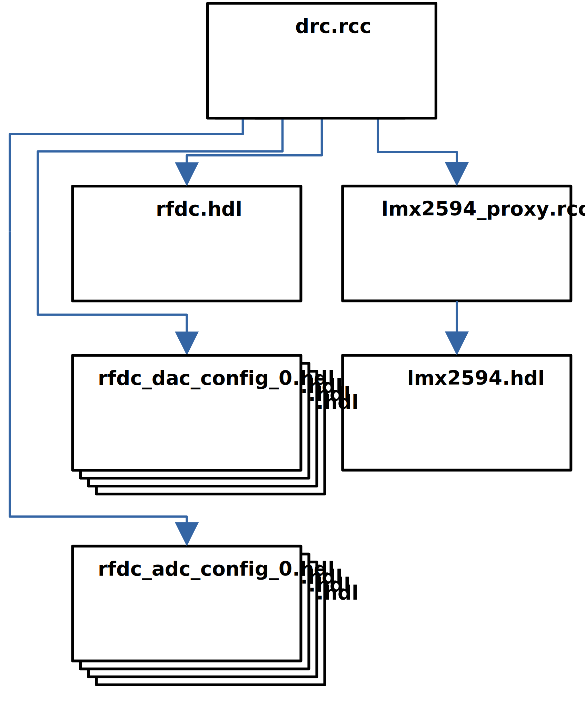
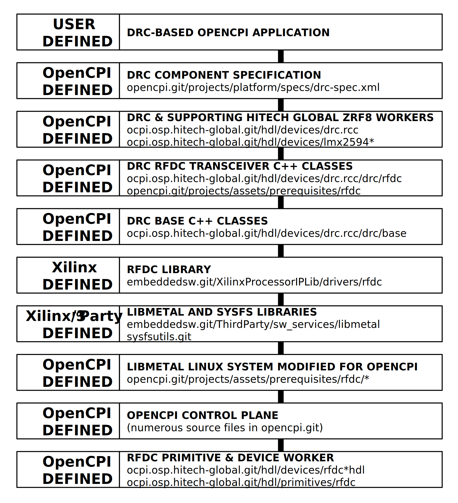
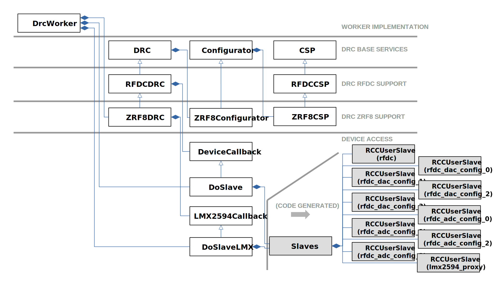

.. drc.rcc RCC worker

.. This file is protected by Copyright. Please refer to the COPYRIGHT file
   distributed with this source distribution.

   This file is part of OpenCPI <http://www.opencpi.org>

   OpenCPI is free software: you can redistribute it and/or modify it under the
   terms of the GNU Lesser General Public License as published by the Free
   Software Foundation, either version 3 of the License, or (at your option) any
   later version.

   OpenCPI is distributed in the hope that it will be useful, but WITHOUT ANY
   WARRANTY; without even the implied warranty of MERCHANTABILITY or FITNESS FOR
   A PARTICULAR PURPOSE. See the GNU Lesser General Public License for
   more details.

   You should have received a copy of the GNU Lesser General Public License
   along with this program. If not, see <http://www.gnu.org/licenses/>.

..

.. _drc.rcc-RCC-worker:

``drc.rcc`` RCC Worker
======================

Digital Radio Controller (DRC) for the Xilinx RF Data Converter on the HiTech Global ZRF8 (only the 48DR variant is currently supported).

Detail
------

The worker's slave relationships are shown below.

The top-down architecture of the RF Data Converter Architecture using the
Digital Radio Controller (DRC) control interface is shown below.
The worker is designed around the Xilinx RF Data Converter FPGA IP (v2.5) and
the rfdc software library which is added as an OpenCPI prerequisite.
This prerequisite exists in the rfdc branch of a fork of opencpi.git at the
time of writing this document. The OpenCPI support stack for the RF Data
Converter adapts both the RF Data Converter IP and the rfdc software library
to use the OpenCPI HDL worker control plane for register access.

A high-level, non-comprehensive C++ class diagram of the worker is shown below.

Tested Platforms
----------------
* xilinx21_1_aarch64 (RCC platform) and zrf8_48dr (platform of the HDL slaves)

.. ocpi_documentation_worker::

rfdc and libmetal Software Library Dependencies
~~~~~~~~~~~~~~~~~~~~~~~~~~~~~~~~~~~~~~~~~~~~~~~
The rfdc software library is added as an OpenCPI prerequisite to support
runtime configuration and access of the RF Data Converter. The libmetal
software library that is built-in ("in-tree") to the rfdc repo is used. The
OpenCPI prerequisite build scripts patch libmetal's "linux" system to forward
libmetal io accesses to callback methods, e.g., get_ushort_prop(), that are later
defined in this worker's DeviceCallback class which has access to the
control plane of HDL slave workers. These callback methods are declared
in the opencpi repo's rfdc prerequisite .patch file. The libmetal library has a
build dependency on sysfs, which is the usual libmetal method of retrieving
buildtime-embedded system information regarding the RF Data Converter. Because
OpenCPI has no such paradigm, i.e., OpenCPI FPGA builds will not produce any
device tree output that is readable by sysfs at OpenCPI runtime, this worker's
use of the rfdc/libmetal library bypasses sysfs entirely. By not calling the
XRFdc_Lookup_Config() API call, as is normally seen in rfdc examples, sysfs is
effectively bypassed. These are all critical design details that allow
the Xilinx RF Data Converter software and FPGA to interact in the standard
OpenCPI fashion.

RF Data Converter Sample Clocking
~~~~~~~~~~~~~~~~~~~~~~~~~~~~~~~~~
The HiTech Global ZRF8 uses an LMX2594 device to generate the sampling clock for
the RF data converter. The C++ classes herein use lmx2594_proxy.rcc slave to
effectively initialize the LMX2594 to have output rates of 3600 MHz for both its
outputs, which drive the various ADC/DAC clock inputs of the RF Data Converter FPGA IP.
Optionally, users can enter the filename of their own Analog Devices
TICS-Pro-generated file via the tics_pro_filename property of this DRC worker,
which overrides the default LMX2594 3600 MHz.configuration, but this is not
recommended as it could invalidate clock rate assumptions that are hardcoded
within the ZRF8DRC-related C++ classes.
Note that the RF Data Converter IP instances
decimators/interpolators for all interfaces with a factor of 40, so the
effective sampling rate exposed to the OpenCPI data plane is 90 Msps.
Care is taken to ensure LMX2594 initialization occurs according to the RF Data
Converter requirements, especially with respect to RF Data Converter FPGA
IP AXI-Lite and AXI-Stream reset ordering. A good indication that the RF Data
Converter IP has a good clock configuration and fully completed its
Power-On Reset (POR) sequence is the worker runtime logs indicating a POR
state (denoted as st in the log below) of 15 for all relevant tiles.
The log is in the format "[DEBUG] rfdc <adc/dac> tl<tile#> <config> <value>"::

  [INFO] rfdc XRFdc_CfgInitialize
  [INFO] rfdc XRFdc_GetIPStatus
  [DEBUG] rfdc d tl2 en 1
  [DEBUG] rfdc d tl2 st 15
  [DEBUG] rfdc d tl2 pu 1
  [DEBUG] rfdc d tl2 pl 0
  [DEBUG] rfdc d tl3 en 1
  [DEBUG] rfdc d tl3 st 15
  [DEBUG] rfdc d tl3 pu 1
  [DEBUG] rfdc d tl3 pl 0
  [DEBUG] rfdc a tl0 en 1
  [DEBUG] rfdc a tl0 st 15
  [DEBUG] rfdc a tl0 pu 1
  [DEBUG] rfdc a tl0 pl 0
  [DEBUG] rfdc a tl1 en 1
  [DEBUG] rfdc a tl1 st 15
  [DEBUG] rfdc a tl1 pu 1
  [DEBUG] rfdc a tl1 pl 0
  [DEBUG] rfdc a tl2 en 1
  [DEBUG] rfdc a tl2 st 15
  [DEBUG] rfdc a tl2 pu 1
  [DEBUG] rfdc a tl2 pl 0
  [DEBUG] rfdc a tl3 en 1
  [DEBUG] rfdc a tl3 st 15
  [DEBUG] rfdc a tl3 pu 1
  [DEBUG] rfdc a tl3 pl 0

Logging
~~~~~~~
At runtime, the worker displays an initial cache of the RF Data Converter
configurations, per RF port. Some settings are set as constants in the C++ code
and some are read from RF Data Converter registers::

    [INFO] cache[J13][direction]          = tx
    [INFO] cache[J13][tuning_freq_MHz]    = 390.950000
    [INFO] cache[J13][bandwidth_3dB_MHz]  = 90.000000
    [INFO] cache[J13][sampling_rate_Msps] = 90.000000
    [INFO] cache[J13][samples_are_complex]= true
    [INFO] cache[J13][gain_mode]          = manual
    [INFO] cache[J13][gain_dB]            = 0.000000
    [INFO] cache[J18][direction]          = rx
    [INFO] cache[J18][tuning_freq_MHz]    = 390.950000
    [INFO] cache[J18][bandwidth_3dB_MHz]  = 90.000000
    [INFO] cache[J18][sampling_rate_Msps] = 90.000000
    [INFO] cache[J18][samples_are_complex]= true
    [INFO] cache[J18][gain_mode]          = manual
    [INFO] cache[J18][gain_dB]            = 0.000000
    [INFO] cache[J20][direction]          = rx
    [INFO] cache[J20][tuning_freq_MHz]    = 390.950000
    [INFO] cache[J20][bandwidth_3dB_MHz]  = 90.000000
    [INFO] cache[J20][sampling_rate_Msps] = 90.000000
    [INFO] cache[J20][samples_are_complex]= true
    [INFO] cache[J20][gain_mode]          = manual
    [INFO] cache[J20][gain_dB]            = 0.000000
    [INFO] cache[J3][direction]          = tx
    [INFO] cache[J3][tuning_freq_MHz]    = 20.000000
    [INFO] cache[J3][bandwidth_3dB_MHz]  = 90.000000
    [INFO] cache[J3][sampling_rate_Msps] = 90.000000
    [INFO] cache[J3][samples_are_complex]= true
    [INFO] cache[J3][gain_mode]          = manual
    [INFO] cache[J3][gain_dB]            = 0.000000

At runtime, the worker logs every API call that is made to the underlying
Xilinx rfdc software library. Examples of this are as follows::

    [INFO] rfdc XRFdc_CfgInitialize
    [INFO] rfdc XRFdc_GetIPStatus
    [INFO] rfdc XRFdc_GetMixerSettings
    [INFO] rfdc XRFdc_CheckTileEnabled

RF Port Configuration
---------------------
An excerpt of an example application XML which successfully started TX configuration for the HiTech Global J13 TX RF port is as follows::

    <instance component='ocpi.platform.drc'>
      <property name='configurations'
          value="{description first,
          channels {{rx false,
          tuning_freq_MHz 390.95,
          bandwidth_3dB_MHz 90,
          sampling_rate_Msps 90,
          samples_are_complex true,
          gain_mode manual,
          gain_dB 0,
          tolerance_tuning_freq_MHz 0.01,
          tolerance_sampling_rate_Msps 0.01,
          tolerance_gain_dB 1,
          rf_port_name J13}}}">
      </property>
      <property name='start' value='0'/>
    </instance>

The corresponding runtime log is as follows::

    [INFO] lock SUCCEEDED for rf_port_name: J13 for config: direction for value: 1
    [INFO] lock SUCCEEDED for rf_port_name: J13 for config: tuning_freq_MHz for value: 390.95 w/ tolerance: +/- 0.01
    [INFO] lock SUCCEEDED for rf_port_name: J13 for config: bandwidth_3dB_MHz for value: 90 w/ tolerance: +/- 0
    [INFO] lock SUCCEEDED for rf_port_name: J13 for config: sampling_rate_Msps for value: 90 w/ tolerance: +/- 0.01
    [INFO] lock SUCCEEDED for rf_port_name: J13 for config: samples_are_complex for value: 1
    [INFO] lock SUCCEEDED for rf_port_name: J13 for config: gain_mode for value: 1
    [INFO] lock SUCCEEDED for rf_port_name: J13 for config: gain_dB for value: 0 w/ tolerance: +/- 1
    [INFO] rf_port_name J13 met lock requirements
    [INFO] request lock 0 succeeded

The configurations property must always be set according to the constrained ranges of the table below.

+--------------------------------------+--------+------------------------------+-----------------------------------+-----------------------------------------------+
| DRC API call                         | Data   | Constraint Satisfaction      | Underlying API call (ref 1.)      | Constrained                                   |
|                                      | Stream | Problem Variable             |                                   | Range(s)                                      |
|                                      | ID     |                              |                                   |                                               |
+======================================+========+==============================+===================================+===============================================+
| RFDCDRC::set_direction()             | rx1    | rfdc_dir_rx1                 | N/A                               | 0 (rx)                                        |
+--------------------------------------+--------+------------------------------+-----------------------------------+-----------------------------------------------+
| RFDCDRC::set_direction()             | rx2    | rfdc_dir_rx2                 | N/A                               | 0 (rx)                                        |
+--------------------------------------+--------+------------------------------+-----------------------------------+-----------------------------------------------+
| RFDCDRC::set_direction()             | tx1    | rfdc_dir_tx1                 | N/A                               | 1 (tx)                                        |
+--------------------------------------+--------+------------------------------+-----------------------------------+-----------------------------------------------+
| RFDCDRC::set_direction()             | tx2    | rfdc_dir_tx2                 | N/A                               | 1 (tx)                                        |
+--------------------------------------+--------+------------------------------+-----------------------------------+-----------------------------------------------+
| RFDCDRC::set_tuning_freq_MHz()       | rx1    | rfdc_fc_meghz_rx1            | N/A                               | 390.95 (ref 2./3.)                            |
+--------------------------------------+--------+------------------------------+-----------------------------------+-----------------------------------------------+
| RFDCDRC::set_tuning_freq_MHz()       | rx2    | rfdc_fc_meghz_rx2            | N/A                               | 390.95(ref 2./3.)                             |
+--------------------------------------+--------+------------------------------+-----------------------------------+-----------------------------------------------+
| RFDCDRC::set_tuning_freq_MHz()       | tx1    | rfdc_fc_meghz_tx1            | N/A                               | 20 (ref 2./3.)                                |
+--------------------------------------+--------+------------------------------+-----------------------------------+-----------------------------------------------+
| RFDCDRC::set_tuning_freq_MHz()       | tx2    | rfdc_fc_meghz_tx2            | N/A                               | 390.95 (ref 2./3.)                            |
+--------------------------------------+--------+------------------------------+-----------------------------------+-----------------------------------------------+
| RFDCDRC::set_bandwidth_3dB_MHz()     | rx1    | rfdc_bw_meghz_rx1            | N/A                               | 90 (ref 3.)                                   |
+--------------------------------------+--------+------------------------------+-----------------------------------+-----------------------------------------------+
| RFDCDRC::set_bandwidth_3dB_MHz()     | rx2    | rfdc_bw_meghz_rx2            | N/A                               | 90 (ref 3.)                                   |
+--------------------------------------+--------+------------------------------+-----------------------------------+-----------------------------------------------+
| RFDCDRC::set_bandwidth_3dB_MHz()     | tx1    | rfdc_bw_meghz_tx1            | N/A                               | 90 (ref 3.)                                   |
+--------------------------------------+--------+------------------------------+-----------------------------------+-----------------------------------------------+
| RFDCDRC::set_bandwidth_3dB_MHz()     | tx2    | rfdc_bw_meghz_tx2            | N/A                               | 90 (ref 3.)                                   |
+--------------------------------------+--------+------------------------------+-----------------------------------+-----------------------------------------------+
| RFDCDRC::set_sampling_rate_Msps()    | rx1    | rfdc_fs_megsps_rx1           | N/A                               | 90 (ref 3.)                                   |
+--------------------------------------+--------+------------------------------+-----------------------------------+-----------------------------------------------+
| RFDCDRC::set_sampling_rate_Msps()    | rx2    | rfdc_fs_megsps_rx2           | N/A                               | 90 (ref 3.)                                   |
+--------------------------------------+--------+------------------------------+-----------------------------------+-----------------------------------------------+
| RFDCDRC::set_sampling_rate_Msps()    | tx1    | rfdc_fs_megsps_tx1           | N/A                               | 90 (ref 3.)                                   |
+--------------------------------------+--------+------------------------------+-----------------------------------+-----------------------------------------------+
| RFDCDRC::set_sampling_rate_Msps()    | tx2    | rfdc_fs_megsps_tx2           | N/A                               | 90 (ref 3.)                                   |
+--------------------------------------+--------+------------------------------+-----------------------------------+-----------------------------------------------+
| RFDCDRC::set_samples_are_complex()   | rx1    | rfdc_samps_comp_rx1          | N/A                               | 1                                             |
+--------------------------------------+--------+------------------------------+-----------------------------------+-----------------------------------------------+
| RFDCDRC::set_samples_are_complex()   | rx2    | rfdc_samps_comp_rx2          | N/A                               | 1                                             |
+--------------------------------------+--------+------------------------------+-----------------------------------+-----------------------------------------------+
| RFDCDRC::set_samples_are_complex()   | tx1    | rfdc_samps_comp_tx1          | N/A                               | 1                                             |
+--------------------------------------+--------+------------------------------+-----------------------------------+-----------------------------------------------+
| RFDCDRC::set_samples_are_complex()   | tx2    | rfdc_samps_comp_tx2          | N/A                               | 1                                             |
+--------------------------------------+--------+------------------------------+-----------------------------------+-----------------------------------------------+
| RFDCDRC::set_gain_mode()             | rx1    | rfdc_gain_mode_rx1           | N/A                               | 1 (manual)                                    |
+--------------------------------------+--------+------------------------------+-----------------------------------+-----------------------------------------------+
| RFDCDRC::set_gain_mode()             | rx2    | rfdc_gain_mode_rx2           | N/A                               | 1 (manual)                                    |
+--------------------------------------+--------+------------------------------+-----------------------------------+-----------------------------------------------+
| RFDCDRC::set_gain_mode()             | tx1    | rfdc_gain_mode_tx1           | N/A                               | 1 (manual)                                    |
+--------------------------------------+--------+------------------------------+-----------------------------------+-----------------------------------------------+
| RFDCDRC::set_gain_mode()             | tx2    | rfdc_gain_mode_tx2           | N/A                               | 1 (manual)                                    |
+--------------------------------------+--------+------------------------------+-----------------------------------+-----------------------------------------------+
| RFDCDRC::set_gain_dB()               | rx1    | rfdc_gain_db_rx1             | N/A                               | 0 (ref 2.)                                    |
+--------------------------------------+--------+------------------------------+-----------------------------------+-----------------------------------------------+
| RFDCDRC::set_gain_dB()               | rx2    | rfdc_gain_db_rx2             | N/A                               | 0 (ref 2.)                                    |
+--------------------------------------+--------+------------------------------+-----------------------------------+-----------------------------------------------+
| RFDCDRC::set_gain_dB()               | tx1    | rfdc_gain_db_tx1             | N/A                               | 0 (ref 2.)                                    |
+--------------------------------------+--------+------------------------------+-----------------------------------+-----------------------------------------------+
| RFDCDRC::set_gain_dB()               | tx2    | rfdc_gain_db_tx2             | N/A                               | 0 (ref 2.)                                    |
+--------------------------------------+--------+------------------------------+-----------------------------------+-----------------------------------------------+

References:

   1. rfdc API call, unless otherwise noted

   2. This is an existing limitation of the RFDCDRC C++ class implementation, and does not represent the limits of the underlying hardware.

   3. This is an existing limitation of the FPGA design that is built in buildtime (during Xilinx IP generation within the rfdc primitive), and does not represent the limits of the underlying hardware.

Troubleshooting
---------------

If a runtime log occurs that indicates "lock FAILED", the configurations
property was likely not set according to the contrained ranges described in
the above table. An example log output of a user requesting a tuning freq of
1000 MHz, which this radio is not capable of in the current configuration,
produces the following error::

    [INFO] lock SUCCEEDED for rf_port_name: J13 for config: direction for value: 1
    [INFO] lock FAILED for rf_port_name: J13 for config: tuning_freq_MHz for value: 1000 w/ tolerance: +/- 0.01
    [INFO] for rf_port_name J13: unlocking config direction
    [INFO] rf_port_name J13 did not meet requirements
    Exiting for exception: Code 0x17, level 0, error: 'Worker "drc" produced an error during the "start" control operation: config prepare request was unsuccessful, set OCPI_LOG_LEVEL to 8 (or higher) for more info'
