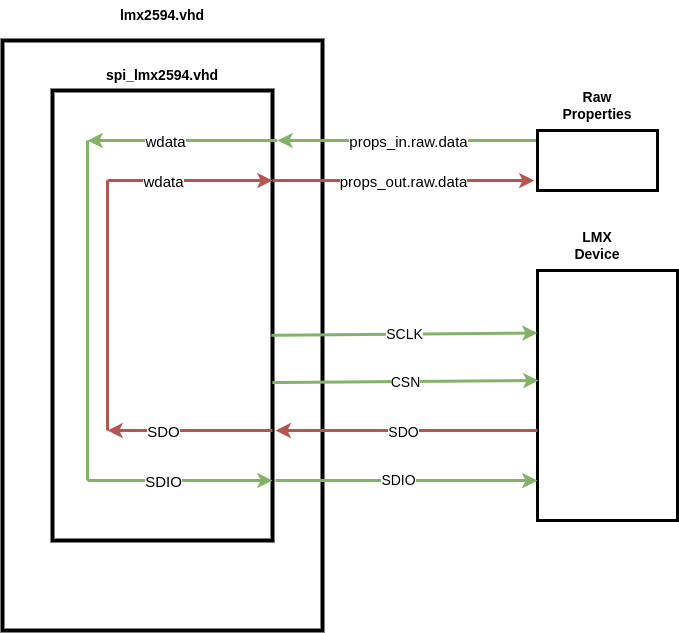
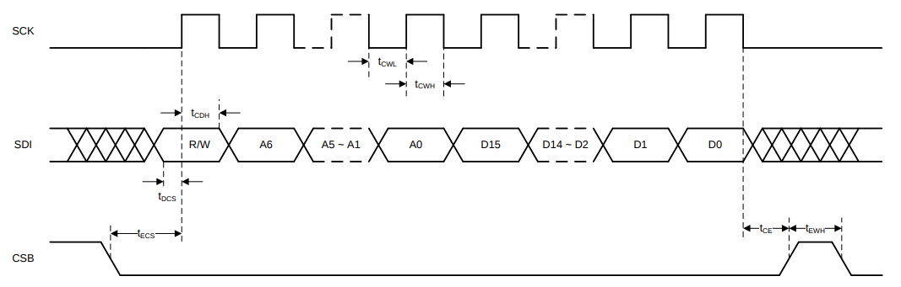
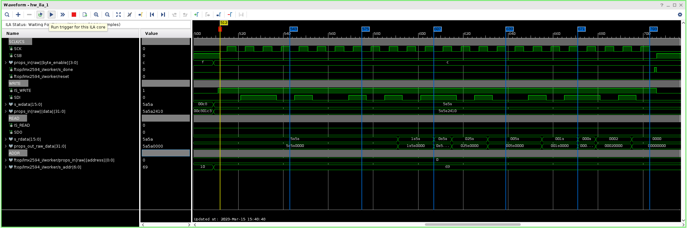
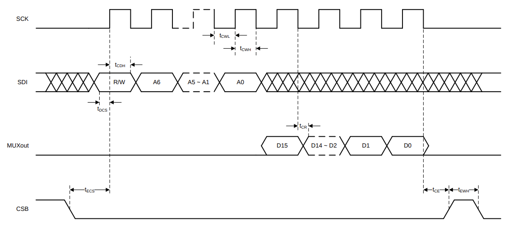
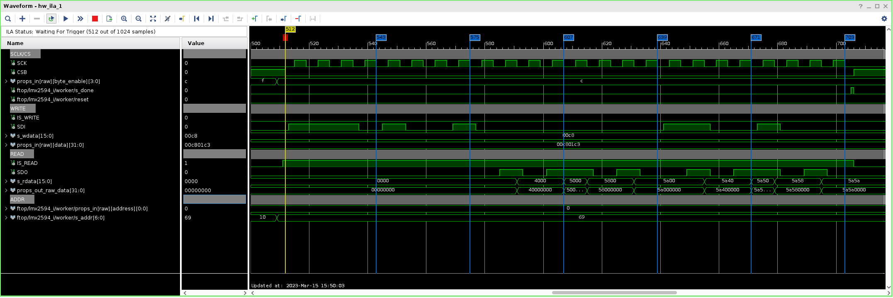

.. lmx2594 HDL worker

.. This file is protected by Copyright. Please refer to the COPYRIGHT file
   distributed with this source distribution.

   This file is part of OpenCPI <http://www.opencpi.org>

   OpenCPI is free software: you can redistribute it and/or modify it under the
   terms of the GNU Lesser General Public License as published by the Free
   Software Foundation, either version 3 of the License, or (at your option) any
   later version.

   OpenCPI is distributed in the hope that it will be useful, but WITHOUT ANY
   WARRANTY; without even the implied warranty of MERCHANTABILITY or FITNESS FOR
   A PARTICULAR PURPOSE. See the GNU Lesser General Public License for
   more details.

   You should have received a copy of the GNU Lesser General Public License
   along with this program. If not, see <http://www.gnu.org/licenses/>.

..

:orphan:

.. _lmx2594-HDL-worker:

``lmx2594`` HDL worker
======================

.. warning:: **CRITICAL WARNING:**

   This HDL Worker will be relocated to opencpi/projects/platform/hdl/devices to best support component reuse.

Device Worker for the Texas Instruments LMX2594 15-GHz Wideband PLLATINUM(TM) RF Synthesizer

- https://www.ti.com/lit/ds/symlink/lmx2594.pdf?ts=1678736304180&ref_url=https%253A%252F%252Fwww.ti.com%252Fproduct%252FLMX2594

Detail
------

Register Properties
^^^^^^^^^^^^^^^^^^^

The raw properties corresponding to the LMX2594 registers are directly connected to the ``rawprops`` interface. This is required to be connected to a separate SPI primitive that converts memory mapped reads and writes of the raw properties to SPI transfers to the device.

The ``spi_lmx2594.vhd`` is a modified version of the framework supplied ``./core/hdl/primitives/util/spi.vhd``. Modifications were made to the ``spi.vhd`` to satisfy the timing diagrams that are listed in the device data-sheet which are also provided below.

While property paramaters build-time configuration of the SPI clock rate and the Control Plane clock, only one configuration has been validated on hardware.

All 113 device registers are defined as type ``ushort``.

   - Registers R0 - R106: ``volatile`` and ``writable``

   - Registers 107 - 112: ``volatile`` only.

Due to the nature of ``ushort`` register types, the ``props_in.raw.byte_enable`` signal needed to be used. The ``props_in.raw.byte_enable`` is included when a raw property is less than 32 bits. The (4) byte enables for reading/writing bytes in the 32-bit data path of the control interface.

Device Initialization Sequence
------------------------------

The lmx2594 device worker must adhere to the **Recommended Initial Power-Up Sequence** provided by the datasheet. The Device Initialization sequence will be provided here for reference:

   #. Apply power to the device.

   #. Program RESET = 1 to reset registers

   #. Program RESET = 0 to remove reset.

   #. Program registers as shown in the register map in REVERSE order from highest to lowest.

   #. Wait 10 ms.

   #. Program register R0 one additional time with FCAL_EN = 1 to ensure that the VCO calibration runs from a stable state.

Block-Diagram
-------------

..

Control Timing and Signals
--------------------------

The device worker operates entirely in the control plane clock domain. All of the SPI signals are generated in the control plane domain.

Serial Data Input Timing Diagram:
^^^^^^^^^^^^^^^^^^^^^^^^^^^^^^^^^

..

**Write**: R/W bit must be set to 0.

**SDI**: The data on SDI pin is clocked into a shift register on each **rising edge** on the SCK pin.

ILA Write Waveform:
^^^^^^^^^^^^^^^^^^^

ocpihdl set 3 register_105 0x5A5A

..

Serial Data Readback Timing Diagram:
^^^^^^^^^^^^^^^^^^^^^^^^^^^^^^^^^^^^

..

**READ**: R/W bit must be set to 1.

**SDO/MUXout**: The data on SDO/MUXout pin is clocked into a shift register on each **falling edge** on the SCK pin.

**SDI**: The data portion of the transition on the SDI line is always ignored.

ILA Read Waveform
^^^^^^^^^^^^^^^^^

ocpihdl get 3 register_105

..

Utilization
-----------
