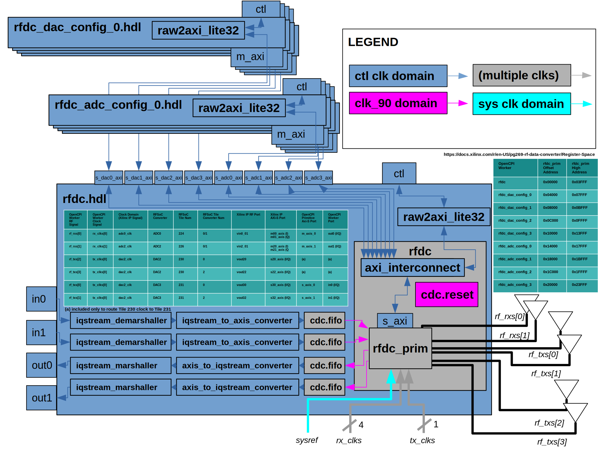

.. rfdc.hdl HDL worker

.. This file is protected by Copyright. Please refer to the COPYRIGHT file
   distributed with this source distribution.

   This file is part of OpenCPI <http://www.opencpi.org>

   OpenCPI is free software: you can redistribute it and/or modify it under the
   terms of the GNU Lesser General Public License as published by the Free
   Software Foundation, either version 3 of the License, or (at your option) any
   later version.

   OpenCPI is distributed in the hope that it will be useful, but WITHOUT ANY
   WARRANTY; without even the implied warranty of MERCHANTABILITY or FITNESS FOR
   A PARTICULAR PURPOSE. See the GNU Lesser General Public License for
   more details.

   You should have received a copy of the GNU Lesser General Public License
   along with this program. If not, see <http://www.gnu.org/licenses/>.

..

.. _rfdc.hdl-HDL-worker:

``rfdc.hdl`` HDL Worker
=======================
Xilinx RF Data Converter Device Worker.

Description
-----------
For a full top-down description of the RF Data Converter Architecture, see the drc.rcc worker documentation. A block diagram of this HDL device worker is shown below. The rf_tx and rf_rx device worker signals expose the RF ports. The rx_clks and tx_clks device worker signals ingest the externally-supplied converter clocks. An additional sysref clock is ingested as well. The rfdc HDL primitive wraps a fixed configuration of the Xilinx RF Data Converter IP.

.. ocpi_documentation_worker::

The Xilinx RF Data Converter (RFDC) has 3 generations (https://www.xilinx.com/products/intellectual-property/rf-data-converter.html). The following is a non-comprehensive list of capabilities:

#. Number of RF ADCs range from 0 to 16 (generation-dependent)
#. Number of RF DACs range from 0 to 16 (generation-dependent)
#. ADC number of sample bits ranges from 12 bits to 14 bits (generation-dependent)
#. DAC number of sample bits is 14
#. ADC RF direction conversion sampling rates vary and are up to 5.9 Gsps (generation-dependent) and are specified at build-time by the IP generator GUI
#. DAC RF direction conversion sampling rates vary and are up to 10 Gsps (generation-dependent) and are specified at build-time by the IP generator GUI
#. Digital decimation/interpolation rates range from 1x to 40x (generation-dependent)
#. Clock source/routing is complicated and the Xilinx IP generator GUI indicates valid/invalid configurations
#. ADCs and DACs are organized by tiles in a manner that adds significant complexity

Build Configurations
--------------------

This worker and its underlying rfdc primitive only support the following RFDC configuration(s):

* config 0

  * Generation 3 ZU48DR (xczu48dr-ffvg1517-2-e)
  * 2 I/Q ADCs (Tiles 224, 226)
  * 2 I/Q DACs (Tile 231)
  * 14-bit ADC (14-bit I, 14-bit Q, data alignment within 16-bit AXI-Stream interface is determined by Xilinx IP generation - see its documentation)
  * 14-bit DAC (14-bit I, 14-bit Q, data alignment within 16-bit AXI-Stream interface is determined by Xilinx IP generation - see its documentation)
  * ADC RF direction conversion sampling rate of 3.6 Gsps
  * DAC RF direction conversion sampling rate of 3.6 Gsps
  * Digital decimation/interpolation rate of 40x (3.6 Gsps / 40 = 90 Msps at AXI-Stream ports)
  * Digital complex mixer (fine frequency control) enabled for every converter (fixed at 390.95 MHz for rx1/rx2/tx2 and 20 for tx1)

Clock Domains
-------------
* ctl clock - the 100 MHz OpenCPI control plane clock that all AXI-Lite interfaces and ports within this worker operate at
* clk_90 clock - inside the rfdc HDL primitive, the RF Data Converter IP outputs a clock at a power-of-2-divided-rate of the sampling clock (3.6 Gsps/16 = 225 MHz) which then is passed through a Xilinx clock wizard IP to convert from a single 225 MHz clock output to a signal 90 MHz clock used for, and required by, all AXI-Stream ports, which is then crossed over to the ctl clock domain. Also note that all rfdc.vhd signals labelled rx_aclks or tx_aclks are actually the single clk_90 signal and clock domain
* sys clock - this clock is simply passed in from an external signal to the rfdc HDL primitive and its internal RF Data Converter IP
* 225 MHz clock - (not exposed external to the rfdc HDL primitive - see clk_90 description)

Resets
------
* ctl_in.reset - the active-high 100 MHz OpenCPI control plane reset which is used to reset the rfdc HDL primitive, and its internal RF Data Convert IP, AXI-Lite interface
* props_in.axis_resetn - an additional active-low 100 MHz OpenCPI control plane reset which is used asynchronously to keep the AXI-Stream ports (which are on the clk_90 domain) in reset longer according the Xilinx RF Data Converter IP Power-On Reset requirements related to the external sampling clock initialization
* clk_90_reset - active-high reset in the clk_90 domain used for all AXI-Stream ports of the rfdc HDL primitive and its internal RF Data Converter IP (erroneously labelled as std_logic_vector rx_aresets in rfdc.vhd which is really all a single reset)
* clk_90_reset_n - active-low version of clk_90 (erroneously labelled as std_logic_vector rx_aresetns in rfdc.vhd which is really all a single reset)

Constraints - IMPORTANT
-----------------------

This worker was designed and tested using the Xilinx-documented IP flow which creates a managed IP project and uses the output XCI file for integration into the final implementation phase that occurs within OpenCPI HDL assembly builds for Xilinx. This XCI file is exported during the rfdc HDL primitive build process, and contains constraints for all clocks related to the RF data converter IP. OpenCPI does not have a well-supported mechanism for exporting and including XCI files. See this project's hdl/assemblies directory for examples of how this XCI was included with custom build.tcl files which are imported into OpenCPI using its undocumented HdlPreOptHook GNU Make variable in assembly makefiles. By following this flow, users can see the Xilinx RF data converter clocks show up in the final static timing analysis report (assembly container.../target/.../timing.out is the file name at the time of writing this document).

Design Philosophy
-----------------

The rfdc.hdl worker contains a fixed number of WSI ports according to the previously mentioned ADC/DAC configuration(s). Future support for additional configuration(s) require detailed investigation of the common functionality, especially the clock configuration, and incorporating additional parameter properties (and mapping them to underlying rfdc primitive VHDL generics) and OpenCPI ports in the worker's component specification (and mapping them to underlying rfdc primitive AXI-Stream ports), and enabling the parameter-controlled configuration via a worker build.xml.

AXI-Lite Register Access
------------------------

The permissible address space per OpenCPI HDL worker has limited documentation. Because runtime exceptions were occurring when putting all possible Xilinx RFDC IP registers within the rfdc.hdl worker's property space, the IP address space was segmented in 16 KB segments across the following workers according to a similar segmentation within the RF Data Converter IP itself:

* rfdc.hdl
* rfdc_dac_config_0.hdl
* rfdc_dac_config_1.hdl
* rfdc_dac_config_2.hdl
* rfdc_dac_config_3.hdl
* rfdc_adc_config_0.hdl
* rfdc_adc_config_1.hdl
* rfdc_adc_config_2.hdl
* rfdc_adc_config_3.hdl

The overarching software in drc.rcc knows about this segmentation and forwards each libmetal register access to the proper HDL worker.

``rfdc`` HDL Primitive
======================
The primitive consists of a Makefile, Vivado TCL script, and a VHDL wrapper module and corresponding VHDL package. The following build steps are performed:

#. Create Xilinx Managed IP Project ("a special project for managing customizations and output products of specified IP" (https://docs.xilinx.com/r/en-US/ug896-vivado-ip/Using-Manage-IP-Projects) which is well-suited to wrapping Xilinx IP in OpenCPI HDL primitives).
#. Instance the Xilinx RF Data Converter IP
#. Configure the Xilinx RF Data Converter IP as previously mentioned
#. Export Xilinx RF Data Converter IP instantiation templates
#. Perform Xilinx RF Data Converter IP synthesis
#. Write Xilinx RF Data Converter IP VHDL stub file
#. Instance the Xilinx clock wizard IP
#. Configure the Xilinx clock wizard IP for 225 MHz to 90 MHz clock conversion
#. Export Xilinx clock wizard IP instantiation templates
#. Perform Xilinx clock wizard IP synthesis
#. Write Xilinx clock wizard IP VHDL stub file

The generic_pcie primitive was used as an example for Xilinx IP managed project creation and synthesis. 
The rfdc primitive contains a fixed number of AXI-Stream ports according to the previously mentioned configuration(s). Future support for additional configuration(s) requires highly detailed investigation of the common functionality, especially the clock configuration, and incorporating additional VHDL generics and/or AXI-Stream ports in the rfdc primitive.
The rfdc primitive instances a custom AXI-Lite interconnect that properly forwards the worker-segmented property spaces to the single AXI-Lite slave interface on the Xilinx IP module.
