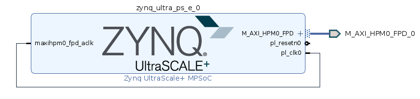
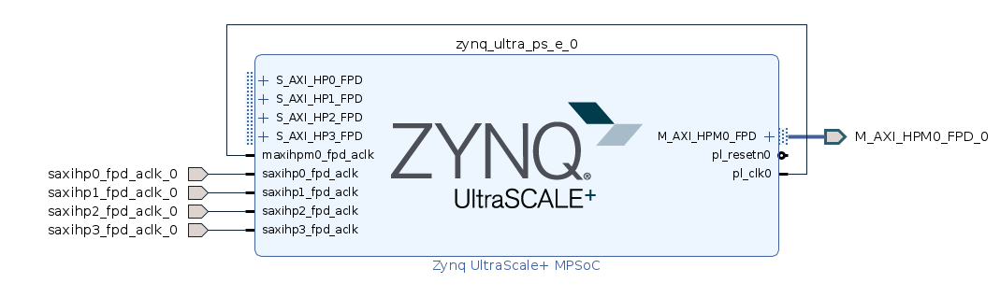

.. OpenCPI zrf8_48dr Developers Guide

.. This file is protected by Copyright. Please refer to the COPYRIGHT file
   distributed with this source distribution.

   This file is part of OpenCPI <http://www.opencpi.org>

   OpenCPI is free software: you can redistribute it and/or modify it under the
   terms of the GNU Lesser General Public License as published by the Free
   Software Foundation, either version 3 of the License, or (at your option) any
   later version.

   OpenCPI is distributed in the hope that it will be useful, but WITHOUT ANY
   WARRANTY; without even the implied warranty of MERCHANTABILITY or FITNESS FOR
   A PARTICULAR PURPOSE. See the GNU Lesser General Public License for
   more details.

   You should have received a copy of the GNU Lesser General Public License
   along with this program. If not, see <http://www.gnu.org/licenses/>.

.. _dev-OpenCPI zrf8_48dr Developers Guide:

OpenCPI zrf8_48dr Developers Guide
==================================

.. _dev-Introduction:

Introduction
------------

The OSP supports the following minimum requirement:

#. Control Plane via a single Master AXI High-Performance Memory Mapped port of the RFSoC

#. Data Plane via four Slave Streaming-AXI High-Performance ports of the RFSoC

#. Platform Configurations: ``base``

#. Several device/proxy workers to interface with devices that are external to the UltraScale+ RFSoC

#. Benchmarking:

   #. Control Plane (CP) ONLY verification on the zcu104

      - CP reference application, i.e. ``pattern_capture``

   #. Data Plane (DP) verification of the following on the zcu104

      - DP reference application, i.e. ``testbias``

.. _dev-Deliverables:

Deliverables
^^^^^^^^^^^^

#. An OpenCPI project named, ``ocpi.osp.hitech-global``

#. One OpenCPI Board Support Package (OSP)

   - HDL Platform named ``zrf8_48dr``, with an RCC platform dependency on ``xilinx21_1_aarch64``

#. Support of the HDL Control Plane, HDL Data Plane, and interfaces to various other devices in a manner that is comparable with the vendor provided SDR

#. Documentation

   - OpenCPI zrf8_48dr Getting Started Guide

   - OpenCPI zrf8_48dr Developers Guide (This Guide)

.. _dev-Prerequisites:

Prerequisites
^^^^^^^^^^^^^

#. **Knowledge**

   #. A working knowledge of the OpenCPI framework is a must. Its documentation is located at https://opencpi.gitlab.io/releases/. Close attention must be made to the following:

      - OpenCPI Platform Development Guide

      - OpenCPI Component Development Guide

      - Getting Started Guide for the ZCU104

   #. High-Tech Global ZRF8 Documentation - **The following documentation must be requested directly from Hitech Global**

      - HiTech-Global ZRF8 Users Guide

      - HiTech-Global ZRF8 Schematic

#. **Tools**

   #. Xilinx tools:

      - Vivado/SDK 2021.1

      - Petalinux: v2021.1

   #. OpenCPI FOSS framework, https://gitlab.com/opencpi/opencpi.git

.. _dev-Preview-of-the-concluding-directory-tree:

Preview of the concluding directory tree
^^^^^^^^^^^^^^^^^^^^^^^^^^^^^^^^^^^^^^^^

This guide requires the creation of many directories. A summary of those directories are provided below:

**Clone of OpenCPI FOSS framework**:

   ::

      /home/user/opencpi

   ..

**OpenCPI project repo directory for ZRF8**:

   ::

      /home/user/opencpi/projects/osps/ocpi.osp.hitech-global

   ..

**Vendor's reference design(s)**:

   ::

      /home/user/reference_design
      /home/user/zrf8_48dr_cp
      /home/user/zrf8_48dr_dp

   ..


**Petalinux directories**:

   ::

      /home/user/zrf8_48dr_cp/pl_core/build/htg-zrf8-rev3/pl_core/petalinux_cp
      /home/user/zrf8_48dr_dp/pl_core/build/htg-zrf8-rev3/pl_core/petalinux_dp

   ..

.. _dev-Design-Staging:

Design Staging
--------------

.. _dev-Take-inventory-of-the-target-board:

Take inventory of the target board
^^^^^^^^^^^^^^^^^^^^^^^^^^^^^^^^^^

**BACKGROUND:**

Per the OpenCPI Platform Development Guide, the target board was examined to identify the devices and interfaces that are required to support a functioning OSP. One of the main focuses of this phase is to identify the device(s) that will be used as an OpenCPI “container(s)”, which is where an application or portion of an application can be deployed. The interfaces between all devices are examined to determine if they are necessary for command/control or to transport payload data within an OSP. It is necessary to establish which device or interconnect to an external device serves as the “main processor”, and whose responsibility it is to perform system level functionality like, command/control, and possibly, transportation of payload data. This serves as an aid for determining the amount of work necessary to develop an OSP for the target platform.

**GOAL:**

- Identify container(s)

- Identify interface(s)

These items were sorted into the following categories based on their current support within the OpenCPI framework: **Yes, No, Partial.** For items where there is partial or no support, a research phase was conducted to ascertain the amount of development that is required to understand the level of support that is needed by the target platform. The “level of support” varies based on the configuration for a given device versus the requirements of the target platform. For example, although the digital interface of the Analog Devices transceiver may support LVDS and CMOS electrical standards, the target platform may implement support of only the LVDS standard, and therefore it may not be necessary to also enable support for CMOS. However, implementing support for CMOS standard could be added at a later time. This also highlights any additional requirement(s) for developing support for new tooling or other features that must be integrated into the OpenCPI framework to properly target the devices, such as FPGA build tools or software cross-compilers. In many cases, this initial investigation into the platform can be accomplished from vendor provided documentation, such as,  the User’s guide, board schematics and wiring diagrams. In cases where this documentation is insufficient, analysis must be performed with access to the board directly. However, it is also possible that not enough information can be gathered to successfully develop an OSP, but this should be determined upon the completion of the phases described above.

**IMPLEMENTATION:**

+---------------------------------+-------------------------------+------------------------------------+
| Tool/Device/Interface/Function  | Description                   | Framework Support (Yes/No/Partial) |
+=================================+===============================+====================================+
| T: FPGA build tools             | Xilinx Vivado 2021.1          | No                                 |
+---------------------------------+-------------------------------+------------------------------------+
| D: Xilinx XCZU48DR-FFVG1517-2-E | Zynq UltraScale+ RFSoC        | Yes                                |
+---------------------------------+-------------------------------+------------------------------------+
| D: Skyworks Si5341A             | Clock Generator               | No                                 |
+---------------------------------+-------------------------------+------------------------------------+
| D: TI LMX2594                   | Wideband Freq Synth           | No                                 |
+---------------------------------+-------------------------------+------------------------------------+
| D: VCC6-LAB-122M8800000         | I2C Programmable XO           | NO                                 |
+---------------------------------+-------------------------------+------------------------------------+
| D: DDR4                         | External Memory               | NO                                 |
+---------------------------------+-------------------------------+------------------------------------+
| D: XADC                         | Low Rate ADC                  | NO                                 |
+---------------------------------+-------------------------------+------------------------------------+
| D: Display Port                 | Video Monitor                 | NO                                 |
+---------------------------------+-------------------------------+------------------------------------+
| D: SATA                         | High Speed Serial             | NO                                 |
+---------------------------------+-------------------------------+------------------------------------+
| D: IRIG                         | GPS Sync                      | NO                                 |
+---------------------------------+-------------------------------+------------------------------------+
| I: Slots: FMC+                  | Slots for daughtercards       | Existing                           |
+---------------------------------+-------------------------------+------------------------------------+
| I: x8 PCI Express Gen3          | Interface                     | Partial                            |
+---------------------------------+-------------------------------+------------------------------------+
| I: GPIO                         | General Purpose I/O           | Existing (May require mods)        |
+---------------------------------+-------------------------------+------------------------------------+

.. _dev-Review-Vendor's-Reference-Design-Package:

Review Vendor's Reference Design Package
^^^^^^^^^^^^^^^^^^^^^^^^^^^^^^^^^^^^^^^^

**GOAL:**

- Allow the user to become familiar with the target board and its reference design package. By working through the reference design package, the user becomes comfortable with various tools, modifying source code, understanding the build flow (Vivado, Petalinux), creating a microSD card, loading the FPGA and running an application. The build flow steps captured during the review are heavily relied upon throughout much of this guide and its lessons-learned are used during the integration with OpenCPI.

   - Review its documentation and work though the reference designs that targets the processor and/or the FPGA.

   - (OPTIONAL) Verify that the reference design can be modified and rebuilt so that a value of a register is set at build-time and readback during run-time. Then build the bitstream, create an image via Petalinux, install the artifacts onto the ZRF8 and readback the custom register value.

**IMPLEMENTATION:**

#. Install and build reference design package

#. Review the vendor provided documentation, such as, but not limited to:

   #. HiTech-Global ZRF8 Users Guide

cpiadmin deploy platform xilinx21_1_aarch64 zrf8_48dr
   #. HiTech-Global ZRF8 Schematic

#. Run the various examples application(s)

#. Explore all that has been provided and make note of any special build or run time steps, which may be reused in the OpenCPI development flow:

   #. Building the bitstream

   #. Building the petalinux project

   #. Booting the ZRF8

   #. Setting up the microSD card

   #. Loading of the FPGA

   #. Runing Application(s)

#. (OPTIONAL) Once you have become familiar with the out-of-the-box reference design, convince yourself that you can edit the design by including a register for readback, which supports read/write or has a constant value. The details are left to the reader.

.. _dev-OpenCPI-Staging:

OpenCPI Staging
---------------

.. _dev-Install-the-framework:

Install the OpenCPI framework
^^^^^^^^^^^^^^^^^^^^^^^^^^^^^

**GOAL:**

- Install the OpenCPI Framework to use for development of the OSP

**IMPLEMENTATION:**

This Guide uses the following Framework branch and commit ID

   - `3420-support-for-rcc-platform-xilinx21_1_aarch64 <https://gitlab.com/opencpi/opencpi/-/tree/3420-support-for-rcc-platform-xilinx21_1_aarch64>`_

   - git commit ID - **cbcd6fa7fa477e72031181c997a5a666487b0eb9**

#. Clone the OpenCPI framework

   ``cd /home/user``

   ``git clone https://gitlab.com/opencpi/opencpi.git``

   ``cd opencpi``

   ``git checkout cbcd6fa7fa477e72031181c997a5a666487b0eb9``

#. Install the framework

   ``cd /home/user/opencpi/``

   ``./scripts/install-opencpi.sh --minimal``

.. _dev-Configure-a-host-terminal-for-OpenCPI-development:

Configure a host terminal for OpenCPI development
^^^^^^^^^^^^^^^^^^^^^^^^^^^^^^^^^^^^^^^^^^^^^^^^^

**GOAL:**

- As a convenience, below are the steps for configuring a Host terminal for the OpenCPI development environment

**IMPLEMENTATION:**

#. After the OpenCPI framework has been installed, source the OpenCPI framework setup script

   ``cd /home/user/opencpi``

   ``source cdk/opencpi-setup.sh -s``

#. Ensure that the environment is configured for the **desired version of Vivado** and its license file

   ``export OCPI_XILINX_VIVADO_VERSION=2021.1``

   ``env | grep OCPI``

   ::

      $ env | grep OCPI
      OCPI_TOOL_PLATFORM=centos7
      OCPI_PREREQUISITES_DIR=/home/user/opencpi/prerequisites
      OCPI_TOOL_OS_VERSION=c7
      OCPI_CDK_DIR=/home/user/opencpi/cdk
      OCPI_XILINX_VIVADO_VERSION=2021.1
      OCPI_ROOT_DIR=/home/user/opencpi
      OCPI_TOOL_OS=linux
      OCPI_TOOL_PLATFORM_DIR=/home/user/opencpi/project-registry/ocpi.core/exports/rcc/platforms/centos7
      OCPI_TOOL_ARCH=x86_64
      OCPI_TOOL_DIR=centos7

  ..

.. _dev-Modifications-to-the-Install-and-Deploy-scripts:

Modifications to the Install and Deploy scripts
^^^^^^^^^^^^^^^^^^^^^^^^^^^^^^^^^^^^^^^^^^^^^^^

**GOAL:**

- By default, the ``testbias`` (Control Plane + Data Plane) HDL assembly is built as part of the installation process for a given OSP, and this bitstream is included in the deployment of said OSP. The purpose of these modifications are to replace the ``testbias`` HDL assembly with the ``pattern_capture`` (Control Plane **ONLY**) HDL assembly  so that its bitstream is built, and the ``pattern_capture.xml`` application is deployed, thus making it the ``new`` default assembly and application for assessing the behavior of the Control Plane.

**IMPLEMENTATION:**

#. So that the Control Plane application (``pattern_capture.xml``) is included in the list of OASs that are exported to ``/home/user/opencpi/cdk/<rcc-platform>/sdcard*/opencpi/applications``, create a symbolic link within the ``/home/user/opencpi/projects/assets/applications/`` to ``pattern_capture.xml``

   ``cd /home/user/opencpi/projects/assets/applications/``

   ``ln -s pattern_capture/pattern_capture.xml ./pattern_capture.xml``

#. Edit the following scripts to target the assembly ``pattern_capture_asm``, rather than the ``testbias`` assembly:

   #. Edit the ``/home/user/opencpi/tools/scripts/export-platform-to-framework.sh`` to target ``pattern_capture_asm``

      FROM::

         tbz=projects/assets/exports/artifacts/ocpi.assets.testbias_${platform}_base.hdl.0.${platform}.bitz

      ..

      TO::

         tbz=projects/assets/exports/artifacts/ocpi.assets.pattern_capture_asm_${platform}_base.hdl.0.${platform}.bitz

      ..

   #. Edit the ``/home/user/opencpi/tools/scripts/ocpiadmin.sh`` to target ``pattern_capture_asm``

      FROM::

         ocpidev -d projects/assets build --hdl-platform=$platform hdl ${minimal:+--workers-as-needed} assembly testbias

      ..

      TO::

         ocpidev -d projects/assets build --hdl-platform=$platform hdl ${minimal:+--workers-as-needed} assembly pattern_capture_asm

      ..

      **AND**

      FROM::

         echo "HDL platform \"$platform\" built, with one HDL assembly (testbias) built for testing."

      ..

      TO::

         echo "HDL platform \"$platform\" built, with one HDL assembly (pattern_capture_asm) built for testing."

      ..

   #. Edit the ``/home/user/opencpi/tools/scripts/deploy-platform.sh`` to target ``pattern_capture_asm``

      FROM::

         cp $verbose -L ../projects/assets/hdl/assemblies/testbias/container-testbias_${hdl_platform}_base/target-*/*.bitz \
            $sd/opencpi/artifacts


      ..

      TO::

         cp $verbose -L ../projects/assets/hdl/assemblies/pattern_capture_asm/container-pattern_capture_asm_${hdl_platform}_base/target-*/*.bitz \
            $sd/opencpi/artifacts

      ..

.. _dev-Setup-the-Software-cross-compiler:

Setup the Software cross-compiler
^^^^^^^^^^^^^^^^^^^^^^^^^^^^^^^^^

**GOAL:**

- To establish the software cross-complier

- To setup the OpenCPI functionality of the ``ZynqReleases`` and ``git`` Xilinx directories

**IMPLEMENTATION:**

The following commands are outlined in the `OpenCPI Installation Guide <https://opencpi.gitlab.io/releases/latest/docs/OpenCPI_Installation_Guide.pdf>`_

#. Download the prebuilt Linux image for the ``zcu104`` board platform

#. Go to the `Xilinx Wiki page <https://xilinx-wiki.atlassian.net/wiki/spaces/A/pages/1884029195/2021.1+Release>`_

#. Navigate/scroll to the ``Downloads`` section of the page

#. Download the ``2021.1-zcu104-release.tar.xz``

#. Setup ``Xilinx/ZynqReleases/``

   ``sudo mkdir -p /opt/Xilinx/ZynqReleases/2021.1/``

   ``cd /home/user/Downloads``

   ``sudo cp 2021.1-zcu104-release.tar.xz /opt/Xilinx/ZynqReleases/2021.1``

   ``sudo chown -R <user>:users /opt/Xilinx/ZynqReleases``

   - Example: ``sudo chown -R smith:users /opt/Xilinx/ZynqReleases``

   - Note: This may require adjusting the permissions for ``/opt/Xilinx/ZynqReleases`` or its subdirectories

#. Setup ``Xilinx/git/``

   ``sudo mkdir -p /opt/Xilinx/git``

   #. Download ``linux-xlnx``

      ``cd ~/Downloads``

      ``git clone https://github.com/Xilinx/linux-xlnx.git``

      ``sudo cp -rf linux-xlnx /opt/Xilinx/git``

      ``sudo chown -R <user>:users /opt/Xilinx/git``

   #. Download ``u-boot-xlnx``

      ``cd ~/Downloads``

      ``git clone https://github.com/Xilinx/u-boot-xlnx.git``

      ``sudo cp -rf u-boot-xlnx /opt/Xilinx/git``

      ``sudo chown -R <user>:users /opt/Xilinx/git``

.. _dev-Install-xilinx21_1_aarch64-RCC-Platfrom:

Install and Deployment
^^^^^^^^^^^^^^^^^^^^^^

**GOAL:**

- To install and deploy the RCC Platform ``xilinx21_1_aarch64`` and the HDL Platform ``zcu104``

**IMPLEMENTATION:**

**Install: xilinx21_1_aarch64 (an RCC platform)**

   ``cd opencpi/``

   ``ocpiadmin install platform xilinx21_1_aarch64 --minimal``

**Install: zcu104 (an HDL platform)**

   ``cd opencpi/``

   ``ocpiadmin install platform zcu104 --minimal``

**Deploy: zcu104 with xilinx21_1_aarch64**

   ``ocpiadmin deploy platform xilinx21_1_aarch64 zcu104``

.. _dev-Benchmark-testing-the-OpenCPI-zcu104-OSP:

Benchmark testing the OpenCPI zcu104 OSP
^^^^^^^^^^^^^^^^^^^^^^^^^^^^^^^^^^^^^^^^

**GOAL:**

- Gain a benchmark understanding of the build-time and run-time utilities as they are performed for the HDL platform ``zcu104`` when paired with the RCC platform ``xilinx21_1_aarch64``.

**IMPLEMENTATION:**

#. Build ``known good`` HDL and RCC platforms to aid in the development of the OSP.

#. Understand the impact of the contents of the ``zcu104.exports`` file by reviewing the outputs of install/deploy of the ``zcu104``

#. Build the ``canary`` **Control Plane** (CP) HDL bitstreams and run its application

#. Build the ``canary`` **Data Plane** (DP) HDL bitstreams and run its application

#. Build the Component Unit Tests and run them on the ``zcu104`` to obtain benchmark performance metrics.

.. _dev-Create-an-OpenCPI-project-for-the-ZRF8:

Create an OpenCPI project for the ZRF8
^^^^^^^^^^^^^^^^^^^^^^^^^^^^^^^^^^^^^

**GOAL:**

- To create a skeleton project directory for the OSP and add to the project-registry

**IMPLEMENTATION:**

#. Create a project, under ``/home/user/opencpi/projects/osps``

   ``cd /home/user/opencpi/projects/osps/``

   ``ocpidev create project ocpi.osp.hitech-global``

   ``cd ocpi.osp.hitech-global``

#. Clean up the following files

   ``rm -rf project.xml``

   ``rm -rf project.rst``

#. Create a ``Makefile``:

  ::

      $(if $(realpath $(OCPI_CDK_DIR)),,\
        $(error The OCPI_CDK_DIR environment variable is not set correctly.))
        # This is the Makefile for the ocpi.osp.xilinx project.
      include $(OCPI_CDK_DIR)/include/project.mk

  ..

#. Create a ``Project.mk`` file:

   ::

      PackageName=osp.hitech-global
      PackagePrefix=ocpi
      ProjectDependencies=ocpi.platform ocpi.assets
      ComponentLibraries+=misc_comps util_comps dsp_comps comms_comps

   ..

#. Register the project

   ``ocpidev register project``

#. Confirm that the ``ocpi.osp.hitech-global`` project is registered

   ``ocpidev show registry``

   ::

      -----------------------------------------------------------------------------------------------------
      | Project Package-ID       | Path to Project                                         | Valid/Exists |
      | ------------------------ | ------------------------------------------------------- | ------------ |
      | ocpi.osp.hitech-global   | /home/user/opencpi/projects/osps/ocpi.osp.hitech-global | True         |
      | ocpi.core                | /home/user/opencpi/projects/core                        | True         |
      | ocpi.tutorial            | /home/user/opencpi/projects/tutorial                    | True         |
      | ocpi.assets              | /home/user/opencpi/projects/assets                      | True         |
      | ocpi.platform            | /home/user/opencpi/projects/platform                    | True         |
      | ocpi.assets_ts           | /home/user/opencpi/projects/assets_ts                   | True         |
      -----------------------------------------------------------------------------------------------------

   ..

#. Implement the ``zrf8_48dr`` part number ``xczu48dr`` in the ``/home/user/opencpi/tools/include/hdl/hdl-targets.xml`` file::

     <family name='zynq_ultra' toolset='vivado' default='xczu3cg-2-sbva484e'
              parts='xczu28dr xczu9eg xczu7ev xczu3cg xczu48dr'/>

   ..

#. The ``fmc_plus.xml`` card-spec has been provided in the ``ocpi.osp.hitech-global`` `repository <https://gitlab.com/opencpi/osp/ocpi.osp.hitech-global>`_. The ``fmc_plus.xml`` card-spec is located in the ``ocpi.osp.hitech-global/hdl/platforms/zrf8_48dr/guide``. Implement the ``fmc_plus.xml`` card-spec within the ``projects/core/hdl/cards/specs/`` directory.

   ``cp fmc_plus.xml /home/user/opencpi/projects/core/hdl/cards/specs``

   ``cd /home/user/opencpi/projects/core``

   ``ocpidev unregister project``

   ``ocpidev register project``

.. _dev-Enable-OpenCPI-HDL-Control-Plane:

Enable OpenCPI HDL Control Plane
-------------------------------

.. _dev-Configure-PS-for-CP:

Configure PS for CP
^^^^^^^^^^^^^^^^^^^

**GOAL:**

- Obtain a **Processing System** (PS) core IP which is precisely configured for the ``zrf8_48dr``, that will be wrapped and normalized for OpenCPI signaling and made available to be instanced in the Platform Worker. The steps to acheive this goal start by leveraging the ``zrf8_48dr`` vendor reference design to isolate the Processing System (PS) core IP's source code.

- Configure the PS core IP to enable and configure signals/ports, per the requirements of the OpenCPI HDL Control Plane control software for the Zynq UltraScale+ RFSoC devices:

   - Clock(s)

   - Reset(s)

   - An AXI Master interface - Memory mapping must match with that defined in ``HdlZynq.hh``

- The product of this section is the PS core IP HDL primitive that supports the Control Plane.

**IMPLEMENTATION:**

#. Be sure to have the Reference Design built and installed from the :ref:`dev-Review-Vendor's-Reference-Design-Package` section.

#. Create a copy of the reference design and create a ``Control-Plane`` only version ``zrf8_48dr_cp``

   ``cd /home/user``

   ``cp -rf <reference_design>/ ./zrf8_48dr_cp``

#. Open the ``zrf8_48dr_cp`` vivado project

   ``source /opt/Xilinx/Vivado/2021.1/settings64.sh``

   ``cd /home/user/zrf8_48dr_cp/pl_core/build/htg-zrf8-rev3/pl_core/``

   ``vivado pl_core.xpr``

#. Remove the following files from the ``Design Sources``

   #. ``axi_reg_if``

   #. ``pulse_converter``

#. ``Open Block Design``

#. Open the Block Design for editing

   #. Remove all modules except the Zynq UltraScale+ RFSoC IP ``zynq_ultra_ps_e_0``

   #. Remove all signals

   #. Edit the PS core IP (Double Click ``zynq_ultra_ps_e_0``):

      #. **Disable I2C**

         I/O Configuration -> Low-Speed -> I/O Periperals -> I2C -> I2C 0

      #. **Disable SPI**

         I/O Configuration -> Low-Speed -> I/O Peripherals -> SPI -> SPI 0

      #. **Disable TTC**

         I/O Configuration -> Low-Speed -> Processing Unit -> TTC -> TTC 3

      #. **Disable PL to PS Interrupts**

         PS-PL Configuration -> General -> Interrupts -> PL to PS -> IRQ0[0-7] -> 0

      #. **Disable the second Master Interface AXI HPM1 FPD:**

         PS-PL Configuration -> PS-PL Interfaces -> Master Interface -> AXI HPM1 FPD

      #. **Configure the Master Interface AXI HPMO FPD for 32 bit**

         PS-PL Configuration -> PS-PL Interfaces -> Master Interface -> AXI HPM0 FPD -> AX0 HPM1 FPD Data Width -> 32

      #. Click ``OK``

   #. Make a connection from ``pl_clk0`` to ``maxihpm0_fpd_aclk``

   #. Perform ``Regenerate Layout``

   #. Perform ``Validate Design (F6)``

   #. Externalize the ``M_AXI_HPM0_FDP`` port (Ctrl + t)

   #. Perform ``Validate Design (F6)`` -> Auto assign address -> Yes

   #. Edit the Address Editor to match the expected OpenCPI adrress as described here ``/home/user/opencpi/runtime/hdl/include/HdlZynq.hh`` (``M_HP0_PADDR 0xA800000``)

      #. Select the ``Address Editor`` ribbon

      #. Modify the ``M_AXI_HPM0_FPD_0`` Master Base Address to ``0x00_A800_0000``

      #. Re-validate the design ``Validate Design (F6)``

      #. Perform ``Flow Navigator window`` -> ``IP INTEGRATOR`` -> ``Generate Block Design`` -> ``Generate``

   #. In the ``Sources`` tab and ``Hierarchy`` view, expand the ``design_1_wrapper`` and right mouse click the ``design_1_i`` design and click ``Create HDL Wrapper`` -> OK

   #. Export an ``.xsa`` file

      - File -> Export -> Export Hardware...-> Next -> Pre-synthesis -> Finish

      - Leave the default export location ``pl_core``

#. Close Vivado

#. The Block Design should look as follows:



   ZRF8 PS Control Plane Block Design

..

.. _dev-Create-HDL-Primitive-for-CP:

Create HDL Primitive for CP
^^^^^^^^^^^^^^^^^^^^^^^^^^^

**GOAL:**

- Create an OpenCPI HDL primitive that wraps the Zynq UltraScale+ RFSoC PS core IP which has been configured per the settings of the ``ZRF8``. As the ``zcu104`` OpenCPI HDL Platform targets the same device family, its HDL primitive module is used as a reference implementation for this task.

**IMPLEMENTATION:**

**CODEBLOCK**: The code block for the various files that make up the HDL Primitive can be found in the following directory of the ocpi.osp.hitech-global repository:

   ::

      ocpi.osp.hitech-global/hdl/platforms/zrf8_48dr/guide/code-blocks/control-plane/primitives/

   ..

#. Setup terminal for OpenCPI development

   ``cd /home/user/opencpi``

   ``source cdk/opencpi-setup.sh -s``

   ``export OCPI_XILINX_VIVADO_VERSION=2021.1``

#. Create an OpenCPI HDL primitive library, named ``zynq_ultra_zrf8_48dr``

   ``cd projects/osps/ocpi.osp.hitech-global``

   ``ocpidev create hdl primitive library zynq_ultra_zrf8_48dr``

#. Create a ``primitives`` level Makefile

   ``cd <ocpi.osp.hitech-global/hdl/primitives/``

   ``cp /home/user/opencpi/projects/platform/hdl/primitives/Makefile ./``

#. Clean up the following files

   ``cd <ocpi.osp.hitech-global>/hdl/primitives/``

   ``rm -rf primitives.xml``

   ``rm -rf primitives.rst``

   ``rm -rf zynq_ultra_zrf8_48dr.xml``

   ``rm -rf zynq_ultra_zrf8_48dr.rst``

#. From the Vivado project modified in  :ref:`dev-Configure-PS-for-Control-Plane`, which is specific to using the vendor's reference design for configuring the PS core IP for the ``ZRF8``, browse to the generated artifacts directory, and copy them into the newly created OpenCPI HDL primitive library.

   ``cd /home/user/zrf8_48dr_cp/pl_core/build/htg-zrf8-rev3/pl_core/pl_core.gen/sources_1/bd/design_1/ip``

   ``cp -rf design_1_zynq_ultra_ps_e_0_0/ <ocpi.osp.hitech-global>/hdl/primitives/zynq_ultra_zrf8_48dr``

#. Since the ``zrf8_48dr`` is very similar to the ``zcu104``, simply copy and rename a couple files from the ``platform/hdl/primitive/zynq_ultra`` HDL primitive library into the ``zynq_ultra_zrf8_48dr`` and edit as needed.

   ``cd /home/user/opencpi/projects/platform/hdl/primitives/zynq_ultra/``

   ``cp zynq_ultra_pkg.vhd  <ocpi.osp.hitech-global>/hdl/primitives/zynq_ultra_zrf8_48dr/zynq_ultra_zrf8_48dr_pkg.vhd``

   ``cp zynq_ultra_ps.cpp_vhd <ocpi.osp.hitech-global>/hdl/primitives/zynq_ultra_zrf8_48dr/zynq_ultra_zrf8_48dr_ps.vhd``

#. Edit the HDL package ``zynq_ultra_zrf8_48dr_pkg.vhd``

   #. Change package name from ``zynq_ultra_pkg`` to ``zynq_ultra_zrf8_48dr_pkg``

   #. Reduce the number of Master ports that are supported from 2 to 1.

      From: ``constant C_M_AXI_HP_COUNT : natural := 2``

      To: ``constant C_M_AXI_HP_COUNT : natural := 1``

   #. Change primitive component name from ``zynq_ultra_ps`` to ``zynq_ultra_zrf8_48dr_ps``

   #. Comment out the ``s_axi_hp_in`` and ``s_axi_hp_out`` ports

      .. note::

	 These are for the Data Plane and will be added back into the design in a later section.

      ..

#. Edit the ``zynq_ultra_zrf8_48dr_ps.vhd``, to remove all C++ preprocessing code and to normalize the interface of the generated PS core IP to OpenCPI Control Plane signaling.

   .. note::

      This file edit is very intricate and in depth. As you read through this section it is encouraged that you use a comparison tool and compare the CODEBLOCK of this file (outlined at the top of this section) with the file that is currently in place in your project. This will give you the best overview of the step-by-step process in this section.

   ..

   #. Change library names from:

      from ``library zynq_ultra`` to ``library zynq_ultra_zrf8_48dr``

      from ``zynq_ultra.zynq_ultra_pkg.all`` to ``zynq_ultra_zrf8_48dr.zynq_ultra_zrf8_48dr_pkg.all``

   #. Change entity name:

      from ``zynq_ultra_ps`` to ``zynq_ultra_zrf8_48dr_ps``

   #. Comment out any lines containing:

      ``s_axi_hp_in``, ``s_axi_hp_out``

   #. Change architecture name:

      from ``zynq_ultra_ps`` to ``zynq_ultra_zrf8_48dr_ps``

   #. Change the component name:

      from ``PS8_WRAPPER_MODULE`` to ``design_1_zynq_ultra_ps_e_0_0``

   #. Remove the ``GENERIC`` ports:

   #. Remove all ports in the entity except for the following:

      #. ``maxihpm0_*``, ``saxihp0_*``, ``saxihp1_*``, ``saxihp2_*``, ``saxihp3_*``

      #. ``maxigp0_*``, ``saxigp2_*``, ``saxigp3_*``, ``saxigp4_*``, ``saxigp5_*``

      #. ``pl_resetn0``

      #. ``pl_clk0``

   #. Of the remaining ports in the entity, comment out the following  ports from the entity
      (these are for the Data Plane, and will be added back later):

      #. ``saxihp0_*``, ``saxihp1_*``, ``saxihp2_*``, ``saxihp3_*``

      #. ``saxigp2_*``, ``saxigp3_*``, ``saxigp4_*``, ``saxigp5_*``

   #. Replace the ``PS8_WRAPPER_MODULE`` that is in the architecture declaration and body with
      ``design_1_zynq_ultra_ps_e_0_0``

   #. In the ``PORT MAP`` perfrom the same removal and commenting as in the entity

      #. Remove the ``GENERIC`` ports

      #. Remove all ports in the entity except for the following:

         #. ``maxihpm0_*``, ``saxihp0_*``, ``saxihp1_*``, ``saxihp2_*``, ``saxihp3_*``

         #. ``maxigp0_*``, ``saxigp2_*``, ``saxigp3_*``, ``saxigp4_*``, ``saxigp5_*``

         #. ``pl_resetn0``

         #. ``pl_clk0``

   #. Of the remaining ports in the entity, comment out the following  ports from the entity
      (these are for the Data Plane, and will be added back later):

      #. ``saxihp0_*``, ``saxihp1_*``, ``saxihp2_*``, ``saxihp3_*``

      #. ``saxigp2_*``, ``saxigp3_*``, ``saxigp4_*``, ``saxigp5_*``

   #. All that should remain are the following ports:

      #. gm: for i in - to C_M_AXI_HP_COUNT-1 code block (Control Plane Ports)

      #. gs: for i in 0 to C_S_AXI_HP_COUNT-1 generate code block (Data Plane Ports)

      #. ``maxihpm0_fpd_aclk`` (Control Plane Clock - destination)

      #. ``maxigp0_*`` (Control Plane Ports)

      #. ``saxihp{0,1,2,3}_fpd_aclk`` (Data Plane Clocks - destination)

      #. ``saxigp{2,3,4,5}`` (Data Plane Ports)

      #. ``pl_resetn0``

      #. ``pl_clk0`` (Control Plane Clock - source)

   #. Of the remaining ports, the following ports listed should be commented out (these are for the
      Data Plane, and will be added back later)

      #. gs: for i in 0 to C_S_AXI_HP_COUNT-1 generate code block (Data Plane Ports)

      #. ``saxihp{0,1,2,3}_fpd_aclk`` (Data Plane Clocks)

      #. ``saxigp{2,3,4,5}`` (Data Plane Ports)

#. Create the primitive library's ``Makefile`` to specify all of the dependencies:

   ``ocpi.osp.hitech-global/hdl/primitives/zynq_ultra_zrf8_48dr/Makefile``

   ::

      Libraries=fixed_float ocpi axi sdp platform

      SourceFiles= \
          zynq_ultra_zrf8_48dr_pkg.vhd \
          zynq_ultra_zrf8_48dr_ps.vhd \
          design_1_zynq_ultra_ps_e_0_0/design_1_zynq_ultra_ps_e_0_0.dcp

      OnlyTargets=zynq_ultra

      include $(OCPI_CDK_DIR)/include/hdl/hdl-library.mk

   ..

.. _dev-Build-HDL-Primitive-for-CP:

Build HDL Primitive for CP
^^^^^^^^^^^^^^^^^^^^^^^^^^

**GOAL:**

- Build the HDL Primitive that is instanced in the HDL Platform Worker

**IMPLEMENTATION:**

#. Return to the top of the project

   ``cd /home/user/opencpi/projects/osps/ocpi.osp.hitech-global``

#. Build the primitive library

   ``ocpidev build --hdl-target zynq_ultra``

   ::

      $ ocpidev build --hdl-target zynq_ultra
      No HDL platforms specified. No HDL assets will be targeted.
      Possible HdlPlatforms are: alst4 alst4x isim matchstiq_z1 ml605 modelsim picoevb x4sim xsim zcu104 zcu106 zed zed_ether zed_ise.
      Setting up exports
      :
      :
      :
      :
      :
      ============== For library zynq_ultra_zrf8_48dr:
      Building the zynq_ultra_zrf8_48dr library for zynq_ultra (target-zynq_ultra/zynq_ultra_zrf8_48dr) 0:()
       Tool "vivado" for target "zynq_ultra" succeeded.  0:00.02 at 10:53:39
      Creating directory ../lib/zynq_ultra_zrf8_48dr for library zynq_ultra_zrf8_48dr
      No previous installation for gen/zynq_ultra_zrf8_48dr.libs in ../lib/zynq_ultra_zrf8_48dr.
      Installing gen/zynq_ultra_zrf8_48dr.libs into ../lib/zynq_ultra_zrf8_48dr
      No previous installation for target-zynq_ultra/zynq_ultra_zrf8_48dr.sources in target-zynq_ultra/zynq_ultra_zrf8_48dr.
      Installing target-zynq_ultra/zynq_ultra_zrf8_48dr.sources into target-zynq_ultra/zynq_ultra_zrf8_48dr
      No previous installation for target-zynq_ultra/zynq_ultra_zrf8_48dr in ../lib/zynq_ultra_zrf8_48dr/zynq_ultra.
      Installing target-zynq_ultra/zynq_ultra_zrf8_48dr into ../lib/zynq_ultra_zrf8_48dr/zynq_ultra

   ..

.. _dev-Create-HDL-Platform-Worker-for-CP:

Create HDL Platform Worker for CP
^^^^^^^^^^^^^^^^^^^^^^^^^^^^^^^^^

**CODEBLOCK:** The code block for the various files that make up the HDL platform worker can be found in the following directory of the ocpi.osp.hitech-global repository:::

   ocpi.osp.hitech-global/hdl/platforms/zrf8_48dr/guide/code-blocks/control-plane/platforms/

..

#. Create HDL Platform Worker

   ``cd opencpi/projects/osps/ocpi.osp.hitech-global``

   ``ocpidev create hdl platform zrf8_48dr``

#. Change directory to HDL Platform Worker

   ``cd hdl/platforms/zrf8_48dr``

#. Copy ``zcu104.xml`` into the ``zrf8_48dr`` platform worker directory and rename it ``zrf8_48dr.xml``

   ``cp /home/user/opencpi/projects/platform/hdl/platforms/zcu104/zcu104.xml ./zrf8_48dr.xml``

#. Edit the newly created ``zrf8_48dr.xml``

   #. Change all references of ``zcu104`` to ``zrf8_48dr``

   #. Delete all ``specproperty`` elements except for ``platform``, i.e. delete nLEDS, nSlots,
      nSwitches, slotNames.

   #. Comment out the Scalable-Data Plane interface, i.e. ``<sdp name=...>```

   #. Delete Property: ``useGP1``

   #. Comment out debug Properties: ``axi_error``, ``sdpDropCount``, ``debug_state``,
      ``debug_state1``, and ``debug_state2``

   #. Remove all signals

   #. Remove the slot declaration(s) and associated signals and comments

#. Copy ``zcu104.vhd`` into the zrf8_48dr platform worker directory and rename it ``zrf8_48dr.vhd``

   ``cp /home/user/opencpi/projects/platform/hdl/platform/zcu104/zcu104.vhd ./zrf8_48dr.vhd``

#. Edit the newly created ``zrf8_48dr.vhd``

   #. Comment out Library: ``platform``

   #. Change Library: ``zynq_ultra`` to ``zynq_ultra_zrf8_48dr``

   #. Change: ``zynq_ultra.zynq_ultra_pkg.all`` to ``zynq_ultra_zrf8_48dr.zynq_ultra_zrf8_48dr_pkg.all``

   #. Comment out Library: ``bsv`` and ``sdp``

   #. Change architecture: ``zcu104_worker`` to ``zrf8_48dr_worker``

   #. Remove ``whichGP`` comments and constant

   #. Comment out the following signals:

      ``ps_s_axi_hp_in``, ``ps_s_axi_hp_out``, ``rst_n``, ``my_sdp_out``, ``my_sdp_out_data``,
      ``dbg_state``, ``dbg_state1``, ``dbg_state2``

   #. Remove signals: ``count`` ``ledbuf`` and ``cnt_t``

   #. Change ``ps : zynq_ultra_ps`` to ``ps : zynq_ultra_zrf8_48dr_ps``

   #. Remove the ``useGP1`` comments

   #. Change: ``ps in.debug => (31 => useGP1, others => '0'),`` to ``ps in.debug => (others => '0'),``

   #. Comment out connections: ``s_axi_hp_in``, ``s_axi_hp_out``, ``zynq_ultra_out``,
      ``zynq_ultra_out_data``, ``props_out.sdpDropCount``

   #. Change : ``ps_m_axi_gp_out(whichGP)`` to ``ps_m_axi_gp_out(0)``

   #. Change : ``ps_m_axi_gp_in(whichGP)`` to ``ps_m_axi_gp_in(0)``

   #. Comment out the ``sdp2axi`` adapter module

   #. Remove connections: ``props_out.switches``, ``leds``

   #. Remove the comments and ``process`` associated with driving the LEDS

#. Create a constraints files named ``zrf8_48dr.xdc`` and add the following clock constraint

   ::

      # OpenCPI additions to the above, which is unmodified from the original

      create_clock -name clk_fpga_0 -period 10.000 [get_pins -hier * -filter {NAME =~ /ps/U0/inst/PS8_i/PLCLK[0]}]
      set_property DONT_TOUCH true [get_cells "ftop/pfconfig_i/zrf8_48dr_i/worker/ps/U0/inst/PS8_i"]

   ..

#. Copy the ``zcu104/Makefile`` to ``zrf8_48dr/Makefile`` and edit it such that its contents match the provided CODE BLOCK

   ``cd ocpi.osp.hitech-global/hdl/platforms/zrf8_48dr``

   ``cp opencpi/projects/platform/hdl/platform/zcu104/Makefile ./``

      ::

         # The zrf8_48dr platform.
         Libraries=zynq_ultra_zrf8_48dr axi sdp
         Configuration=base
         OnlyTargets=zynq_ultra

         include $(OCPI_CDK_DIR)/include/hdl/hdl-platform.mk

      ..


#. Copy/rename the ``zcu104/zcu104.mk`` to ``zrf8_48dr/zrf8_48dr.mk`` and edit it such that its contents match the provided CODE BLOCK

   ``cp /home/user/opencpi/projects/platforms/hdl/platforms/zcu104/zcu104.mk ./zrf8_48dr.mk``

      ::

         HdlPart_zrf8_48dr=xczu48dr-2-ffvg1517e
         HdlRccPlatform_zrf8_48dr=xilinx21_1_aarch64

      ..

#. Copy/rename the ``zcu104/zcu104.exports`` to ``zrf8_48dr/zrf8_48dr.exports`` and edit it such that its contents match the provided CODE BLOCK

   ``cp /home/user/opencpi/projects/platforms/hdl/platforms/zcu104/zcu104.exports ./zrf8_48dr.exports``

      ::

         # Development files for building for this platform
         +<platform_dir>/zrf8_48dr.xdc
         +<platform_dir>/zrf8_48dr_bit.xdc
         =<platform_dir>/sd_card/system.xml

         # Udev rules for runtime on dev host
         # They are always placed in the udev-rules subdir in the runtime packages
         =<platform-dir>/98-zrf8_48dr.rules udev-rules/

         # Assume that all the boot files are in the software platforms for now
         @<platform-dir>/sd_card/system.xml opencpi/
         @<platform-dir>/sd_card/artifacts/image.ub /
         @<platform-dir>/sd_card/artifacts/rootfs.tar.gz /

      ..


#. Copy/rename the ``zcu104/98-zcu104.rules`` to ``zrf8_48dr/98-zrf8_48dr.rules`` and edit such that its contents match the provided CODE BLOCK

   ``cp /home/user/opencpi/projects/platforms/hdl/platforms/zcu104/98-zcu104.rules ./98-zrf8_48dr.rules``

      ::

         UBSYSTEM=="tty" ATTRS{product}=="Cypress-USB2UART-*" SYMLINK+="z3u%n" MODE:="0666"

      ..

#. Create a ``zrf8_48dr_bit.xdc``, which is to remain empty.

   .. note::

      When this file is void of contents, it signifies to Vivado that all defaults project settings are acceptable.

   ..

#. Create an ``sd_card`` directory

   #. ``mkdir sd_card``

   #. ``cp /home/user/opencpi/platforms/zynq/zynq_system.xml ./sd_card/system.xml``

   #. Edit the file to look like the following::

         <opencpi>
             <container>
                 <rcc load='1'/>
                 <remote load='1'/>
                 <hdl load='1'>
                     <device name='PL:0' platform='zrf8_48dr'/>
                 </hdl>
             </container>
             <transfer smbsize='128K'>
                 <pio load='1' smbsize='10M'/>
                 <dma load='1'/>
                 <socket load='1'/>
             </transfer>
         </opencpi>

   ..

.. _dev-Build-HDL-Platform-Worker-for-CP:

Build HDL Platform Worker for CP
^^^^^^^^^^^^^^^^^^^^^^^^^^^^^^^^

**GOAL:**

- Build the HDL Platform Worker and ``base`` Platform Configuration

- Verify that the HDL platform is recognized by the framework

**IMPLEMENTATION:**

#. **Build the HDL platform zrf8_48dr**

   ``cd /home/user/opencpi/projects/osps/ocpi.osp.hitech-global``

   ``ocpidev build --hdl-platform zrf8_48dr --rcc-platform xilinx21_1_aarch64``

#. Confirm that the zrf8_48dr is recognized by the framework as a valid HDL platform target:

   ``ocpidev show platforms``

   ::

      | -----------------------------------------------------------------------------------------------------------------------------------------
      | Platform            | Type | Package-ID                                 | Target              | HDL Part                   | HDL Vendor |
      | ------------------ -| ---- | ------------------------------------------ | ------------------- | -------------------------- | ---------- |
      | centos7             | rcc  | ocpi.core.platforms.centos7                | linux-c7-x86_64     | N/A                        | N/A        |
      | xilinx21_1_aarch64  | rcc  | ocpi.core.platforms.xilinx21_1_aarch64     | linux-18_3-aarch64  | N/A                        | N/A        |
      | zrf8_48dr           | hdl  | ocpi.osp.hitech-global.platforms.zrf8_48dr | zynq_ultra          | xczu3eg-1-sbva484i         | xilinx     |
      | zcu104              | hdl  | ocpi.platform.platforms.zcu104             | zynq_ultra          | xczu7ev-2-ffvc1156e        | xilinx     |
      | -----------------------------------------------------------------------------------------------------------------------------------------

   ..

.. _dev-Install-the-HDL-Platform-zrf8_48dr-for-CP:

Install the HDL Platform zrf8_48dr for CP
^^^^^^^^^^^^^^^^^^^^^^^^^^^^^^^^^^^^^^^^^

**GOAL:**

- The goal of this section is to **install** the ``zrf8_48dr`` HDL Platform.

- Installation of the ``ZRF8`` includes building the HDL Container (i.e. bitstream) for verifying
  the Control Plane.

**IMPLEMENTATION:**

With all previous :ref:`dev-Enable-OpenCPI-HDL-Control-Plane` sections complete, the ``zrf8_48dr`` HDL and ``xilinx21_1_aarch64``  RCC platform can now be installed and deployed.

#. Browse to top of the OpenCPI directory

   ``cd /home/user/opencpi``

#. Setup terminal for OpenCPI development

   ``source ./cdk/opencpi-setup.sh -s``

   ``export OCPI_XILINX_VIVADO_VERSION=2021.1``

#. **Install: zrf8_48dr (an HDL platform)**

   ``ocpiadmin install platform zrf8_48dr --minimal``

.. _dev-Petalinux-workspace-for-CP:

Petalinux workspace for CP
^^^^^^^^^^^^^^^^^^^^^^^^^^

**GOAL:**

- The following `Petalinux Tools Documentation Reference Guide (UG1144) <https://docs.xilinx.com/r/2021.1-English/ug1144-petalinux-tools-reference-guide>`_ describes the commands and build flow that will be utilized in this section. These steps can be revisted, and will allow consequent bitstreams to be "spot checked".

- Successful completion of this section is a bootable SD-card image utilizing the Petalinux utility

**IMPLEMENTATION:**

#. Source Petalinux 2021.1

   ``source /opt/Xilinx/Petalinux/2021.1/settings.sh``

#. Create a petalinux project directory for Control-Plane (cp)

   ``cd /home/user/zrf8_48dr_cp/pl_core/build/htg-zrf8-rev3/pl_core/``

   ``petalinux-create -t project --template zynqMP --name "petalinux_cp"``

#. **Complete the** :ref:`dev-Petalinux-Fix-for-ZRF8` **section**

#. Import the Hardware Configuration that was exported from the Vivado project. This is the ``*.xsa`` file that was created during the  File → Export → Export Hardware step.

   ``cd /home/user/zrf8_48dr_cp/pl_core/build/htg-zrf8-rev3/pl_core/petalinux_cp/``

   ``petalinux-config --get-hw-description=../``

#. Once the ``/misc/config`` System Configuration GUI is present in the terminal, continue by: Exit -> Yes

   #. If you are presented with: ``Error: Incompatible SDK installer! Your host gcc version is 4.8 and this SDK was built by gcc higher version.``, this can be fixed with the following

       ``Yocto Settings`` -> ``[*] Enable Buildtools Extended``

   #. If you are presented with: ``ERROR: Failed to generate meta-plnx-generated layer``, this can be fixed with the following command:

         ``sudo sysctl -n -w fs.inotify.max_user_watches=524288``

#. Build the project:

   ``petalinux-build``

#. Package the ``BOOT.BIN`` image

   - **The BOOT.BIN must be packaged with the appropriate** ``pattern_capture_asm_zrf8_48dr_base.bit`` **file. This file was created during the** :ref:`dev-Install-the-HDL-Platform-zrf8_48dr-for-CP` **section.**


   ``cd images/linux``

   ``petalinux-package --boot --fsbl --fpga /home/user/opencpi/projects/assets/hdl/assemblies/pattern_capture_asm/container-pattern_capture_asm_zrf8_48dr_base/target-zynq_ultra/pattern_capture_asm_zrf8_48dr_base.bit --u-boot --force``

   There should now be a ``BOOT.BIN`` in the ``images/linux`` directory

.. _dev-Create-CP-Boot-Artifacts:

Create CP Boot Artifacts
^^^^^^^^^^^^^^^^^^^^^^^^

**GOAL:**

 - Create Control-Plane boot artifacts for the framework to leverage when the Platform is deployed

**IMPLEMENTATION**

#. Create ``2021.1-zrf8_48dr-release`` directory to store boot artifacts

   ``cd /home/user/zrf8_48dr_cp/pl_core/build/htg-zrf8-rev3/pl_core/petalinux_cp/images/linux``

   ``mkdir 2021.1-zrf8_48dr-release``

#. Copy the boot artifacts into the directory and create a ``ZynqReleases`` tar

   ``cp BOOT.BIN boot.scr 2021.1-zrf8_48dr-release``

   ``tar cvfz 2021.1-zrf8_48dr-release.tar.xz 2021.1-zrf8_48dr-release``

   ``cp 2021.1-zrf8_48dr-release.tar.xz /opt/Xilinx/ZynqReleases/2021.1``

   ``sudo chown -R <user>:users /opt/Xilinx/ZynqReleases/2021.1``

       - Example: ``sudo chown -R smith:users /opt/Xilinx/ZynqReleases``

       - Note: This may require adjusting the permissions for ``/opt/Xilinx/ZynqReleases`` or its subdirectories

.. _dev-Install-the-RCC-Platform-xilinx21_1_aarch64-for-CP:

Install the RCC Platform xilinx21_1_aarch64 for CP
^^^^^^^^^^^^^^^^^^^^^^^^^^^^^^^^^^^^^^^^^^^^^^^^^^

**GOAL:**

- The goal of this section is to **install** the ``xilinx21_1_aarch64`` RCC Platform

**IMPLEMENTATION:**

#. Browse to top of the OpenCPI directory

   ``cd /home/user/opencpi``

#. Setup terminal for OpenCPI development

   ``source ./cdk/opencpi-setup.sh -s``

   ``export OCPI_XILINX_VIVADO_VERSION=2021.1``

#. **Reinstall RCC Platform** ``xilinx21_1_aarch64`` so that the new ``2021.1-zrf8_48dr-release.tar.xz`` boot artifacts can be implemented into the framework.

   #. Remove the old ``xilinx21_1_aarch64`` from ``cdk``

      ``cd /home/user/opencpi/cdk``

      ``rm -rf xilinx21_1_aarch64``

   #. Clean out stale build artifacts from ``core/rcc/platforms/xilinx21_1_aarch64``

      ``cd /home/user/opencpi/projects/core/rcc/platforms/xilinx21_1_aarch64``

      ``rm -rf gen/ lib/``

   #. Unregister/Re-register project

      ``cd /home/user/opencpi/projects/core``

      ``ocpidev unregister project``

      ``ocpidev register project``

   #. Reinstall the RCC platform

      ``cd /home/user/opencpi``

      ``ocpiadmin install platform xilinx21_1_aarch64 --minimal``

.. _dev-Deploy-the-Platforms-for-CP:

Deploy the Platforms for CP
^^^^^^^^^^^^^^^^^^^^^^^^^^^

**GOAL:**

- To deploy the the HDL Platfrom ``zrf8_48dr`` with the RCC Platform ``xilinx21_1_aarch64`` to create SD-Card artifacts for the ``zrf8_48dr`` device.

**IMPLEMENTATION:**

``ocpiadmin deploy platform xilinx21_1_aarch64 zrf8_48dr``

.. _dev-Populate-the-SD-Card-Artifacts-for-CP:

Populate the SD-Card Artifacts for CP
^^^^^^^^^^^^^^^^^^^^^^^^^^^^^^^^^^^^^

**GOAL:**

- To populate the SD-Card Artifacts from the Control-Plane implementation onto a properly formatted SD-Card

**IMPLEMENTATION:**

Be sure that the :ref:`dev-Format-SD-card` section is complete.

``cd /home/user/opencpi/cdk/zrf8_48dr/sdcard-xilinx21_1_aarch64/``

``sudo rm -rf /run/media/<user>/BOOT/*``

``cp BOOT.BIN boot.scr Image rootfs.cpio.gz.u-boot /run/media/<user>/BOOT/``

``cp -RLp opencpi/ /run/media/<user>/BOOT/``

``umount /dev/sda1``

.. _dev-HDL-CP-Verification-OpenCPI-Magic-Word:

HDL CP Verification: OpenCPI Magic Word
^^^^^^^^^^^^^^^^^^^^^^^^^^^^^^^^^^^^^^^

**GOAL:**

- The ``Magic Word`` is a constant value that is located in the OpenCPI Scalable Control Plane infrastructure HDL module and spells out ``OPENCPIx`` in hexidecimal. Successfully reading this register value is the first verification step to determine if the OpenCPI HDL Control Plane is functioning correctly.

- As this step only requires devmem/devmem2 to be available on the embedded image, it does not require that the OpenCPI run-time utilities to have been cross-compiled, thus greatly simplifying the level of effort required for verification.

**IMPLEMENTATION:**

#. Perform the :ref:`dev-Booting-the-zrf8_48dr` section in the Appendix to setup the ``zrf8_48dr`` device.

#. Perform the following commands to verify that the Control Plane is successfully enabled:

   ::

      % devmem 0xa8000000
      0x4F70656E
      % devmem 0xa8000004
      0x43504900
      %

   ..

   ``0x4F70656E`` = Open

   ``0x43504900`` = CPIx

.. _dev-HDL-CP-Verification-Pattern-Capture-application:

HDL CP Verification: Pattern Capture application
^^^^^^^^^^^^^^^^^^^^^^^^^^^^^^^^^^^^^^^^^^^^^^^^

**GOAL:**

- Setup the zrf8_48dr with the OpenCPI runtime environment and run the ``canary`` Control Plane test
  application ``pattern_capture``

**IMPLEMENTATION:**

#. Perform the :ref:`dev-Booting-the-zrf8_48dr` section in the Appendix to setup the ``zrf8_48dr`` device.

#. During the next step (Execute the Standalone Mode setup section) implement the ``mysetup.sh`` script to target the ``pattern_capture_asm`` bitstream, rather than the ``testbias`` bitream.

   FROM:

   ::

      echo Loading bitstream
        if   ocpihdl load -d $OCPI_DEFAULT_HDL_DEVICE $OCPI_CDK_DIR/artifacts/testbias_$HDL_PLATFORM\_base.bitz; then
          echo Bitstream loaded successfully

   ..

   TO:

   ::

      echo Loading bitstream
        if   ocpihdl load -d $OCPI_DEFAULT_HDL_DEVICE $OCPI_CDK_DIR/artifacts/pattern_capture_asm_$HDL_PLATFORM\_base.bitz; then
          echo Bitstream loaded successfully

   ..

#. Execute the :ref:`dev-Standalone-Mode-setup` section.

#. Run the ``pattern_capture.xml`` application

   ``cd /home/root/opencpi/applications/

   ``ocpirun -v -x -d pattern_capture.xml``

   ::

      % ocpirun -v -x -d pattern_capture.xml
      Available containers are:  0: PL:0 [model: hdl os:  platform: zrf8_48dr], 1: rcc0 [model: rcc os: linux platform: xilinx21_1_aarch64]
      Actual deployment is:
        Instance  0 pattern_v2 (spec ocpi.assets.util_comps.pattern_v2) on hdl container 0: PL:0, using pattern_v2/a/pattern_v2 in /media/sd-mmcblk0p1/opencpi/artifacts/pattern_capture_asm_zrf8_48dr_base.bitz dated Tue Jan 31 11:59:20 2023
        Instance  1 capture_v2 (spec ocpi.assets.util_comps.capture_v2) on hdl container 0: PL:0, using capture_v2/a/capture_v2 in /media/sd-mmcblk0p1/opencpi/artifacts/pattern_capture_asm_zrf8_48dr_base.bitz dated Tue Jan 31 11:59:20 2023
      Application XML parsed and deployments (containers and artifacts) chosen [0 s 53 ms]
      Application established: containers, workers, connections all created [0 s 3 ms]
      Dump of all initial property values:
      Property   0: pattern_v2.dataRepeat = "true" (cached)
      Property   1: pattern_v2.numMessagesMax = "0x5" (parameter)
      Property   2: pattern_v2.messagesToSend = "0x5"
      Property   3: pattern_v2.messagesSent = "0x0"
      Property   4: pattern_v2.dataSent = "0x0"
      Property   5: pattern_v2.numDataWords = "0xf" (parameter)
      Property   6: pattern_v2.numMessageFields = "0x2" (parameter)
      Property   7: pattern_v2.messages = "{0x4,0xfb},{0x8,0xfc},{0xc,0xfd},{0x10,0xfe},{0x14,0xff}" (cached)
      Property   8: pattern_v2.data = "0x0,0x1,0x2,0x3,0x4,0x5,0x6,0x7,0x8,0x9,0xa,0xb,0xc,0xd,0xe" (cached)
      Property  20: capture_v2.stopOnFull = "true" (cached)
      Property  21: capture_v2.metadataCount = "0x0"
      Property  22: capture_v2.dataCount = "0x0"
      Property  23: capture_v2.numRecords = "0x100" (parameter)
      Property  24: capture_v2.numDataWords = "0x400" (parameter)
      Property  25: capture_v2.numMetadataWords = "0x4" (parameter)
      Property  26: capture_v2.metaFull = "false"
      Property  27: capture_v2.dataFull = "false"
      Property  28: capture_v2.stopZLMOpcode = "0x0" (cached)
      Property  29: capture_v2.stopOnZLM = "false" (cached)
      Property  30: capture_v2.stopOnEOF = "true" (cached)
      Property  31: capture_v2.totalBytes = "0x0"
      Property  32: capture_v2.metadata = "{0x0}"
      Property  33: capture_v2.data = "0x0"
      Application started/running [0 s 6 ms]
      Waiting for application to finish (no time limit)
      Application finished [0 s 0 ms]
      Dump of all final property values:
      Property   0: pattern_v2.dataRepeat = "true" (cached)
      Property   2: pattern_v2.messagesToSend = "0x0"
      Property   3: pattern_v2.messagesSent = "0x5"
      Property   4: pattern_v2.dataSent = "0xf"
      Property   7: pattern_v2.messages = "{0x4,0xfb},{0x8,0xfc},{0xc,0xfd},{0x10,0xfe},{0x14,0xff}" (cached)
      Property   8: pattern_v2.data = "0x0,0x1,0x2,0x3,0x4,0x5,0x6,0x7,0x8,0x9,0xa,0xb,0xc,0xd,0xe" (cached)
      Property  20: capture_v2.stopOnFull = "true" (cached)
      Property  21: capture_v2.metadataCount = "0x5"
      Property  22: capture_v2.dataCount = "0xf"
      Property  26: capture_v2.metaFull = "false"
      Property  27: capture_v2.dataFull = "false"
      Property  28: capture_v2.stopZLMOpcode = "0x0" (cached)
      Property  29: capture_v2.stopOnZLM = "false" (cached)
      Property  30: capture_v2.stopOnEOF = "true" (cached)
      Property  31: capture_v2.totalBytes = "0x3c"
      Property  32: capture_v2.metadata = "{0xfb000004,0xc6abce0,0xc6abce0,0x25b},{0xfc000008,0xc6abdb7,0xc6abdb7,0x25b},{0xfd00000c,0xc6abe8e,0xc6abdb7,0x25b},{0xfe000010,0xc6abf64,0xc6abe8e,0x25b},{0xff000014,0xc6ac03b,0xc6abf64,0x25b},{0x0}"
      Property  33: capture_v2.data = "0x0,0x0,0x1,0x0,0x1,0x2,0x0,0x1,0x2,0x3,0x0,0x1,0x2,0x3,0x4,0x0"

   ..

.. _dev-Enable-OpenCPI-HDL-Data-Plane:

Enable OpenCPI HDL Data Plane
-----------------------------

.. _dev-Configure-PS-for-DP:

Configure PS for DP
^^^^^^^^^^^^^^^^^^^

**GOAL:**

- Modify the PS core IP from the :ref:`dev-Configure-PS-for-CP` section, to add the ports necessary to support enabling the OpenCPI Data Plane

- Re-generate the PS core IP output products

- Build, Run/Verify the ``canary`` Data Plane application: ``testbias``

- Build, Run/Verify another application which requires the Data Plane, but is more complicated: FSK ``filerw``

**IMPLEMENTATION:**

#. These steps continue with the completion of the :ref:`dev-Configure-PS-for-CP` section.

   ``source /opt/Xilinx/Vivado/2021.1/settings64.sh``

   ``cd /home/user/``

   ``cp -rf zrf8_48dr_cp/  zrf8_48dr_dp/``

   ``cd zrf8_48dr_dp/pl_core/build/htg-zrf8-rev3/pl_core/``

#. Remove the old ``petalinux_cp`` directory

   ``rm -rf petalinux_cp``

#. Open the ``pl_core`` project

   ``source /opt/Xilinx/Vivado/2021.1/settings64.sh``

   ``vivado pl_core.xpr &``

#. Enable the Slave High Performance ports of the PS core IP

   #. Open the Block Design

   #. Double-click the ``zynq_ultra_ps_e_0`` IP Block

   #. Click on the PS-PL Configuration

      #. ``PS-PL Interface`` -> ``Slave Interface`` -> ``AXI HP`` -> Enable the following AXI HP Ports: ``AXI HP0 FPD``, ``AXI HP1 FPD``, ``AXI HP2 FPD``, ``AXI HP3 FPD``

      #. From the same location expand each of the enabled ``AXI HP* FPD`` Ports to select a ``64 bit`` ``AXI HP FPD* Data Width`` -> Select ``OK``

      #. For each of the Slave AXI HP port clocks ( ``saxihp*_fpd_aclk``), perform ``Make External``

#. Perform ``Regenerate Layout``

#. Perform ``Validate Design (F6)``

#. Perform ``Flow Navigator window`` -> ``IP INTEGRATOR`` -> ``Generate Block Design`` -> ``Generate``

#. Export an ``.xsa`` file

   - File -> Export -> Export Hardware...-> Next -> Pre-synthesis -> Finish

   - Leave the default export location ``pl_core``

   - Overwrite the ``*.xsa`` that is there from the Control-Plane section

#. The Block Design should look as follows:



   ZRF8 PS DP Block Design

..

.. _dev-Configure-HDL-Primitive-for-DP:

Configure HDL Primitive for DP
^^^^^^^^^^^^^^^^^^^^^^^^^^^^^^

**GOAL:**

- Edit the OpenCPI HDL primitive library source to support the Slave High-Performance (HP) ports that were made available in the previous section.

**IMPLEMENTATION:**

**CODEBLOCK**: The code block for the various files that make up the HDL Primitive can be found in the following directory of the ocpi.osp.hitech-global repository:::

   ocpi.osp.hitech-global/hdl/platform/zrf8_48dr/guide/code-blocks/data-plane/primitives/

..

#. At the start of this effort, perform a clean within the OSP directory to ensure that no stale files exist

   ``cd /home/user/opencpi/projects/osps/ocpi.osp.hitech-global``

   ``ocpidev clean``

#. In an effort to avoid stale content, remove the current PS core IP before copying over the updated version

   ``cd ocpi.osp.hitech-global/hdl/primitives/zynq_ultra_zrf8_48dr``

   ``rm -rf design_1_zynq_ultra_ps_e_0_0``

#. From :ref:`dev-Configure-PS-for-DP`, copy the updated ``design_1_zynq_ultra_ps_e_0_0`` directory into the ``ocpi.osp.hitech-global`` HDL primitive directory

   ``cd /home/user/zrf8_48dr_dp/pl_core/build/htg-zrf8-rev3/pl_core/pl_core.srcs/sources_1/bd/design_1/ip/``

   ``cp -rf design_1_zynq_ultra_ps_e_0_0/ <ocpi.osp.hitech-global>/hdl/primitives/zynq_ultra_zrf8_48dr/``

   ``cd <ocpi.osp.hitech-global>/hdl/primitives/zynq_ultra_zrf8_48dr``

#. Edit the ``zynq_ultra_zrf8_48dr_pkg.vhd`` file to include the newly enabled Slave HP ports

   #. In the entity, uncomment the ``s_axi_hp_in`` and ``s_axi_hp_out`` ports

#. Edit the ``zynq_ultra_zrf8_48dr_ps.vhd`` file to enable the newly enabled Slave HP ports

   #. In the entity, uncomment the ``s_axi_hp_in`` and ``s_axi_hp_out`` ports

   #. Uncomment all other ports which included:

      #. ``saxihp0_*``, ``saxihp1_*``, ``saxihp2_*``, ``saxihp3_*``

      #. ``saxigp2_*``, ``saxigp3_*``, ``saxigp4_*``, ``saxigp5_*``

   #. Uncomment the ``gs: for i in 0 to C_S_AXI_HP_COUNT-1 generate`` code block

.. _dev-Build-HDL-Primitive-DP:

Build HDL Primitive for DP
^^^^^^^^^^^^^^^^^^^^^^^^^^

**GOAL:**

- Build the HDL Primitive that implements the DP and which is instanced in the zrf8_48dr HDL Platform
  Worker

**IMPLEMENTATION:**

#. Return to the top of the project

   ``$ cd /home/user/opencpi/projects/osps/ocpi.osp.hitech-global``

#. **Build the primitive library**

   ``$ ocpidev build --hdl-target zynq_ultra``

   ::

      $ ocpidev build --hdl-target zynq_ultra
      No HDL platforms specified.  No HDL assets will be targeted.
      Possible HdlPlatforms are: alst4 alst4x isim matchstiq_z1 ml605 modelsim x4sim xsim zcu104 zcu104 zcu104_ise.
      make[1]: Entering directory `/home/user/opencpi/projects/osps/ocpi.osp.hitech-global'
      make[1]: Leaving directory `/home/user/opencpi/projects/osps/ocpi.osp.hitech-global'
      ============== For library zynq_ultra_zrf8_48dr:
      Building the zynq_ultra_zrf8_48dr library for zynq_ultra (target-zynq_ultra/zynq_ultra_zrf8_48dr) 0:()
       Tool "vivado" for target "zynq_ultra" succeeded.  0:00.02 at 14:13:29
      Creating directory ../lib/zynq_ultra_zrf8_48dr for library zynq_ultra_zrf8_48dr
      No previous installation for gen/zynq_ultra_zrf8_48dr.libs in ../lib/zynq_ultra_zrf8_48dr.
      Installing gen/zynq_ultra_zrf8_48dr.libs into ../lib/zynq_ultra_zrf8_48dr
      No previous installation for target-zynq_ultra/zynq_ultra_zrf8_48dr.sources in target-zynq_ultra/zynq_ultra_zrf8_48dr.
      Installing target-zynq_ultra/zynq_ultra_zrf8_48dr.sources into target-zynq_ultra/zynq_ultra_zrf8_48dr
      No previous installation for target-zynq_ultra/zynq_ultra_zrf8_48dr in ../lib/zynq_ultra_zrf8_48dr/zynq_ultra.
      Installing target-zynq_ultra/zynq_ultra_zrf8_48dr into ../lib/zynq_ultra_zrf8_48dr/zynq_ultra


.. _dev-Configure-HDL-Platform-Worker-for-DP:

Configure HDL Platform Worker for DP
^^^^^^^^^^^^^^^^^^^^^^^^^^^^^^^^^^^^

**GOAL:**

- Edit the HDL Platform Worker files in order to implement the Slave High-Performance (HP) ports that have been made available to the ZynqMP Processing System.

**IMPLEMENTATION:**


**CODEBLOCK**: The code block for the various files that make up the HDL Primitive can be found in the following directory of the ocpi.osp.hitech-global repository:::

   ocpi.osp.hitech-global/hdl/platforms/zrf8_48dr/guide/code-blocks/data-plane/platforms/

..

#. Edit the ``zrf8_48dr.xml`` file

   #. Uncomment the ``<sdp name='zynq_ultra' master='true' count='4'/>``

   #. Uncomment the following Properties: ``axi_error``, and ``sdpDropCount``

   #. Leave the ``debug_state*`` properties commented out

#. Edit the ``zrf8_48dr.vhd`` file:

   #. Uncomment the ``library sdp``

   #. Uncomment the newly created ``Slave HP`` signals: ``ps_m_axi_gp_in``, and ``ps_m_axi_gp_out``

   #. Uncomment the sdp signals: ``my_sdp_out``, and ``my_sdp_out_data``

   #. Leave the ``dbg_state*`` signals commented out

   #. Uncomment the ``s_axi_hp_in`` and ``s_axi_hp_out`` signals in the ``ps : zynq_ultra_zrf8_48dr_ps``
      code block

   #. Uncomment the ``zynq_ultra_out`` and ``zynq_ultra_out_data`` signals in the ``cp : axi_...``
      code block

   #. Uncomment the generate block for the ``sdp2axi adapter``, leave the ``dbg_state*`` signals
      commented out


.. _dev-Build-HDL-Platform-Worker-for-DP:

Build HDL Platform Worker for DP
^^^^^^^^^^^^^^^^^^^^^^^^^^^^^^^^

#. **Build the HDL Platform Worker and "base" Platform Configuration**

   ``$ cd /home/user/projects/osps/ocpi.osp.hitech-global``

   ``$ ocpidev build --hdl-platform zrf8_48dr --rcc-platform xilinx21_1_aarch64``


.. _dev-Undo-edits-made-to-validate-HDL-CP:

Undo edits made to validate HDL CP
^^^^^^^^^^^^^^^^^^^^^^^^^^^^^^^^^^

**GOAL:**

- Initially in support of validating the HDL platform for Control Plane ONLY, several scripts
  were modified to build and deploy the ``canary`` Control Plane bitstream (pattern_capture). The
  purpose of this section is to revert those changes such that the ``canary`` Data Plane bitstream
  (testbias) will be installed (i.e. built) and deployed for the targeted HDL platform.

**IMPLEMENTATION:**

#. ``$ cd /home/user/opencpi``

#. ``$ git checkout tools/scripts/deploy-platform.sh``

#. ``$ git checkout tools/scripts/export-platform-to-framework.sh``

#. ``$ git checkout tools/scripts/ocpiadmin.sh``

.. _dev-Install-the-HDL-Platform-zrf8_48dr-for-DP:

Install the HDL Platform zrf8_48dr for DP
^^^^^^^^^^^^^^^^^^^^^^^^^^^^^^^^^^^^^^^^^

**GOAL:**

- The goal of this section is to **install** the ``zrf8_48dr`` HDL Platform.

- Installation of the ``ZRF8`` includes building the HDL Container (i.e. bitstream) for verifying
  the Control Plane.

**IMPLEMENTATION:**

With all previous :ref:`dev-Enable-OpenCPI-HDL-Data-Plane` sections complete, the ``zrf8_48dr`` HDL and ``xilinx21_1_aarch64``  RCC platform can now be installed and deployed.

#. Browse to top of the OpenCPI directory

   ``cd /home/user/opencpi``

#. Setup terminal for OpenCPI development

   ``source ./cdk/opencpi-setup.sh -s``

   ``export OCPI_XILINX_VIVADO_VERSION=2021.1``

#. **Install: zrf8_48dr (an HDL platform)**

   ``ocpiadmin install platform zrf8_48dr --minimal``

.. _dev-Petalinux-workspace-for-DP:

Petalinux workspace for DP
^^^^^^^^^^^^^^^^^^^^^^^^^^

**GOAL:**

- The following `Petalinux Tools Documentation Reference Guide (UG1144) <https://docs.xilinx.com/r/2021.1-English/ug1144-petalinux-tools-reference-guide>`_ describes the commands and build flow that will be utilized in this section. These steps can be revisted, and will allow consequent bitstreams to be "spot checked".

- Successful completion of this section is a bootable SD-card image utilizing the Petalinux utility

TODO: Include Integrating buildtools-extended into Petalinux picture for GCC Error

**IMPLEMENTATION:**

#. Source Petalinux 2021.1

   ``source /opt/Xilinx/Petalinux/2021.1/settings.sh``

#. Create a petalinux project directory for Control-Plane (cp)

   ``cd /home/user/zrf8_48dr_dp/pl_core/build/htg-zrf8-rev3/pl_core/``

   ``petalinux-create -t project --template zynqMP --name "petalinux_dp"``

#. **Be sure that the** :ref:`dev-Petalinux-Fix-for-ZRF8` **section was completed.**

#. Import the Hardware Configuration that was exported from the Vivado project. This is the ``*.xsa`` file that was created during the  File → Export → Export Hardware step.

   ``cd /home/user/zrf8_48dr_dp/pl_core/build/htg-zrf8-rev3/pl_core/petalinux_dp``

   ``petalinux-config --get-hw-description=../``

#. Once the ``/misc/config`` System Configuration GUI is present in the terminal, continue with the following edits

   #. ``Yocto Settings`` -> ``[*] Enable Buildtools Extended``

   #. Exit -> Yes

   #. If you are presented with: ``ERROR: Failed to generate meta-plnx-generated layer``, this can be fixed with the following command:

      ``sudo sysctl -n -w fs.inotify.max_user_watches=524288``

#. Build the project **You may need to run ``petalinux-build`` twice to get passed some erroneous errors**

   ``petalinux-build``

#. Package the ``BOOT.BIN`` image

   ``cd images/linux``

   ``petalinux-package --boot --fsbl --u-boot --force``

   There should now be a ``BOOT.BIN`` in the ``images/linux`` directory

Create DP Boot Artifacts
^^^^^^^^^^^^^^^^^^^^^^^^

**GOAL:**

Create Control-Plane boot artifacts for the framework to leverage when the Platform is deployed

**IMPLEMENTATION**

#. Create ``2021.1-zrf8_48dr-release`` directory to store boot artifacts

   ``cd /home/user/zrf8_48dr_dp/pl_core/build/htg-zrf8-rev3/pl_core/petalinux_dp/images/linux``

   ``mkdir 2021.1-zrf8_48dr-release``

#. Copy the boot artifacts into the directory and create a ``ZynqReleases`` tar

   ``cp BOOT.BIN image.ub boot.scr 2021.1-zrf8_48dr-release``

   ``tar cvfz 2021.1-zrf8_48dr-release.tar.xz 2021.1-zrf8_48dr-release``

   ``sudo cp 2021.1-zrf8_48dr-release.tar.xz /opt/Xilinx/ZynqReleases/2021.1``

   ``sudo chown -R <user>:users /opt/Xilinx/ZynqReleases/2021.1``

       - Example: ``sudo chown -R smith:users /opt/Xilinx/ZynqReleases``

       - Note: This may require adjusting the permissions for ``/opt/Xilinx/ZynqReleases`` or its subdirectories

.. _dev-Install-the-RCC-Platform-xilinx21_1_aarch64-for-DP:

Install the RCC Platform xilinx21_1_aarch64 for DP
^^^^^^^^^^^^^^^^^^^^^^^^^^^^^^^^^^^^^^^^^^^^^^^^^^

**GOAL:**

- The goal of this section is to **install** the ``xilinx21_1_aarch64`` RCC Platform

**IMPLEMENTATION:**

#. Browse to top of the OpenCPI directory

   ``cd /home/user/opencpi``

#. Setup terminal for OpenCPI development

   ``source ./cdk/opencpi-setup.sh -s``

   ``export OCPI_XILINX_VIVADO_VERSION=2021.1``

#. **Reinstall RCC Platform** ``xilinx21_1_aarch64`` so that the new ``2021.1-zrf8_48dr-release.tar.xz`` boot artifacts can be implemented into the framework.

   #. Remove the old ``xilinx21_1_aarch64`` from ``cdk``

      ``cd /home/user/opencpi/cdk``

      ``rm -rf xilinx21_1_aarch64``

   #. Clean out stale build artifacts from ``core/rcc/platforms/xilinx21_1_aarch64``

      ``cd /home/user/opencpi/projects/core/rcc/platforms/xilinx21_1_aarch64``

      ``rm -rf gen/ lib/``

   #. Unregister/Re-register project

      ``cd /home/user/opencpi/projects/core``

      ``ocpidev unregister project``

      ``ocpidev register project``

   #. Reinstall the RCC platform

      ``cd /home/user/opencpi``

      ``ocpiadmin install platform xilinx21_1_aarch64 --minimal``

.. _dev-Deploy-the-Platforms-for-DP:

Deploy the Platforms for DP
^^^^^^^^^^^^^^^^^^^^^^^^^^^

**GOAL:**

- To deploy the the HDL Platfrom ``zrf8_48dr`` with the RCC Platform ``xilinx21_1_aarch64`` to create SD-Card artifacts for the ``zrf8_48dr`` device.

**IMPLEMENTATION:**

``ocpiadmin deploy platform xilinx21_1_aarch64 zrf8_48dr``

.. _dev-Populate-the-SD-Card-Artifacts-for-DP:

Populate the SD-Card Artifacts for DP
^^^^^^^^^^^^^^^^^^^^^^^^^^^^^^^^^^^^^

**GOAL:**

- To populate the SD-Card Artifacts from the Control-Plane implementation onto a properly formatted SD-Card

**IMPLEMENTATION:**

Be sure that the :ref:`dev-Format-SD-card` section is complete.

``cd /home/user/opencpi/cdk/zrf8_48dr/sdcard-xilinx21_1_aarch64/``

``sudo rm -rf /run/media/<user>/BOOT/*``

``cp BOOT.BIN boot.scr Image rootfs.cpio.gz.u-boot /run/media/<user>/BOOT/``

``cp -RLp opencpi/ /run/media/<user>/BOOT/``

``umount /dev/sda1``

.. _dev-HDL-DP-Verification-testbias-application:

HDL DP Verification: testbias application
^^^^^^^^^^^^^^^^^^^^^^^^^^^^^^^^^^^^^^^^^

**GOAL:**

- To successfully execute the ``canary`` HDL Data Plane application on the embedded platform. ``Success`` is defined as the application ran to completion and the md5sum of the input data vs the output data of the testbias application match, when no bias is applied to the data, i.e. bias worker property biasValue=0.

.. note::

   **The** :ref:`dev-Component-Unit-Test-results-table` **section in the APPENDIX contains the verfication test results of the zrf8_48dr board.**

..

**IMPLEMENTATION:**

#. Be sure that the :ref:`dev-Install-and-Deploy-with-DP-enabled` section has been implemented, specifically the **Populate the sd-card artifacts** step.

#. Execute the :ref:`dev-Standalone-Mode-setup` section.

#. Run DP application: ``testbias``

   #. ``# cd /home/root/opencpi/applications``

   #. ``# export OCPI_LIBRARY_PATH=../artifacts:../xilinx21_1_aarch64/artifacts``

   #. ``# export OCPI_DMA_CACHE_MODE=0`` (required if FOSS version is <v2.4.3)

   #. Confirm that the ``testbias`` application functions as expected by verify the input and
      output are equal when assigning a testbias of zero 0 (no change).

      ``% ocpirun -v -d -x -m bias=hdl -p bias=biasvalue=0 testbias.xml``

      stdout of screen session::

         % cd /home/root/opencpi/applications/
         % export OCPI_LIBRARY_PATH=../artifacts/:../xilinx21_1_aarch64/artifacts/
         % export OCPI_DMA_CACHE_MODE=0
         % ocpirun -v -d -x -m bias=hdl -p bias=biasvalue=0^C
         % ocpirun -v -d -x -m bias=hdl -p bias=biasvalue=0 testbias.xml
         Available containers are:  0: PL:0 [model: hdl os:  platform: zrf8_48dr], 1: rcc0 [model: rcc os: linux platform: xilinx21_1_aarch64]
         Actual deployment is:
           Instance  0 file_read (spec ocpi.core.file_read) on rcc container 1: rcc0, using file_read in ../xilinx21_1_aarch64/artifacts//ocpi.core.file_read.rcc.0.xilinx21_1_aarch64.so dated Mon Dec 13 19:04:08 2021
           Instance  1 bias (spec ocpi.core.bias) on hdl container 0: PL:0, using bias_vhdl/a/bias_vhdl in ../artifacts//testbias_zrf8_48dr_base.bitz dated Mon Dec 13 19:04:08 2021
           Instance  2 file_write (spec ocpi.core.file_write) on rcc container 1: rcc0, using file_write in ../xilinx21_1_aarch64/artifacts//ocpi.core.file_write.rcc.0.xilinx21_1_aarch64.so dated Mon Dec 13 19:04:08 2021
         Application XML parsed and deployments (containers and artifacts) chosen [0 s 40 ms]
         Application established: containers, workers, connections all created [0 s 66 ms]
         Dump of all initial property values:
         Property   0: file_read.fileName = "test.input" (cached)
         Property   1: file_read.messagesInFile = "false" (cached)
         Property   2: file_read.opcode = "0x0" (cached)
         Property   3: file_read.messageSize = "0x10"
         Property   4: file_read.granularity = "0x4" (cached)
         Property   5: file_read.repeat = "false"
         Property   6: file_read.bytesRead = "0x0"
         Property   7: file_read.messagesWritten = "0x0"
         Property   8: file_read.suppressEOF = "false"
         Property   9: file_read.badMessage = "false"
         Property  16: bias.biasValue = "0x0" (cached)
         Property  20: bias.test64 = "0x0"
         Property  31: file_write.fileName = "test.output" (cached)
         Property  32: file_write.messagesInFile = "false" (cached)
         Property  33: file_write.bytesWritten = "0x0"
         Property  34: file_write.messagesWritten = "0x0"
         Property  35: file_write.stopOnEOF = "true" (cached)
         Property  39: file_write.suppressWrites = "false"
         Property  40: file_write.countData = "false"
         Property  41: file_write.bytesPerSecond = "0x0"
         Application started/running [0 s 1 ms]
         Waiting for application to finish (no time limit)
         Application finished [0 s 20 ms]
         Dump of all final property values:
         Property   0: file_read.fileName = "test.input" (cached)
         Property   1: file_read.messagesInFile = "false" (cached)
         Property   2: file_read.opcode = "0x0" (cached)
         Property   3: file_read.messageSize = "0x10"
         Property   4: file_read.granularity = "0x4" (cached)
         Property   5: file_read.repeat = "false" (cached)
         Property   6: file_read.bytesRead = "0xfa0"
         Property   7: file_read.messagesWritten = "0xfa"
         Property   8: file_read.suppressEOF = "false" (cached)
         Property   9: file_read.badMessage = "false"
         Property  16: bias.biasValue = "0x0" (cached)
         Property  20: bias.test64 = "0x0" (cached)
         Property  31: file_write.fileName = "test.output" (cached)
         Property  32: file_write.messagesInFile = "false" (cached)
         Property  33: file_write.bytesWritten = "0xfa0"
         Property  34: file_write.messagesWritten = "0xfb"
         Property  35: file_write.stopOnEOF = "true" (cached)
         Property  39: file_write.suppressWrites = "false" (cached)
         Property  40: file_write.countData = "false" (cached)
         Property  41: file_write.bytesPerSecond = "0x44229"

      ..

#. Verify that the data has successfully transferred through the application by performing an
   m5sum on the input and output data files with bias effectively disabled, by setting the
   biasValue=0.

   Compare the md5sum of both ``test.input`` and ``test.output``. The stdout should be as follows:

   ::

      % md5sum test.*
      2934e1a7ae11b11b88c9b0e520efd978  test.input
      2934e1a7ae11b11b88c9b0e520efd978  test.output

   ..

.. note::

   **This shows that with a biasvalue=0 (no change in data) that the input matches the output
   and the testbias application is working as it should.**

..

.. _dev-Component-Unit-Testing:

Component Unit Testing
----------------------

**GOAL:**

- To build, run and capture the results for each of the Component Unit Tests provided with the OpenCPI framework. The ``PASS`` (P) or ``FAIL`` (F), results for each test are captured in the :ref:`dev-Component-Unit-Test-results-table` section. The table compares the ``PASS and FAIL`` results to the FOSS supported zcu104. Refer to this table to ensure that testing behavior is consistent.


.. _dev-Build-the-Unit-Tests-(in-parallel)-on-the-Development-Host:

Build the Unit Tests (in parallel) on the Development Host
^^^^^^^^^^^^^^^^^^^^^^^^^^^^^^^^^^^^^^^^^^^^^^^^^^^^^^^^^^

This process can be done in parallel. Open three different terminals and build all three Unit Test project directories (core, assets, assets_ts).

#. Build the component unit tests from project: **core** (Takes several hours)

   Open a new terminal on your local machine

   ``$ cd /home/user/opencpi``

   ``$ source cdk/opencpi-setup.sh -s``

   ``$ cd /home/user/opencpi/projects/core/components``

   ``$ ocpidev build tests --hdl-platform zrf8_48dr``

#. Build the component unit tests from project: **assets** (Takes several hours)

   Open a new terminal on your local machine

   ``$ cd /home/user/opencpi``

   ``$ source cdk/opencpi-setup.sh -s``

   ``$ cd /home/user/opencpi/projects/assets/components/<sub-directory>/``

   ``$ ocpidev build tests --hdl-platform zrf8_48dr``

#. Build the component unit tests from project: **assets_ts** (Takes several hours)

   Open a new terminal on your local machine

   ``$ cd /home/user/opencpi``

   ``$ source cdk/opencpi-setup.sh -s``

   ``$ cd /home/user/opencpi/projects/assets_ts/components/``

   ``$ ocpidev build tests --hdl-platform zrf8_48dr``


.. _dev-Run-the-Unit-Tests-(Sequentially)-on-the-Development-Host:

Run the Unit Tests (Sequentially) on the Development Host
^^^^^^^^^^^^^^^^^^^^^^^^^^^^^^^^^^^^^^^^^^^^^^^^^^^^^^^^^

- This section is very painstaking. In order to be certain, that each Component Unit Test is performed, the user must traverse into each unit ``*\.test`` directory of each component library and to execute the unit test.

- Some of these tests are known to fail or partically fail, per the their performance on a FOSS supported OSP.

-  A chart is provided in the** :ref:`dev-Component-Unit-Test-results-table` **section below that outlines the expected outcome for each of these tests (as of v2.4.3).

#. Setup for :ref:`dev-Server-Mode-setup`

#. Run the component unit tests from project: **core**

   ``$ cd /home/user/opencpi/projects/core/components/<>.test``

   ``$ ocpidev run --only-platform zrf8_48dr --accumulate-errors``

#. Run the component unit tests from project: **assets**

   ``$ cd /home/user/opencpi/projects/assets/components/<sub-directory>/<>.test``

   ``$ ocpidev run --only-platform zrf8_48dr --accumulate-errors``

#. Run the component unit tests from project: **assets_ts**

   ``$ cd /home/user/opencpi/projects/assets_ts/components/<>.test``

   ``$ ocpidev run --only-platform zrf8_48dr --accumulate-errors``

.. _dev-APPENDIX:

APPENDIX
--------

.. _dev-Petalinux-Fix-for-ZRF8:

Petalinux Fix for ZRF8
^^^^^^^^^^^^^^^^^^^^^^

**GOAL**

- Fix Read-Only SD-Card issues seen when testing default petalinux sd-card artifacts on the ZRF8

- Fix Network issues seen when testting default petalinux sd-card artifacts on the ZRF8.

**IMPLEMENTATION**

In order to overcome the Read-Only and Networking issues seen when utilizing the default petalinux sd-card artifacts on the ZRF8 the following items will need to be implmented into the Petalinux project.

These files are located in the ``ocpi.osp.hitech-global`` `repository <https://gitlab.com/opencpi/osp/ocpi.osp.hitech-global>`_

   ``/home/user/ocpi.osp.hitech-global/hdl/platforms/zrf8_48dr/guide/petalinux-fix.tar.xz``

Untar these files for use in this section:

   ``tar xvf petalinux-fix.tar.xz``

**Read-Only Fix**

   This issue presents itself once the user mounts the OpenCPI directory onto the ``/home/root/`` filesystem of the device and attempts to create a file.

   ``cd petalinux-fix/``

   ``cp htg-zrf8.dtsi system-user.dtsi /home/user/zrf8_48dr_cp/pl_core/build/htg-zrf8-rev3/pl_core/petalinux_cp/project-spec/meta-user/recipes-bsp/device-tree/files``

   ``cp device-tree.bbappend /home/user/zrf8_48dr_cp/pl_core/build/htg-zrf8-rev3/pl_core/petalinux_cp/project-spec/meta-user/recipes-bsp/device-tree/``

**Network Fix**

   This issue presents itself when attempting to to ``run`` Component Units tests on the device using ``Server-Mode``. The device will intermittently lose connection to the host and fail subsequent Component Unit tests.

   ``cd /home/user/zrf8_48dr_cp/pl_core/build/htg-zrf8-rev3/pl_core/petalinux_cp/project-spec/``

   ``mkdir -p meta-zrf8/recipes-bsp``

   ``cd petalinux-fix/``

    ``cp -rf conf/ /home/user/zrf8_48dr_cp/pl_core/build/htg-zrf8-rev3/pl_core/petalinux_cp/project-spec/meta-zrf8/``

    ``cp -rf pmu-firmware/ /home/user/zrf8_48dr_cp/pl_core/build/htg-zrf8-rev3/pl_core/petalinux_cp/project-spec/meta-zrf8/recipes-bsp/``

**Edit the config file**

   ``cd /home/user/zrf8_48dr_cp/pl_core/build/htg-zrf8-rev3/pl_core/petalinux_cp/project-spec/configs/``

   #. Edit the ``config`` file to include the ``petalinux-image-minimal`` line under the ``Image Packaging Configuration``:

      ::

         CONFIG_SUBSYSTEM_INITRAMFS_IMAGE_NAME="petalinux-image-minimal"

      ..


   #. Edit the ``config`` file to include the ``User Layers`` lines at the bottom of the file:

      ::

         #
         # User Layers
         #
         CONFIG_USER_LAYER_0="../project-spec/meta-zrf8"
         CONFIG_USER_LAYER_1=""

      ..

- Return to :ref:`dev-Petalinux-workspace-for-Control-Plane` section.

- Return to :ref:`dev-Petalinux-workspace-for-Data-Plane` section.

.. _dev-Format-SD-card:

Format SD card
^^^^^^^^^^^^^^

**GOAL**

- To correctly format the SD-Card for OpenCPI use.

**IMPLEMENTATION:**

A valid SD-Card with a ``BOOT`` partition needs to be made.

#. Be sure to save off any important information on the SD card

#. ``sudo umount /dev/sda1``

#. ``sudo fdisk /dev/sda``

#. List the current partition table

   Command (m for help): ``p``

#. Remove all current partitions

   Command (m for help): ``d``

#. Make the following selections to create two partitions

   #. New ``n``, Primary ``p``, Partition number ``1``, First sector ``[enter]`` (default),
      Last sector size ``[enter]`` (default)

#. Write table to disk and exit

   Command (m for help): ``w``

#. Uninstall and reinstall the SD Card / USB drive

#. ``sudo umount /dev/sda1``

#. ``sudo mkfs.vfat -F 32 -n BOOT /dev/sda1``

#. Uninstall and reinstall the microSD card

#. Check that the partition ``BOOT`` has been created

.. _dev-Booting-the-zrf8_48dr:

Booting the zrf8_48dr
^^^^^^^^^^^^^^^^^^^^^

**GOAL:**

- To properly setup the ``zrf8_48dr`` device hardware.

- To properly initialize a boot sequence.

**Implementation**

#. Remove power from the ``zrf8_48dr`` unit

#. With contents provided in either the :ref:`dev-Populate-the-SD-Card-Artifacts-for-Control-Plane` section or the :ref:`dev-Populate-the-SD-Card-Artifacts-for-Data-Plane` section, insert the micro SD-Card into the ``zrf8_48dr`` micro SD-Card slot.

#. Attach a micro-USB serial port from the ``zrf8_48dr`` to the host (Needed for both ``Standalone-Mode`` and ``Server-Mode``)

#. Attach an ethernet cable from the ``zrf8_48dr`` to the host (Only needed for ``Server-Mode``)

#. Establish a serial connection

   ``sudo screen /dev/ttyUSB0 115200``

#. Apply Power and monitor the screen serial connection.

   - This will successfully boot the OpenCPI system image artifacts that are located on the microSD card.

.. _dev-Standalone-Mode-setup:

Standalone Mode setup
^^^^^^^^^^^^^^^^^^^^^

**GOAL:**

- The goal of this section is to enable the user with with ability to setup the Standalone Mode on the ZRF8. Success of this section is the ability to source the ``mysetup.sh`` script that enables  the Standalone Mode and provides the ability for the Platform Host (ZRF8) to load the local bitstream.

**IMPLEMENTATION**

``export OCPI_LOCAL_DIR=/home/root/opencpi``

``mkdir opencpi``

``mount /media/sd-mmcblk0p1/opencpi/ /home/root/opencpi/``

``cd /home/root/opencpi/``

``cp default_mysetup.sh ./mysetup.sh``

``source /home/root/opencpi/mysetup.sh``

::

   root@zynqmp-generic:~/opencpi# source /home/root/opencpi/mysetup.sh
   Attempting to set time from time.nist.gov
   rdate: bad address 'time.nist.gov'
   ====YOU HAVE NO NETWORK CONNECTION and NO HARDWARE CLOCK====
   Set the time using the "date YYYY.MM.DD-HH:MM[:SS]" command.
   Running login script.
   OCPI_CDK_DIR is now /media/sd-mmcblk0p1/opencpi
   OCPI_ROOT_DIR is now /media/sd-mmcblk0p1/opencpi/..
   Executing /etc/profile.d/opencpi-persist.sh.
   No reserved DMA memory found on the linux boot command line.
   [  326.799030] opencpi: loading out-of-tree module taints kernel.
   [  326.810069] ------------[ cut here ]------------
   [  326.814709] opencpi ocpi=mem: rejecting DMA map of vmalloc memory
   [  326.820874] WARNING: CPU: 1 PID: 549 at include/linux/dma-mapping.h:275 get_dma_memory+0x130/0x258 [opencpi]
   [  326.830685] Modules linked in: opencpi(O+) uio_pdrv_genirq
   [  326.836166] CPU: 1 PID: 549 Comm: insmod Tainted: G           O      5.10.0-xilinx-v2021.1 #1
   [  326.844677] Hardware name: ZynqMP HTG-ZRF8 RevA (DT)
   [  326.849627] pstate: 40000005 (nZcv daif -PAN -UAO -TCO BTYPE=--)
   [  326.855627] pc : get_dma_memory+0x130/0x258 [opencpi]
   [  326.860670] lr : get_dma_memory+0x130/0x258 [opencpi]
   [  326.865709] sp : ffff800011cbba50
   [  326.869007] x29: ffff800011cbba50 x28: 0000000000000013 
   [  326.874310] x27: 0000000000000100 x26: ffff800008daa580 
   [  326.879614] x25: 0000000000000000 x24: ffff0008009a7080 
   [  326.884918] x23: ffff800008daa000 x22: 0000000000020000 
   [  326.890221] x21: ffff800011815000 x20: ffff0008099d5000 
   [  326.895525] x19: ffff800011cbbb08 x18: 0000000000000030 
   [  326.900828] x17: 0000000000000000 x16: 0000000000000000 
   [  326.906132] x15: ffff0008009a7498 x14: ffffffffffffffff 
   [  326.911436] x13: ffff8000113b3de0 x12: 00000000000003cc 
   [  326.916739] x11: 0000000000000144 x10: ffff8000113dfde0 
   [  326.922042] x9 : 00000000fffff800 x8 : ffff8000113b3de0 
   [  326.927346] x7 : ffff8000113dfde0 x6 : 0000000000000001 
   [  326.932649] x5 : 0000000000000000 x4 : 0000000000000000 
   [  326.937953] x3 : 0000000000000000 x2 : ffff00087f78d768 
   [  326.943256] x1 : 86250eb4fe566300 x0 : 0000000000000000 
   [  326.948560] Call trace:
   [  326.950996]  get_dma_memory+0x130/0x258 [opencpi]
   [  326.955691]  opencpi_init+0x2dc/0x1000 [opencpi]
   [  326.960300]  do_one_initcall+0x54/0x1bc
   [  326.964127]  do_init_module+0x54/0x240
   [  326.967866]  load_module+0x1ec8/0x2500
   [  326.971599]  __do_sys_finit_module+0xb8/0xfc
   [  326.975852]  __arm64_sys_finit_module+0x24/0x30
   [  326.980367]  el0_svc_common.constprop.0+0x94/0x1c0
   [  326.985149]  do_el0_svc+0x44/0xb0
   [  326.988448]  el0_svc+0x14/0x20
   [  326.991485]  el0_sync_handler+0x1a4/0x1b0
   [  326.995477]  el0_sync+0x174/0x180
   [  326.998775] ---[ end trace 40bb5a20c5310879 ]---
   [  327.003426] opencpi: dma_map_single failed
   [  327.007518] opencpi: get_dma_memory failed in opencpi_init, trying fallback
   [  327.014494] NET: Registered protocol family 12
   Driver loaded successfully.
   OpenCPI ready for zynq.
   Loading bitstream
   Bitstream loaded successfully
   Discovering available containers...
   Available containers:
    #  Model Platform            OS     OS-Version  Arch     Name
    0  hdl   zrf8_48dr                                       PL:0
    1  rcc   xilinx21_1_aarch64  linux  21_1        aarch64  rcc0

..

**The** ``No reserved DMA memory found on the linux boot command line.`` **warning messages can be ignored as they have not been found to create an issue.**


.. _dev-Server-Mode-setup:

Server Mode setup
^^^^^^^^^^^^^^^^^

**GOAL:**

- To enable the user with the ability to setup the Server Mode, which is used extensively for performing Component Unit Testings.

- Success of this section is the ability to utilize the ocpiremote utility that enables the Server Mode and provides the ability to load bitstreams from the Client-side (Host) to the Server-side (embedded device).

**IMPLEMENTATION:**

**Be sure that the following file matches the code block below.**

``/home/user/opencpi/cdk/zrf8_48dr/system.xml``

   - If it does not match the code-block below, you can edit it here and redeploy the platform.

   - However, if the hdl-platform is deleted and redeployed, this system.xml will not updated.

   ::

         <opencpi>
           <container>
             <rcc load='1'/>
             <remote load='1'/>
             <hdl load='1'>
             <device name='PL:0' platform='zrf8_48dr'/>
             </hdl>
           </container>
           <transfer smbsize='128K'>
             <pio load='1' smbsize='10M'/>
             <dma load='1'/>
             <socket load='1'/>
           </transfer>
         </opencpi>

   ..

**Device Setup**

#. Establish a screen connection to the device

   ``sudo screen /dev/ttyUSB0 115200``

#. Setup the IP Address

   ``ifconfig eth0 down``

   ``ifconfig eth0 add <Valid ip-address> netmask 255.255.255.0``

   ``ifconfig eth up``

**Host Setup**

#. Source the OpenCPI environment

   ``cd opencpi/``

   ``source cdk/opencpi-setup.sh -s``

#. Export the Device IP Address and valid Port

   ``export OCPI_SERVER_ADDRESSES=<Valid ip-address>:<Valid port>``

#. Export a valid socket interface

   ``export OCPI_SOCKET_INTERFACE=<Valid Socket>``

#. Load the ``sandbox`` onto the server (device):

   ``ocpiremote load -s xilinx21_1_aarch64 -w zrf8_48dr``

   ::

      $ ocpiremote load -s xilinx21_1_aarch64 -w zrf8_48dr
      Preparing remote sandbox...
      Fri Jan 27 10:53:27 UTC 2023
      Creating server package...
      Sending server package...
      Server package sent successfully
      Getting status (no server expected to be running):
      Executing remote configuration command: status
      No ocpiserve appears to be running: no pid file

   ..

#. Start the Server-Mode:

   ``ocpiremote start -b``

   ::

      $ ocpiremote start -b
      Executing remote configuration command: start -B
      The driver module is not loaded. No action was taken.
      Reloading kernel driver: 
      No reserved DMA memory found on the linux boot command line.
      Driver loaded successfully.
      Loading opencpi bitstream
      PATH=/home/root/sandbox/xilinx21_1_aarch64/bin:/home/root/sandbox/xilinx21_1_aarch64/sdk/bin:/usr/bin:/bin
      LD_LIBRARY_PATH=xilinx21_1_aarch64/sdk/lib
      VALGRIND_LIB=
      nohup ocpiserve -v -p 12345 > 20230127-105808.log
      Server (ocpiserve) started with pid: 598.  Initial log is:
      Discovery options:  discoverable: 0, loopback: 0, onlyloopback: 0
      Container server at <ANY>:12345
        Available TCP server addresses are:
          On interface eth0: 10.100.1.20:12345
      Artifacts stored/cached in the directory "artifacts", which will be retained on exit.
      Containers offered to clients are:
         0: PL:0, model: hdl, os: , osVersion: , platform: zrf8_48dr
         1: rcc0, model: rcc, os: linux, osVersion: 21_1, platform: xilinx21_1_aarch64
      --- end of server startup log success above

   ..


   - If you are presented with the following error while attempting to run any of the Unit-Tests or applications, you may need to disable or reconfigure your firewall:

      ::

         OCPI( 2:991.0828): Exception during application shutdown: error reading from container server "": EOF on socket read
         Exiting for exception: error reading from container server "": EOF on socket read

      ..

      How to disable your firewall:

         ``sudo firewall-cmd --state``

         ``sudo systemctl stop firewalld``

         ``sudo firewall-cmd --state``

         ``sudo systemctl disable firewalld``

         ``sudo systemctl mask --now firewalld``

         ``sudo systemctl status firewalld``

#. Run ``testbias`` application

   ``cd /home/user/opencpi/projects/assets/applications/``

   ``export OCPI_LIBRARY_PATH=../imports/ocpi.core/artifacts/:../../assets/artifacts/``

   ``ocpirun -v -P bias=zrf8_48dr -p bias=biasValue=0 testbias.xml``

::

    $ ocpirun -v -P bias=zcu102 -p bias=biasValue=0 testbias.xml
    Received server information from "10.3.10.66:12345".  Available containers are:
      10.3.10.66:12345/PL:0                platform zcu102, model hdl, os , version , arch , build 
        Transports: ocpi-dma-pio,00:0a:35:00:22:01,0,0,0x41,0x101|ocpi-socket-rdma, ,1,0,0x42,0x41|
      10.3.10.66:12345/rcc0                platform xilinx19_2_aarch64, model rcc, os linux, version 19_2, arch aarch64, build 
        Transports: ocpi-dma-pio,00:0a:35:00:22:01,1,0,0x103,0x103|ocpi-smb-pio,00:0a:35:00:22:01,0,0,0xb,0xb|ocpi-socket-rdma, ,1,0,0x42,0x43|
    Available containers are:  0: 10.3.10.66:12345/PL:0 [model: hdl os:  platform: zcu102], 1: 10.3.10.66:12345/rcc0 [model: rcc os: linux platform: xilinx19_2_aarch64], 2: rcc0 [model: rcc os: linux platform: centos7]
    Actual deployment is:
      Instance  0 file_read (spec ocpi.core.file_read) on rcc container 2: rcc0, using file_read in ../imports/ocpi.core/artifacts//ocpi.core.file_read.rcc.0.centos7.so dated Tue Oct 25 13:35:05 2022
      Instance  1 bias (spec ocpi.core.bias) on hdl container 0: 10.3.10.66:12345/PL:0, using bias_vhdl/a/bias_vhdl in ../../assets/artifacts//ocpi.assets.testbias_zcu102_base.hdl.0.zcu102.bitz dated Tue Oct 25 16:07:24 2022
      Instance  2 file_write (spec ocpi.core.file_write) on rcc container 1: 10.3.10.66:12345/rcc0, using file_write in ../imports/ocpi.core/artifacts//ocpi.core.file_write.rcc.0.xilinx19_2_aarch64.so dated Tue Oct 25 15:25:11 2022
    Application XML parsed and deployments (containers and artifacts) chosen [0 s 160 ms]
    Application established: containers, workers, connections all created [0 s 102 ms]
    Application started/running [0 s 1 ms]
    Waiting for application to finish (no time limit)
    Application finished [0 s 20 ms]

..

#. Validate success

   ``md5sum test.input``

   ``md5sum test.output`` (**On server at ``/home/root/sandbox/test.output``**)

   If they have a matching ``md5sum`` then the application run successfully.

.. _dev-Test-results-tables:

Test results tables
^^^^^^^^^^^^^^^^^^^

**P**: *PASS*

**F**: *FAIL*

**Excluded**: FOSS Makefile limits building of this test and was *excluded*

**Failed Cases**

data_src - case01.06, case01.07, case01.22, case01.23, case01.30, case01.31, case01.38, case01.39, case01.46, case01.47, case01.54, case01.55, case01.62, case01.63, case01.70, case01.71, case01.78, case01.79

- **These cases ALSO failed when testing on the ZCU102. That's to say the ZRF8 is as successfull as the ZCU102**

.. _dev-Component-Unit-Test-results-table:

Component Unit Test results table
"""""""""""""""""""""""""""""""""

+-----------------------------------+-----------------------+
| FOSS Version                      |                       |
+-----------------------------------+-----------------------+
| Platform Under Test               | zrf8_48dr             |
+-----------------------------------+-----------------------+
|                                   |                       |
+-----------------------------------+-----------------------+
| Component Library Under Test      | Pass / Fail           |
+===================================+=======================+
| **core/components**               |                       |
+-----------------------------------+-----------------------+
| backpressure                      | P                     |
+-----------------------------------+-----------------------+
| bias                              | P                     |
+-----------------------------------+-----------------------+
| metadata_stressor                 | P                     |
+-----------------------------------+-----------------------+
|                                   |                       |
+-----------------------------------+-----------------------+
| **assets/components/comms_comps** |                       |
+-----------------------------------+-----------------------+
| mfsk_mapper                       | P                     |
+-----------------------------------+-----------------------+
|                                   |                       |
+-----------------------------------+-----------------------+
| **assets/components/dsp_comps**   |                       |
+-----------------------------------+-----------------------+
| cic_dec                           | P                     |
+-----------------------------------+-----------------------+
| cic_int                           | P                     |
+-----------------------------------+-----------------------+
| complex_mixer                     | P                     |
+-----------------------------------+-----------------------+
| dc_offset_filter                  | P                     |
+-----------------------------------+-----------------------+
| downsample_complex                | P                     |
+-----------------------------------+-----------------------+
| fir_complex_sse                   | P                     |
+-----------------------------------+-----------------------+
| fir_real_sse                      | P                     |
+-----------------------------------+-----------------------+
| iq_imbalance_fixer                | P                     |
+-----------------------------------+-----------------------+
| phase_to_amp_cordic               | P                     |
+-----------------------------------+-----------------------+
| pr_cordic                         | P                     |
+-----------------------------------+-----------------------+
| rp_cordic                         | P                     |
+-----------------------------------+-----------------------+
|                                   |                       |
+-----------------------------------+-----------------------+
| **assets/components/misc_comps**  |                       |
+-----------------------------------+-----------------------+
| cdc_bits_tester                   | Excluded              |
+-----------------------------------+-----------------------+
| cdc_count_up_tester               | Excluded              |
+-----------------------------------+-----------------------+
| cdc_fifo_tester                   | Excluded              |
+-----------------------------------+-----------------------+
| cdc_pulse_tester                  | Excluded              |
+-----------------------------------+-----------------------+
| cdc_single_bit_tester             | Excluded              |
+-----------------------------------+-----------------------+
| csts_to_iqstream                  | P                     |
+-----------------------------------+-----------------------+
| cswm_to_iqstream                  | Excluded              |
+-----------------------------------+-----------------------+
| data_src                          | F                     |
+-----------------------------------+-----------------------+
| delay                             | P                     |
+-----------------------------------+-----------------------+
| iqstream_to_csts                  | P                     |
+-----------------------------------+-----------------------+
| iqstream_to_cswm                  | P                     |
+-----------------------------------+-----------------------+
| iqstream_to_timeiq                | P                     |
+-----------------------------------+-----------------------+
| timeiq_to_iqstream                | P                     |
+-----------------------------------+-----------------------+
|                                   |                       |
+-----------------------------------+-----------------------+
| **assets/components/util_comps**  |                       |
+-----------------------------------+-----------------------+
| agc_real                          | P                     |
+-----------------------------------+-----------------------+
| fifo                              | P                     |
+-----------------------------------+-----------------------+
| pattern_v2                        | P                     |
+-----------------------------------+-----------------------+
| capture_v2                        |                       |
+-----------------------------------+-----------------------+
| test_tx_event                     | P                     |
+-----------------------------------+-----------------------+
| timestamper                       | P                     |
+-----------------------------------+-----------------------+
| timestamper_scdcd                 | P                     |
+-----------------------------------+-----------------------+
| timegate_csts                     | P                     |
+-----------------------------------+-----------------------+
| timestamper_scdcd_csts            | P                     |
+-----------------------------------+-----------------------+
| zero_pad                          | P                     |
+-----------------------------------+-----------------------+
|                                   |                       |
+-----------------------------------+-----------------------+
| **assets_ts/components**          |                       |
+-----------------------------------+-----------------------+
| cic_dec_ts                        | P                     |
+-----------------------------------+-----------------------+
| complex_mixer_ts                  | Excluded              |
+-----------------------------------+-----------------------+
| dc_offset_filter_ts               |                       |
+-----------------------------------+-----------------------+
| downsample_complex_ts             | P                     |
+-----------------------------------+-----------------------+
| fir_complex_sse_ts                | P                     |
+-----------------------------------+-----------------------+
|                                   |                       |
+-----------------------------------+-----------------------+

.. _dev-Application-verification-results-table:

Application verification results table
""""""""""""""""""""""""""""""""""""""

+-----------------------------------+---------------+
| FOSS Version                      | v2.1.0        |
+-----------------------------------+---------------+
| Platform Under Test               | zrf8_48dr     |
+-----------------------------------+---------------+
|                                   |               |
+-----------------------------------+---------------+
| Application Under Test            |               |
+===================================+===============+
| pattern_capture_asm               | P             |
+-----------------------------------+---------------+
| testbias                          | P             |
+-----------------------------------+---------------+
