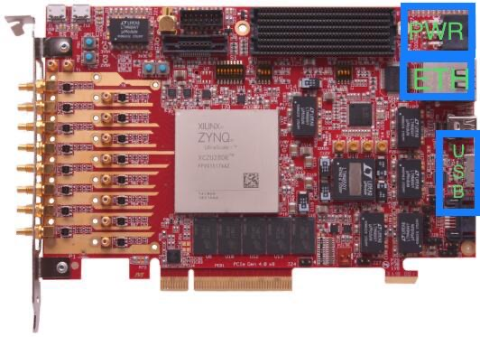

.. OpenCPI zrf8_48dr Getting Started Guide

.. This file is protected by Copyright. Please refer to the COPYRIGHT file
   distributed with this source distribution.

   This file is part of OpenCPI <http://www.opencpi.org>

   OpenCPI is free software: you can redistribute it and/or modify it under the
   terms of the GNU Lesser General Public License as published by the Free
   Software Foundation, either version 3 of the License, or (at your option) any
   later version.

   OpenCPI is distributed in the hope that it will be useful, but WITHOUT ANY
   WARRANTY; without even the implied warranty of MERCHANTABILITY or FITNESS FOR
   A PARTICULAR PURPOSE. See the GNU Lesser General Public License for
   more details.

   You should have received a copy of the GNU Lesser General Public License
   along with this program. If not, see <http://www.gnu.org/licenses/>.

.. _OpenCPI_zrf8_48dr_Getting_Started_Guide:

OpenCPI zrf8_48dr Getting Started Guide
=======================================

.. _Revision-History:

Revision History
----------------

.. csv-table::
   :header: "Revision", "Description of Change", "Date"
   :widths: 20,20,20

   "v1.0", "Initial Release", "02/03/2023"
   "v1.1", "Minor typo update", "02/09/2023"

.. _Hitech-Global-Documentation:

Hitech Global Documentation
---------------------------

This document provides installation information that is specific to the ``HiTech Global HTG RF8-48DR`` OSP, herein ``zrf8_48dr``. It is assumed that the user understands the material and procedures that are defined in the OpenCPI documentation. In an effort of keeping this guide concise and to avoid reproducing redundant information, the following documents are referenced for the tasks described in this guide.

.. csv-table::
   :header: "Document", "Source", "Location"
   :widths: 20,20,20

   "ZRF8 Users-Guide", "HiTech Global", "Request from http://www.hitechglobal.com/"
   "OpenCPI Developer Guides", "OpenCPI", "https://opencpi.gitlab.io/releases/all/"
   "OpenCPI zrf8_48dr Getting Started Guide", "OpenCPI", "https://gitlab.com/opencpi/osp/ocpi.osp.hitech-global"
   "OpenCPI zrf8_48dr Developers Guide", "OpenCPI", "https://gitlab.com/opencpi/osp/ocpi.osp.hitech-global"

.. _Software-setup:

Software Setup
--------------

The following Software suites need to be installed on the host system:

   - **Vivado/SDK v2021.1 Software Suite**

   - **Petalinux v2021.1 Software Suite**

.. _Install the Framework:

Install the Framework
^^^^^^^^^^^^^^^^^^^^^

This Guide uses the ``rfdc`` branch of this Geon Technologies OpenCPI Fork:

   - `Geon Technologies OpenCPI Fork <https://gitlab.com/geon-technologies/opencpi/opencpi/-/tree/rfdc?ref_type=heads>`_

#. Clone the OpenCPI framework

   ``cd /home/user/``

   ``git clone https://gitlab.com/geon-technologies/opencpi/opencpi.git``

   ``cd opencpi/``

   ``git checkout rfdc``

#. Install the framework

   ``./scripts/install-opencpi.sh --minimal``

.. _dev-Configure-a-host-terminal-for-OpenCPI-development:

Configure a host terminal for OpenCPI development
^^^^^^^^^^^^^^^^^^^^^^^^^^^^^^^^^^^^^^^^^^^^^^^^^

#. After the OpenCPI framework has been installed, source the OpenCPI framework setup script

   ``cd /home/user/opencpi``

   ``source cdk/opencpi-setup.sh -s``

#. Ensure that the environment is configured for the **desired version of Vivado** and its license file

   ``export OCPI_XILINX_VIVADO_VERSION=2021.1``

   ``env | grep OCPI``

   ::

      $ env | grep OCPI
      OCPI_TOOL_PLATFORM=centos7
      OCPI_PREREQUISITES_DIR=/home/jpalmer/projects/opencpi/releases/guide_test/opencpi/prerequisites
      OCPI_TOOL_OS_VERSION=c7
      OCPI_CDK_DIR=/home/jpalmer/projects/opencpi/releases/guide_test/opencpi/cdk
      OCPI_XILINX_VIVADO_VERSION=2021.1
      OCPI_ROOT_DIR=/home/jpalmer/projects/opencpi/releases/guide_test/opencpi
      OCPI_TOOL_OS=linux
      OCPI_TOOL_PLATFORM_DIR=/home/jpalmer/projects/opencpi/releases/guide_test/opencpi/project-registry/ocpi.core/exports/rcc/platforms/centos7
      OCPI_TOOL_ARCH=x86_64
      OCPI_TOOL_DIR=centos7

  ..

.. _install-the-ocpi.osp.hitech-global-platform:

Install the ocpi.osp.hitech-global platform
-------------------------------------------

.. _clone-and-register-the-ocpi.osp.hitech-global-project:

Clone and register the ocpi.osp.hitech-global project
^^^^^^^^^^^^^^^^^^^^^^^^^^^^^^^^^^^^^^^^^^^^^^^^^^^^^

#. Clone ``ocpi.osp.hitech-global`` project into the appropriate directory

   ``cd /home/user/opencpi/projects/osps/``

   ``git clone https://gitlab.com/opencpi/osp/ocpi.osp.hitech-global.git``

#. Register the ``ocpi.osp.hitech-global`` project

   ``cd ocpi.osp.hitech-global/``

   ``ocpidev register project``

.. _apply-changes-to-support-building-testbias:

Apply changes to support building testbias
^^^^^^^^^^^^^^^^^^^^^^^^^^^^^^^^^^^^^^^^^^

#. Copy the ``build.tcl`` file located in ``gsg_artifacts`` into the ``projects/assets/hdl/assemblies/testbias`` project.

   ``build.tcl`` Location: ``/home/user/opencpi/projects/osps/ocpi.osp.hitech-global/hdl/platforms/zrf8_48dr/doc/gsg_artifacts``

   ``cd /home/user/opencpi/projects/assets/hdl/assemblies/testbias/``

   ``cp <path>/build.tcl ./``

#. Apply the ``testbias.Makefile.patch`` patch-file

   ``testbias.Makefile.patch`` Location: ``/home/user/opencpi/projects/osps/ocpi.osp.hitech-global/hdl/platforms/zrf8_48dr/doc/gsg_artifacts``

   ``cp <path>/testbias.Makefile.patch ./``

   ``git apply testbias.Makefile.patch``

.. _prerequisite-project-ocpi.comp.sdr:

Prerequisite project ocpi.comp.sdr
^^^^^^^^^^^^^^^^^^^^^^^^^^^^^^^^^^

The ``ocpi.comp.sdr`` project is a prerequisite project for the ``zrf8_48dr`` to successfully install. Below is a set of steps that guide the user through the installation of the ``ocpi.comp.sdr`` project.

#. Clone ``ocpi.comp.sdr`` project into the appropriate directory

   ``cd /home/user/opencpi/projects/``

   ``git clone https://gitlab.com/opencpi/comp/ocpi.comp.sdr.git``

   ``cd ocpi.comp.sdr/``

   ``git checkout tags/v2.4.5``

#. Register the ``ocpi.comp.sdr`` project

   ``ocpidev register project``

#. Build the ``ocpi.comp.sdr`` primitives required for an assembly in this project.

   ``ocpidev build hdl primitives --hdl-target zynq_ultra``

.. _install-the-hdl-platform:

Install the HDL Platform
^^^^^^^^^^^^^^^^^^^^^^^^

Below is an abbreviated set of steps that guide the user through the installation of the ``zrf8_48dr`` HDL Platform. This results in a single test executable application named ``testbias`` based on the ``testbias`` HDL assembly (FPGA bitstream), which are both in the ``ocpi.assets`` built-in project.

The steps provided below rely heavily on the **OpenCPI Installation Guide**.

#. Build core hdl primitive libraries

   ``cd /home/user/opencpi/``

   ``ocpidev -d projects/core/ build hdl primitives --hdl-target zynq_ultra``

#. Build rfdc primitive core IP

   ``cd /home/user/opencpi/projects/osps/ocpi.osp.hitech-global/``

   ``ocpidev build --hdl-target zynq_ultra --no-assemblies``

#. Install ``zrf8_48dr`` HDL platform  using the ``--minimal`` flag

   ``cd /home/user/opencpi/``

   ``ocpiadmin install platform zrf8_48dr --minimal``

.. _install-the-RCC-Platform:

Install the RCC Platform
^^^^^^^^^^^^^^^^^^^^^^^^

#. **Complete the** :ref:`Setup-the-Software-cross-compiler` **Section of the Appendix.**

#. Install the rcc platform ``xilinx21_1_aarch64`` using the ``--minimal`` flag

   ``cd /home/user/opencpi/``

   ``source cdk/opencpi-setup.sh -s``

   ``ocpiadmin install platform xilinx21_1_aarch64 --minimal``

.. _deploy-the-platforms:

Deploy the Platforms
^^^^^^^^^^^^^^^^^^^^

#. Deploy RCC platform onto the HDL platform

   ``ocpiadmin deploy platform xilinx21_1_aarch64 zrf8_48dr``

#. Check that the following SD-Card artifacts have been populated in the ``/home/user/opencpi/cdk/zrf8_48dr/sdcard-xilinx21_1_aarch64`` directory:

   ``BOOT.BIN`` ``boot.scr`` ``Image`` ``opencpi`` ``rootfs.cpio.gz.u-boot``

.. _Hardware-setup:

Hardware Setup
--------------

.. _Device-Overview:

Device Overview
^^^^^^^^^^^^^^^

**Power Cable**

The 6-pin Molex PCIe power cable labeled PWR in the picture below, is used to apply power to the HTG RF8-48DR device.

**Micro-USB**

The micro-USB serial port labeled USB in the picture below, can be used to access the serial connection of the processor.

**MicroSD Card**

The MicroSD Card not shown in the picture below, is used to load the microSD card contents of the System boot artifacts.

**Ethernet Cable**

The Ethernet port in the picture below labeled ETH is used as an Ethernet connection from the development host to the device in order to utilize Server-Mode.

.. _Populating-SD-card-artifacts:

Populating SD-Card artifacts
^^^^^^^^^^^^^^^^^^^^^^^^^^^^

Once the ``zrf8_48dr`` HDL Platform and ``xilinx21_1_aarch64`` RCC Platform have been successfully deployed in the :ref:`deploy-the-platforms`, the following steps can be taken in order to create a valid microSD card to boot the HTG RF8-48DR device.

#. Complete the steps in the :ref:`creating-a-valid-sd-card` sections of the APPENDIX

#. ``cd /home/user/opencpi/cdk/zrf8_48dr/sdcard-xilinx21_1_aarch64/``

#. ``sudo rm -rf /run/media/<user>/boot/*``

#. ``cp BOOT.BIN boot.scr Image rootfs.cpio.gz.u-boot /run/media/<user>/boot/``

#. ``sudo cp -RLp opencpi/ /run/media/<user>/boot/``

#. ``umount /dev/sda1``

- Remove the microSD card from Host

.. _Booting-the-HTG-RF8-48DR:

Booting the HTG RF8-48DR
^^^^^^^^^^^^^^^^^^^^^^^^^

#. Remove power from the HTG RF8-48DR unit

#. With the contents provided in the :ref:`Populating-SD-card-artifacts` section, insert the microSD card into the HTG RF8-48DR microSD card slot

#. Attach a micro-USB serial port from the HTG RF8-48DR to the host (Needed for both ``Standalone-Mode`` and ``Server-Mode``)

#. Attach an ethernet cable from the HTG RF8-48DR to the host (Only needed for ``Server-Mode``)

#. Establish a serial connection

   ``sudo screen /dev/ttyUSB0 115200``

#. Apply Power and monitor the screen serial connection.

   - This will successfully boot the OpenCPI system image artifacts that are located on the microSD card.

.. _Configuring-the-Runtime-Environment-on-the-Platform:

Configuring the Runtime Environment on the Platform
---------------------------------------------------

After a successful boot to PetaLinux, login to the system, using **“root“** for user name and password.

Take note of the **root@zynqmp-generic** indicating that the HTG RF8-48DR has successfully booted using PetaLinux.

Verify that the following ``uname -a`` is observed::

   root@zynqmp-generic:~# uname -a
   Linux zynqmp-generic 5.10.0-xilinx-v2021.1 #1 SMP Tue Aug 24 05:53:21 UTC 2021 aarch64 GNU/Linux

.. _Standalone-Mode-setup:

Standalone Mode setup
^^^^^^^^^^^^^^^^^^^^^

The goal of this section is to enable the user with the ability to setup the ``Standalone Mode`` on the ``zrf8_48dr``. Success of this section is the ability to source the customized ``mysetup.sh`` script that enables the ``Standalone Mode`` and provides the ability to load bitstreams from the microSD card to the Platform Host (``zrf8_48dr``).

#. The following instructions are possible after the HTG RF8-48DR device has been successfully booted.

#. Create an empty ``opencpi`` directory

   ``cd /home/root/``

   ``mkdir opencpi``

#. Mount the ``/media/sd-mmcblk0p1/opencpi`` directory to the one just created in ``/home/root/opencpi/``

   ``mount /media/sd-mmcblk0p1/opencpi /home/root/opencpi``

#. On the HTG RF8-48DR device, browse to the OpenCPI installation directory

   ``cd /home/root/opencpi/``

#. Create the ``mysetup.sh`` for editing

   **If a copy is not made to drop the** ``default_`` **then the script will not run properly.**

   ``cp default_mysetup.sh ./mysetup.sh``

#. Source the ``mysetup.sh`` script to enable ``Standalone Mode``

   ``cd opencpi/``

   ``export OCPI_LOCAL_DIR=/home/root/opencpi``

   ``source /home/root/opencpi/mysetup.sh``

.. _Run-the-testbias-application-using-Standalone-Mode:

Run the testbias application using Standalone-Mode
^^^^^^^^^^^^^^^^^^^^^^^^^^^^^^^^^^^^^^^^^^^^^^^^^^

**The goal of this section is to pass a biasvalue of zero to the testbias application using the** ``bias=biasvalue=0`` **portion of the** ``ocpirun`` **command below. With a biasvalue of zero the input data and output data should be unchanged. This data can then be validated by checking the md5sum of the** ``test.input`` **and** ``test.output`` **files.**

#. On the HTG RF8-48DR device, browse to the applications directory

   ``cd /home/root/opencpi/applications/``

#. Configure the OpenCPI artifacts search path:

   ``export OCPI_LIBRARY_PATH=../artifacts:../xilinx21_1_aarch64/artifacts``

#. Run the testbias application

   ``ocpirun -v -d -x -m bias=hdl -p bias=biasvalue=0 testbias.xml``

   stdout of screen session::

      % cd /home/root/opencpi/applications/
      % export OCPI_LIBRARY_PATH=../artifacts/:../xilinx21_1_aarch64/artifacts/
      % ocpirun -v -d -x -m bias=hdl -p bias=biasvalue=0 testbias.xml
      Available containers are:  0: PL:0 [model: hdl os:  platform: zrf8_48dr], 1: rcc0 [model: rcc os: linux platform: xilinx21_1_aarch64]
      Actual deployment is:
        Instance  0 file_read (spec ocpi.core.file_read) on rcc container 1: rcc0, using file_read in ../xilinx21_1_aarch64/artifacts//ocpi.core.file_read.rcc.0.xilinx21_1_aarch64.so dated Fri Jan 13 19:04:08 2023
        Instance  1 bias (spec ocpi.core.bias) on hdl container 0: PL:0, using bias_vhdl/a/bias_vhdl in ../artifacts//testbias_zrf8_48dr_base.bitz dated Fri Jan 13 19:04:08 2023
        Instance  2 file_write (spec ocpi.core.file_write) on rcc container 1: rcc0, using file_write in ../xilinx21_1_aarch64/artifacts//ocpi.core.file_write.rcc.0.xilinx21_1_aarch64.so dated Fri Jan 13 19:04:08 2023
      Application XML parsed and deployments (containers and artifacts) chosen [0 s 40 ms]
      Application established: containers, workers, connections all created [0 s 66 ms]
      Dump of all initial property values:
      Property   0: file_read.fileName = "test.input" (cached)
      Property   1: file_read.messagesInFile = "false" (cached)
      Property   2: file_read.opcode = "0x0" (cached)
      Property   3: file_read.messageSize = "0x10"
      Property   4: file_read.granularity = "0x4" (cached)
      Property   5: file_read.repeat = "false"
      Property   6: file_read.bytesRead = "0x0"
      Property   7: file_read.messagesWritten = "0x0"
      Property   8: file_read.suppressEOF = "false"
      Property   9: file_read.badMessage = "false"
      Property  16: bias.biasValue = "0x0" (cached)
      Property  20: bias.test64 = "0x0"
      Property  31: file_write.fileName = "test.output" (cached)
      Property  32: file_write.messagesInFile = "false" (cached)
      Property  33: file_write.bytesWritten = "0x0"
      Property  34: file_write.messagesWritten = "0x0"
      Property  35: file_write.stopOnEOF = "true" (cached)
      Property  39: file_write.suppressWrites = "false"
      Property  40: file_write.countData = "false"
      Property  41: file_write.bytesPerSecond = "0x0"
      Application started/running [0 s 1 ms]
      Waiting for application to finish (no time limit)
      Application finished [0 s 20 ms]
      Dump of all final property values:
      Property   0: file_read.fileName = "test.input" (cached)
      Property   1: file_read.messagesInFile = "false" (cached)
      Property   2: file_read.opcode = "0x0" (cached)
      Property   3: file_read.messageSize = "0x10"
      Property   4: file_read.granularity = "0x4" (cached)
      Property   5: file_read.repeat = "false" (cached)
      Property   6: file_read.bytesRead = "0xfa0"
      Property   7: file_read.messagesWritten = "0xfa"
      Property   8: file_read.suppressEOF = "false" (cached)
      Property   9: file_read.badMessage = "false"
      Property  16: bias.biasValue = "0x0" (cached)
      Property  20: bias.test64 = "0x0" (cached)
      Property  31: file_write.fileName = "test.output" (cached)
      Property  32: file_write.messagesInFile = "false" (cached)
      Property  33: file_write.bytesWritten = "0xfa0"
      Property  34: file_write.messagesWritten = "0xfb"
      Property  35: file_write.stopOnEOF = "true" (cached)
      Property  39: file_write.suppressWrites = "false" (cached)
      Property  40: file_write.countData = "false" (cached)
      Property  41: file_write.bytesPerSecond = "0x44229"

   ..

#. Verify that the data has successfully transferred through the application by performing an md5sum on the input and output data files with bias effectively disabled, by setting the biasValue=0.

   Compare the md5sum of both ``test.input`` and ``test.output``. The stdout should be as follows:

   ::

      % md5sum test.*
      2934e1a7ae11b11b88c9b0e520efd978  test.input
      2934e1a7ae11b11b88c9b0e520efd978  test.output

   ..

   .. note::

      **This shows that with a biasvalue=0 (no change in data) that the input matches the output and the testbias application is working as it should.**

   ..

.. _Server-Mode-setup:

Server Mode setup
^^^^^^^^^^^^^^^^^

**Device Setup**

#. Establish a screen connection to the device

   ``sudo screen /dev/ttyUSB0 115200``

#. Setup the IP Address

   ``ifconfig eth0 down``

   ``ifconfig eth0 add <Valid ip-address> netmask 255.255.255.0``

   ``ifconfig eth up``

**Host Setup**

#. Source the OpenCPI environment

   ``cd opencpi/``

   ``source cdk/opencpi-setup.sh -s``

#. Setup the host for targeting the remote platform by setting the terminal environment variables Device IP Address and valid Port.

   ``export OCPI_SERVER_ADDRESSES=<Valid ip-address>:<Valid port>``

#. Export a valid socket interface

   ``export OCPI_SOCKET_INTERFACE=<Valid Socket>``

#. Load the ``sandbox`` onto the server (device):

   ``ocpiremote load -s xilinx21_1_aarch64 -w zrf8_48dr``

   ::

      $ ocpiremote load -s xilinx21_1_aarch64 -w zrf8_48dr
      Preparing remote sandbox...
      Fri Jan 27 10:53:27 UTC 2023
      Creating server package...
      Sending server package...
      Server package sent successfully
      Getting status (no server expected to be running):
      Executing remote configuration command: status
      No ocpiserve appears to be running: no pid file

   ..

#. Start the Server-Mode:

   ``ocpiremote start -b``

   ::

      $ ocpiremote start -b
      Executing remote configuration command: start -B
      The driver module is not loaded. No action was taken.
      Reloading kernel driver:
      No reserved DMA memory found on the linux boot command line.
      Driver loaded successfully.
      Loading opencpi bitstream
      PATH=/home/root/sandbox/xilinx21_1_aarch64/bin:/home/root/sandbox/xilinx21_1_aarch64/sdk/bin:/usr/bin:/bin
      LD_LIBRARY_PATH=xilinx21_1_aarch64/sdk/lib
      VALGRIND_LIB=
      nohup ocpiserve -v -p 12345 > 20230127-105808.log
      Server (ocpiserve) started with pid: 598.  Initial log is:
      Discovery options:  discoverable: 0, loopback: 0, onlyloopback: 0
      Container server at <ANY>:12345
        Available TCP server addresses are:
          On interface eth0: 10.100.1.20:12345
      Artifacts stored/cached in the directory "artifacts", which will be retained on exit.
      Containers offered to clients are:
         0: PL:0, model: hdl, os: , osVersion: , platform: zrf8_48dr
         1: rcc0, model: rcc, os: linux, osVersion: 21_1, platform: xilinx21_1_aarch64
      --- end of server startup log success above

   ..

.. _Run-the-testbias-application-using-Server-Mode:

Run the testbias application using Server-Mode
^^^^^^^^^^^^^^^^^^^^^^^^^^^^^^^^^^^^^^^^^^^^^^

#. On the host, browse to the applications directory

   ``cd /home/user/opencpi/projects/assets/applications/``

#. Configure the OpenCPI artifacts search path:

   ``export OCPI_LIBRARY_PATH=../imports/ocpi.core/artifacts/:../../assets/artifacts/``

#. Run the testbias application

   ``ocpirun -v -P bias=zrf8_48dr -p bias=biasValue=0 testbias.xml``

   ::

      $ ocpirun -v -P bias=zrf8_48dr -p bias=biasValue=0 testbias.xml
      Received server information from "10.100.1.20:12345".  Available containers are:
        10.100.1.20:12345/PL:0               platform zrf8_48dr, model hdl, os , version , arch , build 
          Transports: ocpi-dma-pio,36:6c:6e:30:16:26,0,0,0x41,0x101|ocpi-socket-rdma, ,1,0,0x42,0x41|
        10.100.1.20:12345/rcc0               platform xilinx21_1_aarch64, model rcc, os linux, version 21_1, arch aarch64, build 
          Transports: ocpi-dma-pio,36:6c:6e:30:16:26,1,0,0x103,0x103|ocpi-smb-pio,36:6c:6e:30:16:26,0,0,0xb,0xb|ocpi-socket-rdma, ,1,0,0x42,0x43|
      Available containers are:  0: 10.100.1.20:12345/PL:0 [model: hdl os:  platform: zrf8_48dr], 1: 10.100.1.20:12345/rcc0 [model: rcc os: linux platform: xilinx21_1_aarch64], 2: rcc0 [model: rcc os: linux platform: centos7]
      Actual deployment is:
        Instance  0 file_read (spec ocpi.core.file_read) on rcc container 2: rcc0, using file_read in ../imports/ocpi.core/artifacts//ocpi.core.file_read.rcc.0.centos7.so dated Mon Jun 12 12:50:26 2023
        Instance  1 bias (spec ocpi.core.bias) on hdl container 0: 10.100.1.20:12345/PL:0, using bias_vhdl/a/bias_vhdl in ../../assets/artifacts//ocpi.assets.testbias_zrf8_48dr_base.hdl.0.zrf8_48dr.bitz dated Mon Jun 12 14:35:18 2023
        Instance  2 file_write (spec ocpi.core.file_write) on rcc container 1: 10.100.1.20:12345/rcc0, using file_write in ../imports/ocpi.core/artifacts//ocpi.core.file_write.rcc.0.xilinx21_1_aarch64.so dated Mon Jun 12 13:10:58 2023
      Application XML parsed and deployments (containers and artifacts) chosen [0 s 86 ms]
      Application established: containers, workers, connections all created [0 s 119 ms]
      Application started/running [0 s 1 ms]
      Waiting for application to finish (no time limit)
      Application finished [0 s 30 ms]

   ..

#. Validate success

   ``md5sum test.input``

   ``md5sum test.output`` (**On server at ``/home/root/sandbox/test.output``**)

   If they have a matching ``md5sum`` then the application run successfully.

.. _APPENDIX:

APPENDIX
--------

.. _creating-a-valid-sd-card:

Creating a valid SD-Card
^^^^^^^^^^^^^^^^^^^^^^^^

A valid SD-Card with a ``boot`` partition needs to be made.

#. Be sure to save off any important information on the SD card

#. ``sudo umount /dev/sda1``

#. ``sudo fdisk /dev/sda``

#. List the current partition table

   Command (m for help): ``p``

#. Remove all current partitions

   Command (m for help): ``d``

#. Make the following selections to create two partitions

   #. New ``n``, Primary ``p``, Partition number ``1``, First sector [enter] (default), Last sector size [enter] (default)

#. Write table to disk and exit

   Command (m for help): ``w``

#. Uninstall and reinstall the SD Card / USB drive

#. ``sudo umount /dev/sda1``

#. ``sudo mkfs.vfat -F 32 -n boot /dev/sda1``

#. Uninstall and reinstall the microSD card

#. Check that the partition ``boot`` has been created

.. _Setup-the-Software-cross-compiler:

Setup the Software cross-compiler
^^^^^^^^^^^^^^^^^^^^^^^^^^^^^^^^^

**GOAL:**

- To establish the software cross-complier

- To setup the OpenCPI functionality of the ``ZynqReleases`` and ``git`` Xilinx directories

**IMPLEMENTATION:**

The following commands are outlined in the `OpenCPI Installation Guide <https://opencpi.gitlab.io/releases/latest/docs/OpenCPI_Installation_Guide.pdf>`_

#. Setup ``Xilinx/ZynqReleases/``

   ``sudo mkdir -p /opt/Xilinx/ZynqReleases/2021.1/``

#. Implement the provided ``2021.1-zrf8_48dr-release.tar.xz`` into the ``ZynqReleases`` directory

   ``2021.1-zrf8_48dr-release.tar.xz`` Location: ``/home/user/opencpi/projects/osps/ocpi.osp.hitech-global/hdl/platforms/zrf8_48dr/doc/gsg_artifacts``

   ``sudo cp <2021.1-zrf8_48dr-release.tar.xz> /opt/Xilinx/ZynqReleases/2021.1/``

   ``sudo chown -R <user>:users /opt/Xilinx/ZynqReleases``

      - Example: ``sudo chown -R smith:users /opt/Xilinx/ZynqReleases``

      - Note: This may require adjusting the permissions for ``/opt/Xilinx/ZynqReleases`` or its subdirectories

#. Setup ``Xilinx/git/``

   #. ``sudo mkdir -p /opt/Xilinx/git``

   #. Download ``linux-xlnx``

      #. ``cd ~/Downloads/``

      #. ``git clone https://github.com/Xilinx/linux-xlnx.git``

      #. ``cd linux-xlnx/``

      #. ``git checkout -b xilinx-v2021.1``

      #. ``cd ../``

      #. ``sudo cp -rf linux-xlnx /opt/Xilinx/git``

   #. Download ``u-boot-xlnx``

      #. ``cd ~/Downloads/``

      #. ``git clone https://github.com/Xilinx/u-boot-xlnx.git``

      #. ``cd u-boot-xlnx/``

      #. ``git checkout -b xilinx-v2021.1``

      #. ``cd ../``

      #. ``sudo cp -rf u-boot-xlnx /opt/Xilinx/git``

   #. ``sudo chown -R <user>:users /opt/Xilinx/git``

      - Example: ``sudo chown -R smith:users /opt/Xilinx/git``

      - Note: This may require adjusting the permissions for ``/opt/Xilinx/git`` or its subdirectories
